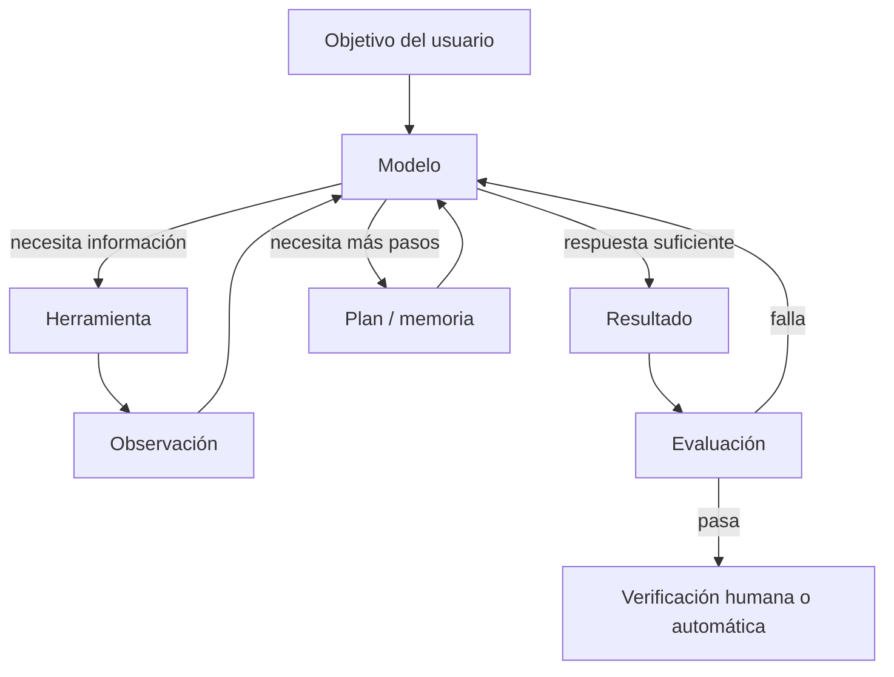

# Mapa de capacidades: qué desbloqueó qué

La evolución no es una línea recta. Es más útil verla como dependencias:

| Capacidad | Pieza que la hizo práctica | Qué permitió después |
|---|---|---|
| Aprender patrones complejos | Redes profundas + GPU + datos | Percepción y políticas de juego |
| Planificar bajo incertidumbre | Red de política + valor + búsqueda | AlphaGo, self-play, sistemas híbridos |
| Relacionar cualquier parte de una secuencia | Self-attention | Transformer y entrenamiento paralelo |
| Reutilizar un mismo modelo | Pretraining a gran escala | GPT, modelos fundacionales, few-shot |
| Entender instrucciones humanas | SFT + preferencias/RLHF | Asistentes conversacionales |
| Consultar conocimiento actual | Embeddings + recuperación | RAG y respuestas con fuentes |
| Resolver problemas con más pasos | CoT + RL verificable + test-time compute | Modelos de razonamiento |
| Actuar en software | Salida estructurada + function calling | Tool use y agentes |
| Integrar muchas herramientas | Protocolos como MCP | Ecosistemas conectables |
| Mantener objetivos largos | Memoria, planificación, sandbox y evals | Coding agents y trabajo autónomo |
| Convertir propuestas en resultados auditables | Prompt + loop + grafo + verificadores | Sistemas de IA fiables y medibles |

## El bucle moderno

El modelo no es todo el sistema. En producción importan tanto el contexto, permisos, herramientas, observabilidad y validación como los pesos del modelo.

## Las grandes “eras” de este curso

| Era | Cambio de interfaz mental |
|---|---|
| AlphaGo | De programar reglas a entrenar políticas y evaluar futuros |
| Transformer | De procesar secuencias paso a paso a relacionarlas en paralelo |
| ChatGPT | De completar texto a colaborar mediante instrucciones y diálogo |
| IA local | De depender del centro de datos a elegir tamaño, bits y hardware |
| Thinking | De una respuesta inmediata a gastar cómputo deliberando |
| Agent Tools | De decir qué hacer a ejecutar acciones verificables |
| MCP | De integraciones únicas a contratos compartidos de herramientas/contexto |
| Agentes autónomos | De una petición a objetivos largos con múltiples iteraciones |
| Loop/graph engineering | De confiar en una respuesta a exigir evidencia, gates y estados terminales |

Siguiente: [AlphaGo, el punto de partida](../01-era-alphago/01-alphago-el-punto-de-partida.md).
