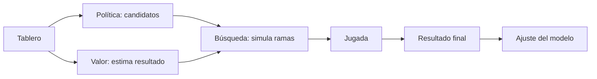

# 2016 — AlphaGo: aprender, valorar y buscar

En marzo de 2016, AlphaGo venció 4–1 a Lee Sedol. El resultado fue importante, pero la arquitectura mental que dejó lo fue más: **proponer buenas acciones, estimar su valor, explorar futuros y aprender de la experiencia**.

## El problema

En Go no se puede enumerar el árbol completo de jugadas: el número de configuraciones posibles ronda `10^170`. Las reglas caben en una página; decidir qué posición es prometedora no.

AlphaGo combinó:

| Pieza | Pregunta que responde | Analogía de software |
|---|---|---|
| Red de política | “¿Qué jugadas parecen plausibles?” | Un índice que descarta el 99,9 % de rutas inútiles |
| Red de valor | “¿Quién parece ir ganando desde aquí?” | Una función heurística que puntúa estados |
| Búsqueda Monte Carlo | “¿Qué pasa si exploro estas opciones?” | Tests especulativos sobre las ramas prometedoras |
| Aprendizaje supervisado | “¿Cómo juegan los expertos?” | Aprender de un histórico etiquetado |
| Aprendizaje por refuerzo | “¿Qué decisiones acaban ganando?” | Ajustar por el resultado de ejecuciones completas |
| Self-play | “¿Cómo consigo datos mejores que mis maestros?” | Generar casos de prueba contra versiones propias |

El paper de 2016 describe redes de política y valor entrenadas con partidas humanas y *self-play*, combinadas con búsqueda en árbol. AlphaGo Zero eliminó después las partidas humanas y aprendió desde juego aleatorio contra sí mismo. Fuentes: [paper de Nature](https://www.nature.com/articles/nature16961), [historia técnica de DeepMind](https://deepmind.google/research/alphago/) y [AlphaGo Zero](https://deepmind.google/blog/alphago-zero-starting-from-scratch/).

## Move 37 y la palabra “creatividad”

La jugada 37 de la segunda partida parecía extraña incluso a profesionales. No demuestra conciencia. Sí demuestra algo más concreto: un optimizador entrenado puede encontrar regiones útiles del espacio de soluciones que la tradición humana casi nunca visita.

## Qué conecta con los LLM actuales

AlphaGo no era un modelo de lenguaje y su búsqueda no es el Transformer. Las conexiones reales son:

- aprender representaciones útiles en vez de codificar todas las reglas;
- combinar una política generativa con un evaluador;
- mejorar mediante feedback y resultados verificables;
- usar más cómputo al decidir, no solo al entrenar;
- producir datos sintéticos mediante *self-play*.

Los modelos de razonamiento y los agentes recuperan este patrón: generan candidatos, prueban, observan y corrigen.

## Límites de la analogía

Go tiene reglas cerradas, una recompensa clara y un simulador perfecto. El desarrollo de software, el derecho o una conversación tienen objetivos ambiguos, información incompleta y consecuencias fuera del tablero. Copiar el bucle sin resolver la función de éxito produce *reward hacking*.

**Idea que debes conservar:** la inteligencia práctica aparece muchas veces al combinar predicción con búsqueda, feedback y verificación; no solo haciendo un predictor mayor.

Siguiente: [modelos, vectores y aprendizaje](02-modelos-vectores-y-aprendizaje.md).
