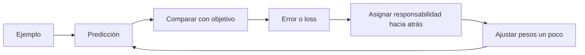

# Qué es un modelo: vectores, capas y predicción

> **Modelo mental:** un modelo entrenado es una función enorme, configurada por millones o miles de millones de números, que transforma una entrada en una distribución de salidas probables.

No es una base de datos de frases ni un árbol gigante de `if`. Sus **pesos** son números organizados en tensores. Durante el entrenamiento se ajustan para que ejemplos parecidos activen rutas internas útiles.

## La petición como ruta por un espacio de números

Tu intuición —“una agrupación de vectores que predice la siguiente ruta”— es buena si añadimos precisión:

1. El texto se parte en tokens.
2. Cada token se convierte en un vector: una lista de números.
3. Las capas mezclan esos vectores según el contexto.
4. El estado final produce una puntuación para cada posible token siguiente.
5. Un decodificador elige uno y el proceso se repite.

```text
"corrige este bug" → tokens → vectores → capas → probabilidades
                                               ├─ "El"  0,28
                                               ├─ "Veo" 0,17
                                               └─ "La"  0,09
```

“Vector” no significa que exista un eje legible llamado `sarcasmo=0.82`. La información suele estar distribuida entre muchas dimensiones y capas.

## Parámetros, arquitectura y estado

| Término | Qué es | Qué no es |
|---|---|---|
| Arquitectura | Plano de cómo fluyen los datos | El conocimiento aprendido |
| Pesos/parámetros | Números ajustados al entrenar | Una lista explícita de hechos |
| Activaciones | Valores temporales de una ejecución | Memoria permanente |
| Contexto | Tokens disponibles en esta petición | Entrenamiento nuevo |
| Estado externo | Archivos, memoria, base de datos, herramientas | Parte necesaria del LLM |

## Aprender: reducir error repetidamente

El bucle básico es parecido a optimizar una función con tests:



- **Forward pass:** ejecutar la red y obtener la predicción.
- **Loss:** un número que resume cuánto se equivocó.
- **Backpropagation:** calcular qué pesos contribuyeron al error.
- **Optimizer:** decidir el pequeño ajuste de cada peso.
- **Batch:** varios ejemplos procesados juntos para aprovechar el hardware.
- **Epoch:** una pasada por el conjunto de datos; en LLM masivos se habla más de tokens y pasos.

## Tres familias de aprendizaje

| Tipo | Señal | Ejemplo |
|---|---|---|
| Supervisado | Respuesta correcta conocida | Imagen → “gato” |
| Autosupervisado | El propio dato oculta o desplaza el objetivo | Texto previo → token siguiente |
| Refuerzo | Recompensa después de acciones | Ganar una partida; pasar tests |

Un LLM suele combinar preentrenamiento autosupervisado, ajuste con ejemplos de instrucciones y optimización con preferencias o recompensas.

## Inferencia no es entrenamiento

Durante **entrenamiento** se cambian los pesos y el coste es enorme. Durante **inferencia** se congelan los pesos y se calculan tokens. Una conversación no suele reentrenar el modelo: cambia su contexto o memoria externa.

## Por qué alucina

El objetivo base es producir continuación probable, no ejecutar una consulta de verdad. Si el patrón lingüístico de una cita inexistente parece adecuado, el modelo puede generarlo. RAG, herramientas, entrenamiento de honestidad y verificación reducen el problema; no lo eliminan.

Profundización: [entrenamiento por dentro](../14-ampliacion-avanzada/02-entrenamiento-y-alineamiento.md).
