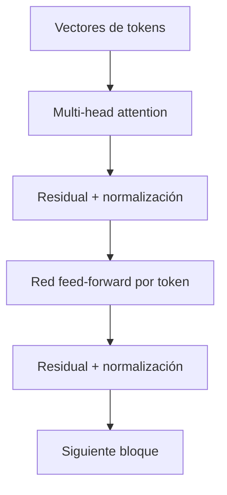

# Transformer y atención: un cambio de arquitectura

Antes del Transformer, muchas redes de secuencia procesaban elementos en orden y arrastraban un estado. Eso dificultaba paralelizar el entrenamiento y conservar relaciones lejanas.

El paper [*Attention Is All You Need*](https://arxiv.org/abs/1706.03762) propuso en 2017 una arquitectura basada en atención, sin recurrencia ni convolución como núcleo.

## La intuición de self-attention

Para cada token, el modelo crea tres proyecciones:

- **Query:** qué información busco.
- **Key:** qué tipo de información ofrezco.
- **Value:** qué contenido aportaré si resulto relevante.

```text
Query("ella") ── compara ── Keys(tokens anteriores)
                         └─ mayor peso a "Andrea"
Values ponderados ─────────> representación contextual de "ella"
```

Es parecido a una consulta de base de datos blanda: no devuelve una fila, mezcla información de todas con pesos distintos.

## Bloque Transformer



- Varias **heads** pueden aprender relaciones distintas.
- Las conexiones **residuales** conservan una ruta directa para la señal.
- La red **feed-forward** transforma cada posición después de mezclar contexto.
- La **posición** se codifica porque la atención sola no sabe el orden.

## Encoder, decoder y LLM causal

| Diseño | Ve | Uso típico |
|---|---|---|
| Encoder | La secuencia completa | Clasificación, embeddings |
| Decoder causal | Solo pasado al predecir | Generación GPT |
| Encoder-decoder | Entrada completa + salida previa | Traducción, transformación |

## Por qué fue revolucionario

El entrenamiento podía procesar muchas posiciones en paralelo. La arquitectura escaló bien en GPU y convirtió la longitud de contexto y el tamaño del modelo en palancas claras.

## Su coste

La atención densa compara todas las posiciones entre sí; trabajo y memoria crecen aproximadamente con el cuadrado de la longitud durante el cálculo ingenuo. FlashAttention mejora el movimiento de memoria, no cambia por sí solo esa relación matemática.

Profundización: [Transformer por dentro](../14-ampliacion-avanzada/01-transformer-por-dentro.md).
