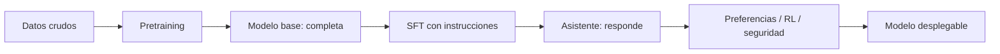

# Pretraining, siguiente token y leyes de escalado

## El objetivo que parece demasiado simple

Se toma texto, se oculta el futuro y se pide predecir el siguiente token. La señal de entrenamiento aparece en cada posición, así que internet y repositorios se convierten en enormes conjuntos de ejemplos sin etiquetar manualmente.

Para acertar de forma consistente, el modelo necesita aproximar sintaxis, estilos, hechos frecuentes, relaciones conceptuales y patrones de razonamiento. No los almacena como lo haría un sistema relacional; los comprime en pesos.

## Modelo base → asistente

Un modelo base puede continuar una pregunta con otra pregunta. El postentrenamiento enseña que, en una interfaz de chat, lo deseable es contestar.

## Escalar funcionó… con condiciones

Las [leyes de escalado de OpenAI](https://openai.com/index/scaling-laws-for-neural-language-models/) mostraron relaciones predecibles entre pérdida, tamaño, datos y cómputo. [GPT-3](https://openai.com/index/language-models-are-few-shot-learners/) mostró que un modelo de 175B parámetros podía adaptarse a tareas mediante instrucciones y ejemplos dentro del prompt.

Pero “más parámetros” no significa automáticamente “mejor producto”:

- hacen falta suficientes datos y pasos de entrenamiento;
- la calidad y mezcla de datos importan;
- inferencia, latencia y energía crecen;
- postentrenamiento y herramientas pueden hacer preferible un modelo menor;
- benchmarks saturados pueden ocultar fallos reales.

## In-context learning

Cuando das ejemplos en el prompt, los pesos no cambian. El modelo infiere el patrón temporalmente a través de sus activaciones. Es “aprender” en sentido funcional, no entrenamiento persistente.

**Idea que debes conservar:** el pretraining fabrica un predictor general; el postentrenamiento decide cómo se comporta; el sistema que lo rodea decide qué puede hacer.
