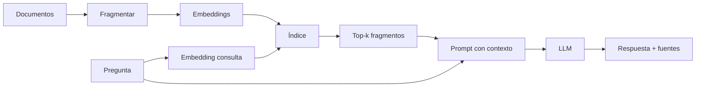

# 2020 — RAG: separar lenguaje y conocimiento actualizable

Un LLM guarda conocimiento difuso en sus parámetros, pero actualizar un dato no debería exigir reentrenarlo. **Retrieval-Augmented Generation (RAG)** recupera documentos en tiempo de consulta y se los entrega al generador.

El paper original de 2020 combinó memoria paramétrica y un índice vectorial de Wikipedia para tareas intensivas en conocimiento: [Lewis et al., 2020](https://arxiv.org/abs/2005.11401).

## Pipeline mínimo

## Qué resuelve

- conocimiento privado o reciente;
- trazabilidad mediante fragmentos citables;
- actualización sin modificar pesos;
- reducción de alucinaciones factuales cuando la recuperación acierta.

## Qué no resuelve

RAG no garantiza verdad. Puede recuperar el documento equivocado, cortar una excepción al fragmentar, mezclar versiones o inducir al modelo mediante texto malicioso. Una respuesta fluida puede ocultar una recuperación mala.

## Decisiones de ingeniería

| Decisión | Trade-off |
|---|---|
| Tamaño del chunk | Pequeño: preciso pero pierde contexto; grande: ruidoso |
| Solapamiento | Conserva continuidad pero duplica resultados |
| Búsqueda vectorial | Semántica, pero puede perder identificadores exactos |
| Búsqueda léxica | Buena para nombres/códigos, peor para paráfrasis |
| Híbrida + reranker | Mejor recuperación, más latencia y complejidad |
| Citas | Aumentan auditabilidad; hay que comprobar que soportan la frase |

Evalúa por separado **retrieval** (¿apareció la evidencia?) y **generation** (¿la usó correctamente?).
