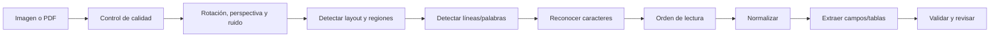
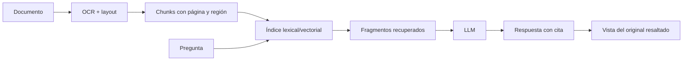

# OCR y Document AI: convertir documentos visuales en datos verificables

**OCR** significa *Optical Character Recognition*: reconocimiento óptico de caracteres. Convierte texto visible en una imagen o escaneo en caracteres que el software puede buscar, copiar y procesar.

Leer letras es solo el primer paso. Una factura útil también necesita saber qué texto es el proveedor, cuál es el total, qué filas forman la tabla y en qué orden debe leerse la página. Esa capa más amplia suele llamarse **Document AI**, *document understanding* o procesamiento inteligente de documentos.

## Primero: ¿el documento necesita OCR?

No todos los PDF son imágenes.

| Tipo de entrada | Qué contiene | Primera acción |
|---|---|---|
| PDF digital | texto, fuentes y coordenadas nativas | extraer la capa de texto; no rasterizar sin motivo |
| PDF escaneado | fotografías de páginas | OCR por página |
| PDF híbrido | texto nativo + imágenes o páginas escaneadas | detectar y procesar solo lo necesario |
| Foto móvil | perspectiva, sombras, reflejos y fondo | corregir geometría y calidad antes de OCR |
| Formulario manuscrito | escritura variable y casillas | modelo con soporte de handwriting + revisión |
| Captura de pantalla | texto de UI y elementos visuales | OCR, accesibilidad o visión según el objetivo |

Aplicar OCR a un PDF que ya contiene texto puede degradar acentos, números y posiciones, además de aumentar coste. Inspecciona primero el archivo.

## Pipeline funcional de OCR



Las implementaciones pueden combinar varias etapas en un modelo, pero pensar en ellas por separado ayuda a localizar el fallo. Si las palabras son correctas y las columnas se mezclan, el problema es layout u orden de lectura, no reconocimiento de caracteres.

## Qué debería devolver

Un OCR útil no produce únicamente una cadena:

- texto completo;
- páginas, bloques, párrafos, líneas, palabras y símbolos;
- bounding boxes o polígonos;
- orden de lectura;
- idioma detectado;
- confianza por elemento;
- orientación de página;
- estilos o escritura manuscrita, si existe soporte;
- relación entre texto y posición original.

Conservar coordenadas y procedencia permite resaltar el campo en la imagen, reconstruir tablas y enseñar a una persona exactamente qué está aprobando.

## OCR, Document AI y VLM

| Capa | Pregunta | Salida típica |
|---|---|---|
| OCR | «¿Qué caracteres aparecen y dónde?» | texto + coordenadas + confianza |
| Layout analysis | «¿Qué es título, tabla, celda, párrafo o pie?» | regiones y estructura |
| Document classification | «¿Es factura, contrato, DNI o albarán?» | tipo de documento |
| Entity/field extraction | «¿Cuál es el total y quién es el proveedor?» | JSON con campos |
| VLM/LLM multimodal | «¿Qué significa este documento o cómo responder?» | explicación o salida generativa |

Un VLM puede leer y razonar directamente sobre la página, pero una respuesta convincente puede inventar un número o perder una fila. Para procesos auditables conviene conservar OCR/layout como evidencia y pedir al modelo que cite página, región o texto fuente.

En documentos repetitivos, un extractor especializado puede superar a un modelo general y ser más barato. En layouts variables, un VLM puede ayudar a interpretar, siempre que reglas, confidence y revisión controlen los efectos.

## Preprocesamiento: mejorar la señal sin borrar información

Operaciones habituales:

- corregir rotación y perspectiva;
- recortar bordes y fondo;
- aumentar contraste;
- reducir ruido;
- corregir iluminación desigual;
- elegir una resolución adecuada;
- separar páginas;
- detectar orientación e idioma.

No existe una receta universal. Un umbral agresivo puede borrar puntos decimales, trazos finos o sellos. Conserva el original y versiona el pipeline para poder reproducir la extracción.

## Layout y orden de lectura

Una página no es una frase larga. Puede tener:

- varias columnas;
- cabeceras y pies repetidos;
- tablas con celdas combinadas;
- notas al margen;
- casillas y firmas;
- texto rotado;
- gráficos y leyendas;
- páginas con numeración distinta del PDF.

Concatenar palabras por coordenada vertical puede mezclar columnas. Para RAG, el chunking debe respetar secciones, tablas y páginas; de otro modo el retriever encuentra un fragmento que ya perdió su contexto.

## Tablas, formularios y campos

La extracción estructurada añade decisiones posteriores al OCR:

```text
"TOTAL 1.234,50 €"
  -> campo: total_factura
  -> valor bruto: "1.234,50 €"
  -> valor normalizado: 1234.50
  -> moneda: EUR
  -> página: 2
  -> región: [x1, y1, x2, y2]
  -> confianza + reglas superadas
```

Guarda tanto el valor bruto como el normalizado. La normalización puede equivocarse con separadores, fechas, monedas o locales. Comprueba relaciones: subtotal + impuestos = total, fecha de vencimiento ≥ emisión, IBAN válido, líneas y sumas coherentes.

## Herramientas y enfoques

| Opción | Encaja cuando… | Cautela |
|---|---|---|
| [Tesseract](https://tesseract-ocr.github.io/tessdoc/) | quieres un motor open source local para texto impreso y muchos idiomas | no es una plataforma completa de formularios/layout; exige preparar y evaluar imágenes |
| Motores OCR modernos open source | necesitas detección, reconocimiento o layout desplegable en tu infraestructura | revisa modelos, licencias, idiomas, GPU y mantenimiento |
| Servicios cloud de Document AI | necesitas OCR, layout, tablas, parsers y escalado gestionado | coste, residencia, privacidad, cuotas y dependencia del proveedor |
| VLM local o API multimodal | layouts variables y preguntas semánticas | alucinación, coste, resolución efectiva y dificultad para localizar evidencia |
| Pipeline híbrido | necesitas evidencia estable + interpretación flexible | más componentes, versionado y observabilidad |

[Google Document AI](https://docs.cloud.google.com/document-ai/docs/overview) separa procesadores para digitalizar, extraer, clasificar y dividir documentos. [Azure Document Intelligence](https://learn.microsoft.com/en-us/training/modules/extract-data-with-document-intelligence/) combina OCR con extracción de texto, tablas, pares clave–valor y datos estructurados. Son ejemplos de la diferencia entre reconocer caracteres y comprender un documento.

## OCR dentro de un sistema RAG



No indexes el texto sin guardar:

- hash y versión del archivo;
- página y coordenadas;
- versión del OCR y configuración;
- idioma y confidence;
- permisos del documento;
- relación con tablas o secciones;
- fecha de ingesta y reindexado.

Si el OCR cambia, el contenido y los offsets pueden cambiar. Trata el índice como artefacto derivado versionado, no como verdad primaria.

## Cómo evaluar OCR de verdad

### Character Error Rate

**CER** mide inserciones, eliminaciones y sustituciones de caracteres respecto a una transcripción correcta. Es útil para texto continuo y alfabetos donde la segmentación por palabras varía.

### Word Error Rate

**WER** aplica una idea similar a palabras. Puede penalizar mucho pequeños cambios de tokenización y esconder que un único dígito crítico está mal.

### Métricas de negocio

Para automatización documental importan además:

- exactitud y F1 por campo;
- precisión de tablas y filas;
- documentos procesados sin intervención (*straight-through processing*);
- tasa de revisión y tiempo por revisión;
- falsos positivos de validación;
- porcentaje de documentos rechazados por baja calidad;
- coste y latencia por página;
- errores críticos: importe, identidad, cuenta o fecha.

Evalúa por tipo de documento, proveedor, idioma, resolución, dispositivo, manuscrito, rotación y antigüedad. Una media alta sobre facturas limpias no demuestra calidad en fotos borrosas.

## Confidence no equivale a probabilidad de verdad

Cada motor define y calibra la confianza de forma distinta. Un `0.98` no garantiza un 98 % de acierto, ni es directamente comparable entre versiones.

Construye umbrales con datos propios:

```text
alta confianza + reglas coherentes -> procesamiento automático
zona intermedia -> revisión humana con región resaltada
baja calidad o contradicción -> rechazar y solicitar nuevo documento
```

Si el coste del error es asimétrico, usa umbrales por campo. La descripción de un producto tolera más error que un IBAN o un importe pagadero.

## OCR no debe convertirse en permiso

Extraer un dato no autoriza una acción. Una factura leída correctamente todavía puede ser fraudulenta; un documento de identidad puede pertenecer a otra persona; una firma visible no prueba consentimiento válido.

Separa:

1. **percepción:** qué texto parece haber;
2. **interpretación:** qué campo representa;
3. **validación:** si cumple reglas y coincide con fuentes autorizadas;
4. **decisión:** qué acción está permitida y quién debe aprobarla.

## Seguridad y privacidad

- trata PDF, imágenes y texto extraído como entrada no confiable;
- escanea archivos y limita formatos, tamaño y páginas;
- aísla parsers y conversores de documentos;
- no permitas que texto oculto o instrucciones impresas gobiernen al agente;
- aplica PII redaction solo después de definir qué campos deben conservarse;
- cifra originales y derivados, con retención y acceso independientes;
- evita enviar documentos sensibles a servicios externos sin base legal y contrato;
- registra accesos, correcciones y decisiones humanas;
- elimina temporales y previews conforme a la política;
- prueba prompt injection visual si un LLM consume el resultado.

## Práctica: factura escaneada con trazabilidad

Prepara 30 documentos variados y una tabla de verdad para cinco campos: proveedor, fecha, subtotal, impuestos y total.

1. Detecta si cada PDF tiene texto nativo.
2. Ejecuta OCR solo donde sea necesario.
3. Conserva texto, coordenadas y confidence.
4. Extrae los campos con reglas, modelo o LLM estructurado.
5. Valida sumas, fechas y formatos.
6. Compara CER/WER con exactitud por campo.
7. Define umbrales de revisión usando el coste real del error.
8. Cambia resolución, rotación y ruido para crear slices.
9. Muestra al revisor cada valor sobre la región original.
10. Versiona motor, configuración, dataset y resultados.

## Idea para recordar

**OCR convierte píxeles en texto; Document AI convierte texto y layout en estructura; un LLM puede interpretar esa estructura. Ninguna de las tres capas demuestra por sí sola que el documento sea auténtico ni que la acción resultante esté autorizada.**

Continúa con [multimodalidad](04-multimodalidad-difusion-y-ciencia.md), [RAG avanzado](../14-ampliacion-avanzada/08-contexto-largo-y-rag-avanzado.md), [modelos multimodales](../14-ampliacion-avanzada/09-multimodal-imagen-audio-video.md) y [RGPD, copyright y secretos](../15-legal/05-rgpd-copyright-y-secretos.md).
