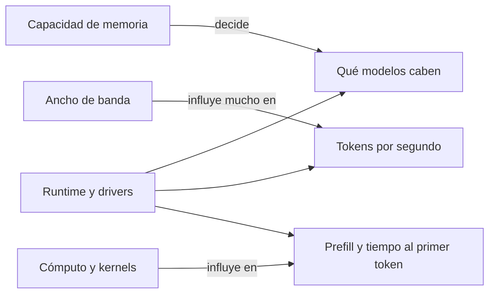
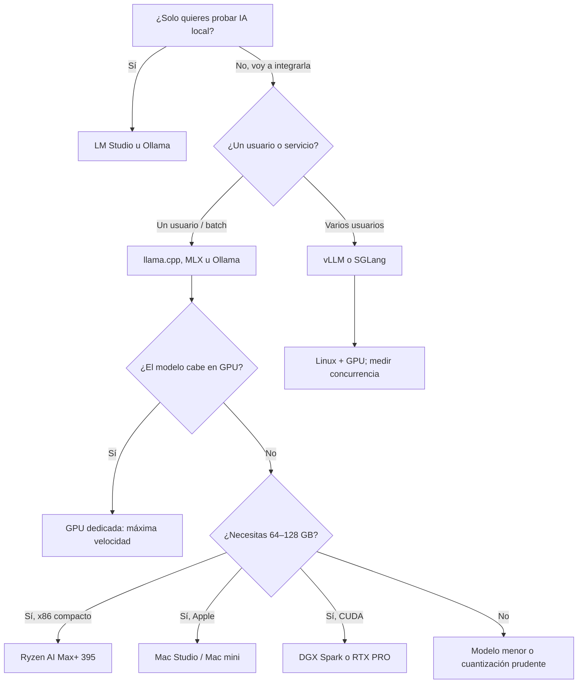

# 2025–2026 — Cómo correr IA local: opciones, máquinas y límites

> **Fotografía revisada el 26 de agosto de 2026.** Las familias de hardware y los principios de memoria duran más que los modelos comerciales concretos. Comprueba siempre compatibilidad del runtime, RAM/VRAM realmente utilizable y benchmarks del equipo exacto antes de comprar.

Ejecutar una IA en local ya no significa necesariamente esperar minutos a que una CPU termine una frase. Un portátil Apple Silicon, un PC con una GPU de consumo, un mini PC con mucha memoria unificada o una estación compacta como DGX Spark pueden ofrecer experiencias útiles. Pero ninguno convierte automáticamente un modelo local en el equivalente offline del mejor servicio cloud: normalmente se usan modelos menores, cuantizados y con menos capacidad para tareas largas, multimodales o agénticas.

## Las cuatro preguntas que deciden si funciona

### 1. ¿Cabe el modelo?

El mínimo teórico para los pesos es:

```text
memoria de pesos ≈ parámetros × bits / 8
```

Un 32B a 4 bits necesita unos 16 GB solo para pesos. Todavía faltan metadatos de cuantización, buffers, runtime, sistema operativo y **KV cache**. Por eso “tengo 16 GB” no significa “puedo usar cómodamente un 32B Q4”.

| Tamaño del modelo | Pesos Q4 teóricos | Presupuesto local prudente | Lectura práctica |
|---:|---:|---:|---|
| 3–4B | 1,5–2 GB | 3–5 GB | Portátiles modestos, móvil y tareas estrechas |
| 7–8B | 3,5–4 GB | 5–8 GB | Punto de entrada útil para chat, extracción y código ligero |
| 14B | 7 GB | 9–12 GB | Más calidad, aún razonable en hardware de consumo |
| 32B | 16 GB | 20–26 GB | Empieza a exigir GPU grande o memoria unificada |
| 70B | 35 GB | 42–50 GB | Apple Silicon alto, Ryzen AI Max o varias GPU |
| 120B | 60 GB | 72–90 GB | Estación de 96–128 GB o más; la velocidad puede ser baja |
| 200B | 100 GB | Más de 120 GB | Solo con cuantización agresiva y contexto controlado en 128 GB |

Son órdenes de magnitud, no garantías. Arquitectura, vocabulario, cuantización, contexto y backend cambian el resultado. En un **Mixture of Experts**, los parámetros activos reducen cómputo por token, pero normalmente todos los expertos deben caber en memoria.

### 2. ¿A qué velocidad se mueve la memoria?

Durante la generación, el sistema lee una gran parte de los pesos para producir cada token. Por eso el **ancho de banda de memoria** suele importar más que los TOPS anunciados. Una GPU con 32 GB muy rápidos puede generar un 32B más deprisa que una APU con 128 GB; la APU, sin embargo, puede cargar un 70B que no cabe en la GPU.



### 3. ¿Existe un backend maduro?

Una cifra de hardware no sirve si PyTorch, llama.cpp o el motor elegido no aprovechan el chip. CUDA continúa siendo la ruta con compatibilidad más amplia; Apple tiene Metal y MLX; AMD combina ROCm y Vulkan, con soporte que depende de sistema operativo y modelo de GPU. La [documentación de Ollama](https://docs.ollama.com/gpu) muestra bien esta fragmentación: CUDA y Metal son rutas estables, mientras que el soporte Vulkan sigue evolucionando.

### 4. ¿Qué calidad necesitas?

La pregunta no es solo “¿arranca?”. Un SLM puede resumir, clasificar, extraer JSON, transcribir o completar código con gran utilidad. Puede fallar más que un modelo frontier en planificación larga, conocimiento raro, uso preciso de herramientas, visión compleja o corrección de repositorios grandes. La evaluación debe usar trabajo real, no una conversación que “parece inteligente”.

## Las rutas disponibles hoy

### Reutilizar CPU y RAM

`llama.cpp` nació con una ruta CPU muy portable y sigue siendo la forma más universal de empezar. Un equipo con 16–32 GB puede ejecutar modelos pequeños cuantizados; con 64 GB puede cargar modelos mayores, pero cargar no implica velocidad interactiva.

**Encaja para:** aprender, procesamiento por lotes sin prisa, automatizaciones estrechas y aprovechar hardware existente.

**Límite:** la RAM convencional ofrece capacidad barata, pero mucho menos ancho de banda que una GPU moderna. El *prompt* largo y la generación pueden sentirse lentos.

### PC con GPU dedicada

Es la ruta de mayor velocidad por euro cuando el modelo cabe en VRAM. Una GeForce RTX 5090 ofrece 32 GB GDDR7; una RTX PRO 6000 Blackwell sube a 96 GB, 1.792 GB/s y 600 W, ya en territorio profesional. Fuentes: [RTX 5090](https://www.nvidia.com/en-us/geforce/graphics-cards/50-series/rtx-5090/) y [RTX PRO 6000](https://www.nvidia.com/en-us/products/workstations/professional-desktop-gpus/rtx-pro-6000/).

**Encaja para:** generación rápida, difusión, visión, fine-tuning, desarrollo CUDA y servidores con concurrencia.

**Límites:** VRAM cara, consumo, calor y ruido. Una 5090 puede ser rapidísima con un 14–32B, pero sus 32 GB no alojan cómodamente un 70B Q4 completo. Dividir entre varias GPU añade coste y comunicaciones; la GeForce 5090 no tiene NVLink.

Las Radeon pueden resultar atractivas por memoria/precio, pero hay que verificar el modelo exacto en la matriz de ROCm o asumir una ruta Vulkan. “AMD” no equivale automáticamente a “ROCm compatible”.

### Apple Silicon: Mac mini, MacBook y Mac Studio

CPU y GPU comparten memoria unificada. Esto evita la barrera fija de VRAM y hace que configuraciones con mucha RAM puedan alojar modelos grandes. MLX está diseñado para esta arquitectura, y `llama.cpp`, Ollama y LM Studio también aprovechan Metal. [Apple describe MLX](https://opensource.apple.com/projects/mlx/) como un framework optimizado para memoria unificada.

- **Mac mini M4 Pro:** hasta 64 GB y 273 GB/s; compacto y suficiente para modelos pequeños/medios, con 32B cuantizados como límite práctico cómodo según contexto. [Especificaciones oficiales](https://support.apple.com/es-es/121555).
- **Mac Studio M4 Max:** hasta 128 GB y 410–546 GB/s; más margen y velocidad para 70B cuantizados.
- **Mac Studio M3 Ultra:** hasta 512 GB y 819 GB/s; puede alojar modelos de cientos de miles de millones de parámetros, aunque quepan no significa que respondan como un servicio de centro de datos. [Apple anunció](https://www.apple.com/newsroom/2025/03/apple-unveils-new-mac-studio-the-most-powerful-mac-ever/) hasta 512 GB y modelos de más de 600B en memoria.

**Ventajas:** silencio, consumo contenido, gran capacidad unificada y stack MLX muy accesible.

**Límites:** memoria y GPU no ampliables, precio elevado en configuraciones grandes, ausencia de CUDA y menos opciones para ciertos proyectos de entrenamiento. La memoria también la usan macOS y las aplicaciones. En LLM, el trabajo principal suele recaer en GPU/Metal o en aceleradores integrados compatibles con MLX, no simplemente en el contador de TOPS del Neural Engine.

### Mini PCs con Ryzen AI Max+ 395

El nombre correcto del chip superior es **AMD Ryzen AI Max+ 395**; existe además la variante empresarial **Ryzen AI Max+ PRO 395**. Integra 16 núcleos Zen 5, Radeon 8060S de 40 unidades de cómputo, NPU de hasta 50 TOPS y hasta 128 GB LPDDR5x‑8000 en un bus de 256 bits. AMD especifica 256 GB/s en su [guía Ryzen AI Halo](https://developer.amd.com/playbooks/user-guide/) y un rango configurable de 45–120 W en la [ficha del procesador](https://www.amd.com/en/products/processors/laptop/ryzen/ai-300-series/amd-ryzen-ai-max-plus-395.html).

Equipos como el [Framework Desktop](https://frame.work/desktop) de 4,5 litros o la [HP Z2 Mini G1a](https://www.hp.com/in-en/products/workstations/product-details/2104054511) ofrecen configuraciones de 128 GB. Otros fabricantes usan el mismo “Strix Halo”; lo determinante es la memoria instalada, potencia sostenida, refrigeración y soporte del sistema.

**Por qué son interesantes:** combinan CPU x86, GPU integrada razonablemente potente y una reserva de memoria para GPU muy superior a la VRAM habitual. Permiten experimentar con 32B y 70B cuantizados en una caja pequeña sin el consumo de una GPU de 600 W.

**Límites:** 256 GB/s es mucha menos banda que una GPU discreta de gama alta; un modelo puede caber y aun así generar despacio. La LPDDR está soldada. ROCm en Ryzen ha mejorado, pero AMD documenta diferencias entre Linux y Windows y problemas de rendimiento en algunas cargas del 395; comprueba la [matriz y limitaciones actuales](https://rocm.docs.amd.com/projects/radeon-ryzen/en/docs-7.2.1/docs/limitations/limitationsryz.html). Para GGUF, llama.cpp u Ollama con ROCm/Vulkan suelen ser el punto de entrada más realista.

> **La NPU no es una tarjeta gráfica de 50 TOPS.** Está pensada para cargas compatibles y eficientes, pero muchos runtimes de LLM de escritorio generan sobre la Radeon integrada. No compares sus TOPS directamente con FP4 de NVIDIA, TFLOPS o tokens/s.

### NVIDIA DGX Spark y sistemas GB10

DGX Spark es un pequeño sistema ARM64 de 15 × 15 cm con el superchip Grace Blackwell GB10, 128 GB LPDDR5x coherentes, 273 GB/s, CUDA y ConnectX‑7. NVIDIA anuncia hasta 1 PFLOP FP4 con sparsity, inferencia de modelos de hasta 200B y fine-tuning de hasta 70B. Sus [especificaciones oficiales](https://www.nvidia.com/en-us/products/workstations/dgx-spark/) indican 140 W de TDP del SoC y una fuente de 240 W.

**Por qué es distinto:** no es solo memoria grande; trae el ecosistema NVIDIA —CUDA, contenedores, PyTorch y TensorRT‑LLM— en una estación compacta. Es útil para desarrollar localmente algo que luego se moverá a infraestructura NVIDIA.

**Límites:** usa ARM64, por lo que una dependencia binaria x86 puede necesitar alternativa o recompilación. Sus 273 GB/s están muy lejos de la banda de una GPU profesional con GDDR7/HBM. El “1 PFLOP” es un pico FP4 con condiciones concretas, no una medida de tokens/s ni equivalente a una DGX de centro de datos. “Hasta 200B” expresa que el modelo puede caber bajo determinadas precisiones; no promete una conversación rápida con contexto largo.

Se pueden enlazar dos unidades para modelos mayores, pero eso no suma memoria como si fuera una única pastilla sin coste: particionar el modelo y comunicar nodos añade complejidad y latencia.

## Comparativa rápida de hardware

| Clase | Memoria relevante | Banda indicada | Zona cómoda orientativa | Ventaja | Límite dominante |
|---|---:|---:|---|---|---|
| CPU/RAM existente | 16–64 GB | Muy variable | 3–14B Q4 | Coste inicial mínimo | Velocidad |
| Mac mini M4 Pro | 24–64 GB unificados | 273 GB/s | 7–32B Q4 | Compacto, MLX/Metal | Memoria no ampliable |
| Ryzen AI Max+ 395 | 64–128 GB unificados | 256 GB/s | 14–70B Q4 | Mucha memoria en mini PC x86 | Drivers y banda |
| GeForce RTX 5090 | 32 GB VRAM | GDDR7 de alta banda | 7–32B Q4 | Velocidad y CUDA | Capacidad, 575 W |
| Mac Studio M4 Max | 36–128 GB unificados | 410–546 GB/s | 14–70B Q4 | Capacidad, silencio, MLX | Precio y ecosistema Metal |
| DGX Spark | 128 GB unificados | 273 GB/s | 32–120B Q4 | Memoria + stack CUDA | Banda y ARM64 |
| RTX PRO 6000 | 96 GB VRAM | 1.792 GB/s | 32–120B Q4 | Velocidad, VRAM y CUDA | Coste y 600 W |
| Mac Studio M3 Ultra | 96–512 GB unificados | 819 GB/s | 70B y modelos mayores | Capacidad excepcional | Coste; no CUDA |

“Zona cómoda” reserva margen y supone uso interactivo individual. Un contexto grande, multimodalidad, varios usuarios o fine-tuning cambian el cálculo. Las cifras de 200B/600B de fabricantes describen capacidad máxima bajo condiciones seleccionadas, no la recomendación de esta tabla.

## Qué runtime elegir

| Runtime | Cuándo elegirlo | Fortalezas | Limitaciones |
|---|---|---|---|
| [LM Studio](https://lmstudio.ai/docs/app/system-requirements) | Quieres interfaz y servidor local sin configurar demasiado | Descarga, chat, estimación de memoria y API; macOS/Windows/Linux | Menos automatizable que una stack montada a medida |
| [Ollama](https://docs.ollama.com/gpu) | Quieres una API local sencilla para aplicaciones | Instalación simple, catálogo, CUDA/Metal/ROCm y Vulkan | Abstrae decisiones; no siempre da el máximo rendimiento |
| [`llama.cpp`](https://github.com/ggml-org/llama.cpp) | Necesitas GGUF, portabilidad y control fino | CPU, CUDA, Metal, Vulkan y cuantizaciones; servidor incluido | Opciones y builds pueden resultar complejos |
| [MLX / MLX‑LM](https://github.com/ml-explore/mlx-lm) | Trabajas exclusivamente con Apple Silicon | Optimización nativa, cuantización y fine-tuning accesible | Ecosistema Apple, formatos/conversiones propios |
| [vLLM](https://docs.vllm.ai/en/latest/getting_started/installation/index.html) | Sirves muchos usuarios o necesitas batching | Throughput, PagedAttention, API compatible y múltiples backends | Instalación más exigente; no siempre ideal para chat individual |
| [SGLang](https://github.com/sgl-project/sglang) | Construyes serving agéntico y salidas estructuradas a escala | Caché, programación de generación y rendimiento | Requiere más operación y comprobar backend/modelo |
| TensorRT‑LLM | Exprimir hardware NVIDIA estable | Kernels y cuantizaciones NVIDIA optimizadas | Conversión, compilación y dependencia de NVIDIA |

En Windows, LM Studio y Ollama reducen fricción. En macOS, MLX y Metal son las rutas naturales. Para un servidor Linux NVIDIA, vLLM/SGLang suelen tener más sentido. En AMD, revisa antes la combinación exacta de GPU, versión ROCm, kernel y runtime.

## Las limitaciones que se olvidan

### Cuantización no es gratis

Q4 suele ser un buen punto de partida, pero puede degradar código, idiomas menos representados, extracción exacta y modelos pequeños. Q2/Q3 permiten presumir de que un modelo “cabe”, a costa de una pérdida que puede inutilizar la tarea. Evalúa varias cuantizaciones de la misma revisión.

### El contexto también ocupa memoria

La KV cache crece con longitud, capas, batch y precisión. Un modelo que arranca con 4K puede quedarse sin memoria a 64K. Reducir contexto, cuantizar KV o usar GQA ayuda, pero puede afectar recuperación y calidad.

### Tokens por segundo no cuentan toda la espera

- **TTFT:** cuánto tarda en leer el prompt y empezar.
- **Decode:** velocidad una vez comienza a escribir.
- **Prompt processing:** crítico para repositorios o documentos largos.
- **Concurrencia:** dos usuarios pueden reducir mucho la velocidad individual.

Compara con el mismo prompt, contexto, cuantización, runtime y temperatura. Una cifra aislada de Reddit o de un fabricante no permite decidir.

### Local no significa automáticamente privado

Los pesos pueden estar en tu equipo mientras la interfaz comprueba actualizaciones, descarga modelos, usa búsqueda web o envía telemetría. Para datos sensibles, verifica tráfico, almacenamiento de chats, licencia, cifrado, permisos y aislamiento. Un modelo local conectado al shell o a MCP conserva todos los riesgos de un agente con herramientas.

### El modelo no incluye el producto cloud

Ejecutar pesos abiertos no reproduce búsqueda, memoria, intérprete de código, voz, visión, moderación ni el *harness* agéntico de un servicio comercial. Hay que construir y evaluar esas capas.

### Fine-tuning exige más que inferencia

Que un 70B Q4 pueda inferir no significa que puedas entrenarlo. Gradientes, estados del optimizador y activaciones multiplican memoria. LoRA/QLoRA reducen el coste, pero siguen necesitando datasets, checkpoints, tiempo y un backend compatible.

## Árbol de decisión práctico



## Benchmark antes de comprar

1. Elige tres modelos candidatos: pequeño, medio y máximo tolerable.
2. Descarga una cuantización real y calcula pesos + 20–30 % de margen.
3. Reúne 20–100 tareas representativas y define qué es correcto.
4. Mide TTFT, tokens/s, memoria pico, energía y tiempo humano de revisión.
5. Prueba el contexto habitual y el peor caso, no solo un “hola”.
6. Repite con la misma versión de runtime y backend en cada equipo.
7. Cuenta ruido, calor, consumo en reposo/carga, garantía y posibilidad de ampliar.
8. Compara el coste total con una API durante 2–3 años; incluye tu tiempo de operación.

## Qué puede estandarizarse en los próximos años

La IA local con SLM probablemente crecerá porque varias curvas avanzan a la vez:

- modelos pequeños mejor entrenados y especializados;
- cuantizaciones con menor pérdida;
- memoria unificada de mayor capacidad;
- kernels portables y runtimes con APIs compatibles;
- *speculative decoding*, cachés y routing entre modelos;
- sistemas operativos que exponen aceleradores de forma más uniforme;
- presión por privacidad, coste predecible y funcionamiento offline.

Pero no hay garantía de que el modelo local persiga siempre a la frontera cloud. Los centros de datos también mejoran, y los modelos más capaces consumen más cómputo en inferencia. El resultado más probable es **híbrido**: un SLM local clasifica, recupera información, protege datos o ejecuta tareas repetitivas; un modelo remoto se reserva para casos complejos y verificaciones difíciles.

## Idea para recordar

> El mejor ordenador para IA local no es el que anuncia más TOPS: es el que puede alojar tu modelo, mover sus pesos con suficiente velocidad y ejecutarlo con un runtime estable dentro de tu presupuesto de calidad, energía y mantenimiento.

Continúa con [cuantización y formatos](02-cuantizacion-y-formatos.md), [el motor de inferencia](03-inferencia-flashattention-y-kv-cache.md) y el [laboratorio de benchmarking local](../10-laboratorios/02-benchmark-de-cuantizacion.md).
