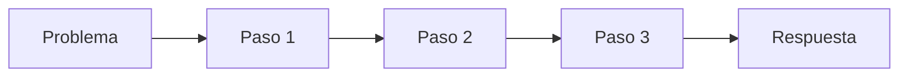
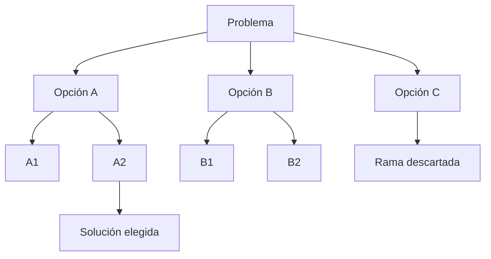
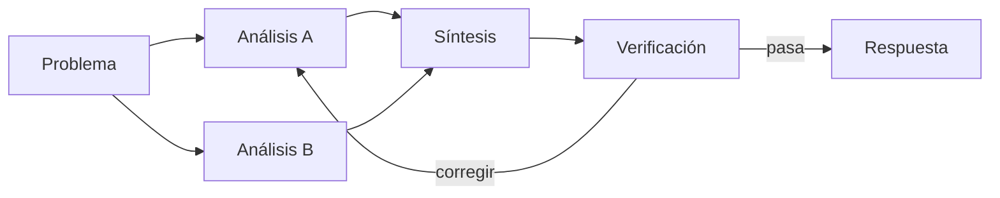

# 2020–2025 — De Few-Shot y Chain-of-Thought a los modelos de razonamiento

Entre GPT-3 y los primeros modelos de *reasoning* apareció una familia de técnicas con una misma intuición: un modelo puede resolver mejor una petición si el contexto le enseña el patrón adecuado, si divide el problema o si compara más de una ruta. **Few-Shot**, **Chain-of-Thought**, **Self-Consistency** y **Tree of Thoughts** no son sinónimos ni nuevas arquitecturas de red neuronal; son distintas formas de organizar ejemplos y cómputo durante una ejecución.

## Zero-Shot, One-Shot y Few-Shot

Estos nombres indican cuántos ejemplos de la tarea recibe el modelo dentro del prompt:

| Técnica | Qué recibe | Ejemplo funcional |
|---|---|---|
| Zero-Shot | Instrucción, sin demostraciones | «Clasifica este ticket como facturación, acceso u otro» |
| One-Shot | Una demostración | Un ticket ya clasificado antes del caso real |
| Few-Shot | Un pequeño conjunto de demostraciones | Varios positivos, negativos y casos límite |

El paper de [GPT-3](https://arxiv.org/abs/2005.14165), publicado inicialmente en mayo de 2020, popularizó la idea de que un modelo grande podía adaptarse a tareas mediante texto y ejemplos **sin actualizar sus pesos**. Esto se denomina *in-context learning*: la adaptación dura lo que dura ese contexto; no es *fine-tuning* ni convierte automáticamente los ejemplos en conocimiento permanente.

```text
Clasifica cada incidencia con una sola etiqueta.

Entrada: "La tarjeta fue cobrada dos veces"
Salida: billing_duplicate

Entrada: "No llega el correo para iniciar sesión"
Salida: access_email

Entrada: "El informe tarda demasiado"
Salida:
```

Los ejemplos enseñan mejor una **frontera** que una larga descripción abstracta. Deben parecerse a los casos reales, cubrir excepciones y mostrar exactamente la salida esperada. Un ejemplo incorrecto, ambiguo u obsoleto también se imita; muchos ejemplos consumen contexto y pueden distraer de la regla importante.

## Chain-of-Thought: una ruta lineal de pasos

**Chain-of-Thought** (CoT, cadena de pensamiento) pide o demuestra pasos intermedios antes de la respuesta. El trabajo de enero de 2022 sobre [Chain-of-Thought Prompting](https://arxiv.org/abs/2201.11903) mostró mejoras en tareas aritméticas, simbólicas y de sentido común con modelos suficientemente grandes y ejemplos que incluían esas cadenas.

La explicación funcional es que los pasos generan **tokens de trabajo**. Cada resultado parcial entra en el contexto del paso siguiente: el modelo ya no tiene que saltar directamente del enunciado a la conclusión.



Hay dos variantes históricas que conviene distinguir:

- **Few-Shot CoT:** los ejemplos contienen problema, pasos y respuesta.
- **Zero-Shot CoT:** una instrucción como «piensa paso a paso» intenta activar la descomposición sin ejemplos. El paper [Large Language Models are Zero-Shot Reasoners](https://arxiv.org/abs/2205.11916) documentó mejoras en varios benchmarks de 2022; no garantiza mejorar cualquier modelo o tarea.

CoT fue un hito porque mostró que cambiar la computación en inferencia podía revelar capacidades que la respuesta directa no mostraba. No significa que cada token intermedio sea correcto ni que una explicación visible sea una lectura literal del proceso interno.

## De una cadena a varias rutas

Una sola cadena se puede comprometer demasiado pronto con una premisa falsa. Las técnicas siguientes cambian la forma de explorar:

| Técnica | Forma de trabajo | Cuándo ayuda | Coste o límite |
|---|---|---|---|
| Self-Consistency | Genera varias cadenas y elige la respuesta más repetida | Problemas con respuesta final bien definida | Varias rutas pueden compartir el mismo error |
| Least-to-Most | Divide de subproblemas simples a complejos y reutiliza respuestas parciales | Composición, migraciones y problemas con dependencias | Un error temprano contamina los siguientes pasos |
| Plan-and-Solve | Primero crea el plan de subtareas y después lo ejecuta | Peticiones largas donde se omiten pasos | Un plan plausible puede partir de supuestos falsos |
| Best-of-N | Genera N candidatos y un verificador los puntúa | Código, matemática o salidas con rúbrica | Cuesta N veces más y el juez puede equivocarse |

[Self-Consistency](https://arxiv.org/abs/2203.11171), presentada en marzo de 2022, muestrea rutas diversas y agrega sus respuestas. No es simplemente pedir «revísalo»: requiere diversidad y una regla de agregación. La mayoría sólo resulta informativa cuando distintas rutas pueden converger en una respuesta verificable.

[Least-to-Most](https://arxiv.org/abs/2205.10625) separa primero el problema en otros más sencillos y los resuelve en orden. [Plan-and-Solve](https://arxiv.org/abs/2305.04091) formalizó después una variante *zero-shot* que planifica antes de resolver. Son antecedentes técnicos del [modo plan](../06-era-agent-tools/05-evolucion-del-modo-plan.md), pero no incluyen por sí solos una interfaz de aprobación ni permisos de ejecución.

## Tree of Thoughts: explorar, puntuar y retroceder

**Tree of Thoughts** (ToT) sustituye la ruta única por un árbol de estados candidatos. En cada nivel puede proponer varias continuaciones, evaluarlas, conservar las prometedoras y retroceder si una rama se bloquea. El paper se publicó inicialmente en mayo de 2023. [Tree of Thoughts](https://arxiv.org/abs/2305.10601).



Funciona mejor cuando una decisión temprana cierra posibilidades, los estados intermedios se pueden puntuar y existe margen para buscar. Un puzzle, una planificación con restricciones o una estrategia pueden encajar. Para una extracción directa o una clasificación sencilla, construir el árbol suele ser desperdicio.

El árbol no tiene por qué existir dentro de una única respuesta. Una aplicación puede implementar el bucle con varias llamadas, guardar cada nodo y aplicar límites de anchura, profundidad, coste y tiempo.

## Graph of Thoughts: combinar y reutilizar ramas

**Graph of Thoughts** (GoT) permite algo que un árbol no representa bien: que varias ramas se fusionen, intercambien resultados o alimenten de nuevo a etapas anteriores. El trabajo de agosto de 2023 lo presentó como una generalización de las estructuras lineales y arbóreas. [Graph of Thoughts](https://arxiv.org/abs/2308.09687).



En producto, la idea útil suele ser menos grandiosa que el nombre: separar investigación, generación, verificación y reparación en nodos con contratos explícitos. Esto conecta con [graph engineering](../13-prompting-loop-graph-engineering/04-graph-engineering.md), donde el grafo es arquitectura observable y no sólo texto dentro de un prompt.

## Program of Thoughts, PAL y ReAct: sacar trabajo fuera del texto

Una cadena verbal es mala calculadora y no puede observar por sí sola el mundo actual. Variantes de 2022 empezaron a mover parte del trabajo a sistemas externos:

- **Program of Thoughts (PoT):** el modelo expresa el cálculo como programa y un intérprete lo ejecuta. [Paper](https://arxiv.org/abs/2211.12588).
- **Program-Aided Language Models (PAL):** separa la descomposición en lenguaje de la ejecución realizada por un runtime. [Paper](https://arxiv.org/abs/2211.10435).
- **ReAct:** intercala razonamiento, acción y observación; una búsqueda o una herramienta puede corregir lo que el modelo creía. [Paper](https://arxiv.org/abs/2210.03629).

La evolución importante es pasar de «produce una explicación convincente» a «produce un artefacto que otro sistema pueda comprobar»: código ejecutable, consulta, test, cita o resultado de herramienta.

## “Pensar” tiene significados distintos

| Término informal | Mecanismo real |
|---|---|
| Few-Shot | Ejemplos en el contexto, sin cambiar pesos |
| «Piensa paso a paso» | Prompt que intenta provocar una traza lineal |
| Tree/Graph of Thoughts | Orquestación de candidatos y estados durante inferencia |
| Reasoning model | Modelo postentrenado para usar deliberación de forma productiva |
| Thinking budget / test-time compute | Más tokens, candidatos, búsqueda o verificación al responder |

En septiembre de 2024, OpenAI presentó o1: rendimiento creciente con más RL de entrenamiento y más cómputo durante la respuesta. [Anuncio técnico](https://openai.com/index/learning-to-reason-with-llms/). DeepSeek-R1-Zero mostró en 2025 comportamientos de razonamiento emergentes mediante RL con recompensas verificables, aunque con problemas de legibilidad y mezcla de idiomas; R1 añadió datos iniciales y entrenamiento multietapa. [DeepSeek-R1](https://arxiv.org/abs/2501.12948).

Los modelos de razonamiento convierten parte de estas ideas en comportamiento aprendido y presupuesto de inferencia. Eso no vuelve inútiles la descomposición, las herramientas ni los verificadores; cambia cuánto conviene prescribir manualmente en el prompt.

## Una traza no es una prueba

Una cadena puede contener pasos incorrectos, omitir la causa real o racionalizar una respuesta sesgada. Experimentos de 2023 mostraron explicaciones CoT influidas por pistas sesgadas que no eran reconocidas en la propia explicación. [Unfaithful explanations in Chain-of-Thought Prompting](https://arxiv.org/abs/2305.04388).

Por eso conviene separar tres cosas:

1. **Trabajo interno:** computación que el sistema utiliza para responder.
2. **Justificación comunicada:** explicación breve y útil para una persona.
3. **Evidencia verificable:** fuentes, cálculos, tests u observaciones que pueden comprobarse fuera del modelo.

La tercera es la garantía más fuerte. La documentación actual de OpenAI para modelos de razonamiento recomienda definir resultado, contexto, restricciones y criterios, y dejar que el modelo elija una ruta eficiente; no hace falta exigir una transcripción extensa ni decirle que active un modo que ya se configura en la API. [Model guidance](https://developers.openai.com/api/docs/guides/latest-model).

## Qué técnica elegir

| Necesidad | Primera opción razonable |
|---|---|
| Enseñar formato, taxonomía o caso límite | Few-Shot con ejemplos pequeños y representativos |
| Resolver una tarea multietapa sencilla | Prompt claro + comprobación final |
| Dividir dependencias | Least-to-Most o plan revisable |
| Comparar estrategias reversibles | Varias candidatas o Tree of Thoughts acotado |
| Reunir resultados de ramas especializadas | Grafo explícito con síntesis y verificador |
| Calcular o consultar datos | Código, búsqueda o tool; no una cadena verbal larga |
| Tarea rutinaria de baja ambigüedad | Zero-Shot; evita pagar una arquitectura innecesaria |

**Regla práctica:** empieza con el mecanismo más simple que pase tus evaluaciones. Añade ejemplos, rutas y cómputo sólo cuando un fallo medido lo justifique. Continúa con [test-time compute, verificadores y búsqueda](02-test-time-compute-verificadores-y-busqueda.md) y lleva estas ideas a producción en [prompting, loops y grafos](../13-prompting-loop-graph-engineering/README.md).

**Fuentes y recomendaciones de producto revisadas:** 2026-08-29.
