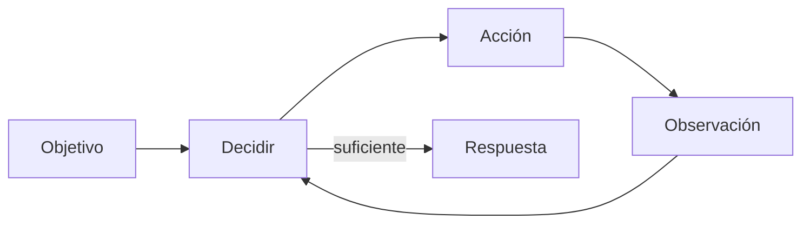

# 2022–2024 — De generar texto a usar herramientas

Un LLM solo produce tokens. Para actuar, un **harness** interpreta una salida estructurada, ejecuta código autorizado y devuelve la observación.

## Function calling

En 2023 OpenAI expuso funciones descritas con JSON Schema: el modelo podía elegir una función y proponer argumentos. [Anuncio original](https://openai.com/index/function-calling-and-other-api-updates/).

```json
{
  "name": "get_weather",
  "arguments": {"city": "Madrid", "unit": "celsius"}
}
```

El modelo **no ejecuta** esto. La aplicación valida, autoriza, ejecuta y devuelve el resultado.

## ReAct

El patrón ReAct intercala razonamiento, acción y observación. Las acciones corrigen información que el modelo no tiene. [Paper ReAct](https://arxiv.org/abs/2210.03629).



Toolformer investigó modelos que aprenden cuándo y cómo llamar APIs mediante ejemplos autogenerados. [Toolformer](https://arxiv.org/abs/2302.04761).

## Qué convierte un LLM en agente

- objetivo;
- bucle de decisión;
- herramientas;
- memoria/estado;
- condición de parada;
- entorno y permisos;
- evaluación del progreso.

“Autónomo” es un grado, no un booleano. Un bot que llama al clima una vez tiene muy poca autonomía; un coding agent que trabaja horas, modifica archivos y coordina subagentes tiene mucha más.
