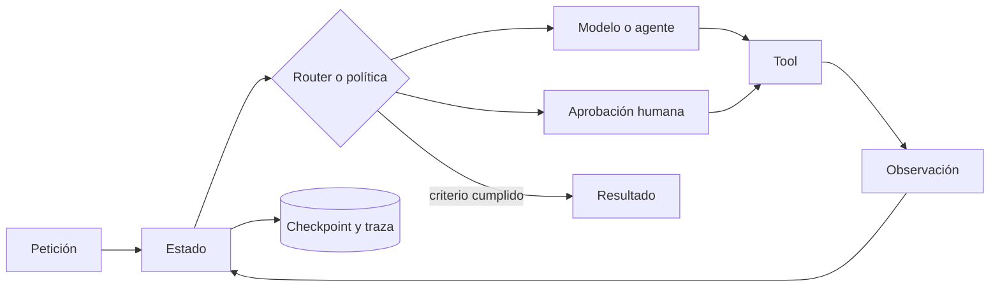
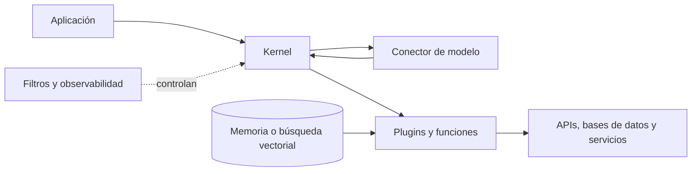
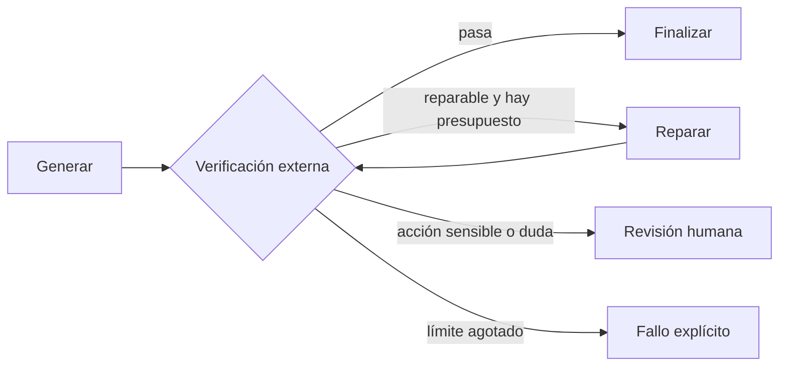

# Frameworks de agentes: LangGraph, CrewAI, AutoGen y el resto del mapa

Un modelo puede proponer la siguiente acción, pero alguien tiene que guardar el estado, ejecutar la herramienta, devolver la observación, limitar los reintentos y decidir cuándo pedir ayuda humana. Un **framework de agentes** aporta piezas de software para construir ese bucle sin reimplementar toda la infraestructura.

No vuelve más inteligente al modelo. Hace más explícita —y, si se diseña bien, más observable y recuperable— la aplicación que lo rodea. Tampoco es obligatorio: un bucle pequeño con funciones normales suele ser el mejor punto de partida.

## Qué problema resuelve realmente

Una aplicación agéntica suele necesitar varias capacidades:

1. recibir una petición y convertirla en estado estructurado;
2. decidir el siguiente paso;
3. llamar una herramienta con argumentos validados;
4. incorporar la observación sin confundirla con una instrucción confiable;
5. persistir un *checkpoint* para poder reanudar;
6. aplicar límites de coste, tiempo, permisos y reintentos;
7. solicitar aprobación antes de un efecto sensible;
8. trazar lo sucedido y evaluarlo después.

Un framework empaqueta una parte de estas necesidades. Ninguno elimina la obligación de diseñar permisos, identidad, aislamiento, idempotencia y evaluaciones.



## Framework, SDK, runtime, plataforma y protocolo

Estos términos se mezclan con frecuencia, pero no son intercambiables.

| Capa | Qué aporta | Ejemplo de pregunta |
|---|---|---|
| SDK o librería | Clases y funciones para agentes, tools, mensajes y salidas | «¿Cómo declaro una herramienta tipada?» |
| Runtime de orquestación | Estado, transiciones, concurrencia, checkpoints y reanudación | «¿Cómo continúo después de un fallo?» |
| *Harness* agéntico | Bucle de ejecución más completo, políticas y contexto operativo | «¿Qué entorno necesita el agente para trabajar?» |
| Plataforma | Despliegue, almacenamiento, observabilidad y gestión operativa | «¿Cómo lo sirvo y monitorizo?» |
| Protocolo | Contrato de interoperabilidad entre sistemas | «¿Cómo descubre una tool MCP o se comunica mediante A2A?» |

**MCP y A2A no compiten con LangGraph o CrewAI.** Un framework puede usar esos protocolos. Del mismo modo, un proveedor de modelos puede integrarse en varios frameworks.

## Mapa rápido de opciones

Las capacidades cambian deprisa. Esta tabla describe la orientación principal documentada a **29 de agosto de 2026**, no una clasificación absoluta.

| Proyecto | Abstracción dominante | Encaja especialmente cuando… | Coste o cautela |
|---|---|---|---|
| [LangGraph](https://langchain-ai.github.io/langgraph/) | Grafo de estado y runtime de larga duración | necesitas control explícito, persistencia, streaming y *human-in-the-loop* | obliga a modelar estados y transiciones; esa ceremonia puede sobrar en un flujo corto |
| [CrewAI](https://docs.crewai.com/) | Agentes con roles, *crews* y *flows* | el equipo entiende bien la metáfora de especialistas y quiere combinarla con flujos estructurados | es fácil crear «personajes» que conversan sin aportar una división real del trabajo |
| [AutoGen](https://microsoft.github.io/autogen/) | Conversaciones multiagente y un núcleo dirigido por eventos | investigas patrones multiagente, mensajes, equipos o sistemas distribuidos | hay que distinguir AgentChat, Core y Extensions, y considerar la evolución hacia Microsoft Agent Framework |
| [Microsoft Agent Framework](https://learn.microsoft.com/agent-framework/) | Agentes, workflows, middleware, memoria y alojamiento | trabajas en Python/C#, Azure o un entorno Microsoft y necesitas una ruta empresarial actual | es un ecosistema más nuevo y su superficie puede evolucionar durante las migraciones |
| [Semantic Kernel](https://learn.microsoft.com/semantic-kernel/) | Kernel de integración, servicios de IA, plugins, filtros y function calling | quieres incorporar modelos a aplicaciones C#, Python o Java y reutilizar APIs y servicios empresariales | no debe confundirse con Microsoft Agent Framework; algunas capas agénticas y de procesos siguen evolucionando |
| [OpenAI Agents SDK](https://openai.github.io/openai-agents-python/) | `Agent`, `Runner`, tools, handoffs, guardrails y sesiones | quieres una capa relativamente ligera, con trazas y patrones de delegación directos | la integración más natural es con la plataforma OpenAI; valida la portabilidad que de verdad necesites |
| [Google ADK](https://adk.dev/) | Agentes y workflows en grafo, multiagente y despliegue | quieres varios lenguajes, sesiones, evaluación, MCP/A2A e integración con el ecosistema Google | su amplitud exige seleccionar solo las piezas necesarias |
| [PydanticAI](https://pydantic.dev/docs/ai/) | Python tipado, dependencias y salidas estructuradas | valoras contratos, validación, proveedores intercambiables y código Python explícito | el tipado no valida por sí solo que una respuesta sea cierta ni que una acción esté autorizada |
| [Mastra](https://mastra.ai/docs/) | Workflows TypeScript con ramas, bucles y suspensión | el producto es TypeScript y quieres agentes, workflows y MCP en la misma stack | comprueba madurez, persistencia y operación para tu carga concreta |
| [LlamaIndex Workflows](https://developers.llamaindex.ai/python/llamaagents/workflows/) | Pasos dirigidos por eventos junto a componentes de datos | el problema gira alrededor de documentos, recuperación, extracción o RAG | no conviertas todo problema de orquestación en uno de recuperación |

También existen opciones como **Haystack**. La lista correcta depende menos de cuántos nombres soporte un proyecto y más de si el runtime resuelve los fallos reales de tu aplicación.

## LangGraph: control explícito mediante estado

LangGraph trata la aplicación como un grafo. Los nodos leen y actualizan estado; las aristas determinan qué puede ocurrir después. Su documentación destaca ejecución durable, persistencia, streaming y participación humana para agentes de larga duración.

Es útil cuando el diagrama ya forma parte del requisito: investigar, redactar, verificar, reparar, pedir aprobación y publicar. Permite razonar sobre cada transición y reanudar desde un checkpoint en vez de repetir todo el trabajo.

El precio es que hay que diseñar el estado. Si el proceso solo necesita una llamada y una tool, envolverlo en un grafo puede añadir más conceptos que valor. LangGraph puede usarse sin LangChain, aunque está integrado con ese ecosistema.

## CrewAI: roles, crews y flows

CrewAI ofrece dos ideas complementarias:

- una **crew** coordina agentes con roles y tareas;
- un **flow** organiza eventos, rutas, estado, persistencia y reanudación.

La metáfora de equipo es accesible: investigador, redactor y revisor. Funciona si cada rol dispone de información, herramientas o criterios genuinamente distintos. Si todos reciben el mismo contexto y se preguntan mutuamente si están de acuerdo, el sistema multiplica tokens y latencia sin ganar independencia.

Para producción, el *flow* suele ser tan importante como la *crew*: contiene las partes deterministas, las condiciones de salida y los puntos de aprobación. Una regla útil es que **el código gobierne el proceso y el modelo resuelva la ambigüedad**.

## AutoGen y la transición de Microsoft

AutoGen popularizó la construcción de aplicaciones mediante agentes que conversan. Su documentación separa:

- **AgentChat**, una API de alto nivel para agentes únicos y equipos conversacionales;
- **Core**, un runtime dirigido por eventos para sistemas multiagente escalables;
- **Extensions**, integraciones de modelos, herramientas y ejecutores;
- **Studio**, una interfaz para prototipar y explorar configuraciones.

No conviene hablar hoy de «AutoGen de Microsoft» como si fuera una única recomendación inmutable. Microsoft también documenta **Microsoft Agent Framework**, con agentes, workflows, middleware, memoria, checkpoints, reanudación y alojamiento, y publica rutas de migración desde AutoGen y Semantic Kernel. Eso no convierte automáticamente a AutoGen en inútil o retirado: significa que un proyecto nuevo debe evaluar la dirección actual, el soporte y el coste de migración antes de comprometer su arquitectura.

## Semantic Kernel: integrar modelos con software empresarial

[Semantic Kernel](https://learn.microsoft.com/semantic-kernel/) es un SDK ligero de Microsoft para incorporar modelos a aplicaciones **C#, Python y Java**. No parte necesariamente de una «crew» de personajes: su centro es el **kernel**, un contenedor que reúne servicios de IA, plugins, configuración y filtros para que el código convencional pueda colaborar con un modelo.



| Pieza | Explicación funcional | Cautela |
|---|---|---|
| **Kernel** | Punto de composición y contenedor de dependencias para modelos, plugins y servicios | centralizar integraciones no equivale a centralizar autorización |
| **Conectores de IA** | Adaptadores para usar distintos servicios de chat, embeddings u otras capacidades | una API compatible no garantiza idéntico comportamiento entre modelos |
| **Plugins y `KernelFunction`** | Funciones descritas semánticamente que el modelo puede solicitar; pueden proceder de código nativo, OpenAPI o MCP | la descripción ayuda a elegir una función, pero no concede permisos ni valida su efecto |
| **Function calling** | El modelo elige una función y el runtime intercambia argumentos y resultados hasta obtener una respuesta o alcanzar un límite | exige validar argumentos, limitar iteraciones y hacer idempotentes las acciones repetibles |
| **Filtros** | Interceptan prompts y llamadas a funciones para registrar, modificar, rechazar o aplicar políticas | un filtro aislado no sustituye controles por identidad ni defensa en profundidad |
| **Memoria y búsqueda vectorial** | Recuperan información relevante mediante componentes configurados o funciones expuestas al modelo | registrar un vector store no hace que el kernel lo use automáticamente ni demuestra que el resultado sea pertinente |
| **Process Framework** | Modela procesos de negocio que combinan pasos de IA y código existente | Microsoft lo documenta actualmente como experimental; hay que comprobar versión y estabilidad antes de producción |

Un **plugin** es el puente más importante. Por ejemplo, una aplicación puede exponer `buscar_cliente`, `calcular_riesgo` y `crear_borrador`, pero reservar `aprobar_crédito` para una persona. Los nombres, descripciones, parámetros y efectos laterales deben ser claros: el modelo necesita saber qué hace la función, mientras que el runtime debe decidir si está autorizado a ejecutarla.

Los antiguos *planners* de Semantic Kernel popularizaron la idea de convertir un objetivo en pasos. En el uso actual, la documentación prioriza el **function calling nativo**: el modelo selecciona herramientas durante la conversación y la aplicación conserva los límites y el bucle de ejecución. Conviene evitar tutoriales antiguos que presentan clases de planificación retiradas o cambiantes como arquitectura recomendada.

### Dos nombres de Microsoft que conviene distinguir

**Semantic Kernel** sigue siendo el SDK de integración con su kernel, plugins, conectores, filtros y áreas de procesos o agentes. **Microsoft Agent Framework** es una oferta posterior y separada centrada en agentes y workflows, para la que Microsoft publica rutas de migración desde componentes agénticos de Semantic Kernel y AutoGen. Eso no significa que toda aplicación basada en Semantic Kernel deba reescribirse: un servicio que solo usa plugins, conectores y function calling puede seguir teniendo un límite arquitectónico razonable.

Para un proyecto nuevo, compara las versiones y el soporte de las capacidades concretas que necesitas. Semantic Kernel encaja especialmente bien si ya tienes servicios empresariales y dependencia inyectada en .NET, si necesitas C#/Python/Java o si quieres convertir APIs existentes en herramientas con una capa común. Unas pocas llamadas simples no necesitan ese armazón; un workflow durable complejo puede requerir además un runtime de estado, checkpoints y reanudación que haga explícito todo el proceso.

## OpenAI Agents SDK: agentes como herramientas o handoffs

El Agents SDK de OpenAI organiza la ejecución alrededor de agentes y un `Runner`. Integra tools, guardrails, sesiones y trazas, y documenta dos patrones de colaboración:

- **manager / agents as tools:** un coordinador conserva el control y llama especialistas como herramientas;
- **handoff:** un agente transfiere la conversación y el control a otro especialista.

El primer patrón facilita una salida coherente y una política central. El segundo permite que el especialista converse directamente con el usuario. En ambos casos, «delegar» no prueba que el especialista sea correcto: sus resultados siguen necesitando contratos y verificación.

## Google ADK: un kit amplio y multilenguaje

El Agent Development Kit de Google documenta workflows en grafo, sistemas multiagente, sesiones, memoria, compresión de contexto, caché, evaluación y despliegue. Su propuesta es independiente del modelo e incluye integraciones con modelos externos y locales, además de MCP y A2A.

Resulta atractivo cuando la interoperabilidad y varios lenguajes importan. La contrapartida de una caja de herramientas amplia es arquitectónica: adoptar ADK no obliga a usar todas sus abstracciones. Elige qué capa será responsable del estado, cuál de las herramientas y cuál de la operación para evitar duplicidades.

## PydanticAI, Mastra y LlamaIndex

**PydanticAI** se siente familiar en aplicaciones Python que ya usan tipos, validación y dependencias. Sus salidas estructuradas ayudan a detectar formas inválidas; sus tools y toolsets, MCP, grafos, persistencia y conexiones con sistemas de ejecución durable permiten crecer sin abandonar el enfoque *code-first*.

**Mastra** ocupa un espacio parecido para equipos TypeScript. Sus workflows expresan secuencias, paralelismo, ramas y bucles, y pueden suspenderse y reanudarse. Es una opción natural cuando compartir tipos y herramientas con una aplicación web vale más que entrar en un ecosistema Python.

**LlamaIndex Workflows** encaja especialmente bien cuando la aplicación nace alrededor de datos: ingestión, recuperación, documentos, agentes de consulta y RAG. Su modelo dirigido por eventos permite separar pasos, pero el diseño debe seguir distinguiendo la calidad del retrieval de la calidad de la orquestación.

## Cómo elegir sin casarte con el marketing

Haz estas preguntas sobre un caso concreto:

| Pregunta | Qué deberías comprobar |
|---|---|
| ¿El flujo es fijo o emergente? | pipeline/estado explícito frente a conversación abierta |
| ¿Un solo agente basta? | añade especialistas solo si cambian herramientas, contexto o criterios |
| ¿Cómo se reanuda? | checkpoints, versionado de estado y compatibilidad tras desplegar código nuevo |
| ¿Qué pasa al repetir una tool? | idempotencia, deduplicación y compensación de efectos |
| ¿Dónde viven permisos y secretos? | fuera del prompt, con identidad y alcance mínimos |
| ¿Cómo se revisa una acción? | aprobación con objetivo, argumentos y efecto visible |
| ¿Cómo se depura? | trazas exportables, correlación, estado por paso y reproducción |
| ¿Cómo se evalúa? | datasets propios, criterios duros, coste, latencia y tasa de recuperación |
| ¿Qué te ata al proveedor? | modelos, formato de mensajes, tools, estado, almacenamiento y hosting |
| ¿Qué protocolo necesita? | MCP para contexto/tools; A2A si aporta interoperabilidad entre agentes |

La neutralidad declarada no basta. Ejecuta una prueba con dos proveedores o intenta sustituir el almacenamiento: ahí aparecen los acoplamientos reales.

## Un experimento de selección reproducible

Implementa el mismo workflow de tamaño pequeño de tres maneras:

```text
entrada -> recuperar evidencia -> redactar -> verificar -> reparar o terminar
```

1. Escríbelo primero con funciones normales y un estado explícito.
2. Repite con los dos frameworks finalistas.
3. Usa el mismo modelo, herramientas, dataset y límites.
4. Interrumpe deliberadamente la ejecución después de recuperar evidencia.
5. Introduce un timeout, una salida mal formada y una tool duplicada.
6. Mide éxito de tarea, tokens, latencia, líneas de pegamento, recuperación y claridad de la traza.
7. Estima cuánto código propio desaparece y cuánto conocimiento específico del framework aparece.

El ganador no es el ejemplo con menos líneas en un tutorial. Es el sistema cuyo fallo puedes entender, contener y reanudar con el menor coste total.

## Anti-patrones frecuentes

### Teatro multiagente

Asignar nombres y personalidades no crea especialización. Sin herramientas, datos o criterios diferentes, varios agentes pueden amplificar el mismo error.

### Orquestación escondida en el prompt

«Reintenta tres veces y luego pide permiso» es una sugerencia textual. Un contador, una transición y un gate en código son controles verificables.

### Un supervisor todopoderoso

Si un solo modelo decide rutas, valida resultados y autoriza acciones, la arquitectura tiene varias cajas pero un único punto de fallo cognitivo.

### Confundir esquema con verdad

Una salida JSON válida puede contener una afirmación falsa. El esquema comprueba forma; las fuentes, tests o reglas de negocio comprueban contenido.

### Adoptar antes de medir

Los frameworks cambian APIs y nomenclatura. Encapsula sus tipos en los bordes, conserva tus estados de dominio y registra versiones para que una migración no reescriba toda la aplicación.

## Arquitectura mínima recomendable

Antes de crear un equipo de agentes, construye un grafo pequeño:



Después añade rutas solo cuando una evaluación revele una clase de error que el diseño actual no puede resolver. Un agente adicional es una dependencia probabilística adicional.

## Idea para recordar

**El modelo propone; el framework coordina; el runtime ejecuta; la política autoriza; las evals comprueban.** Elegir un framework consiste en decidir qué parte de esa responsabilidad quieres comprar ya resuelta y qué parte necesitas conservar bajo tu control.

Antes de llevar uno a producción, revisa [guardarraíles, evals y control de fallos](07-guardarrailes-evals-y-control-de-fallos.md). Continúa después con [Graph engineering: convertir el proceso en arquitectura](../13-prompting-loop-graph-engineering/04-graph-engineering.md) y [coding agents, multiagente y objetivos largos](../08-era-agentes-autonomos/01-coding-agents-multiagente-y-objetivos-largos.md).
