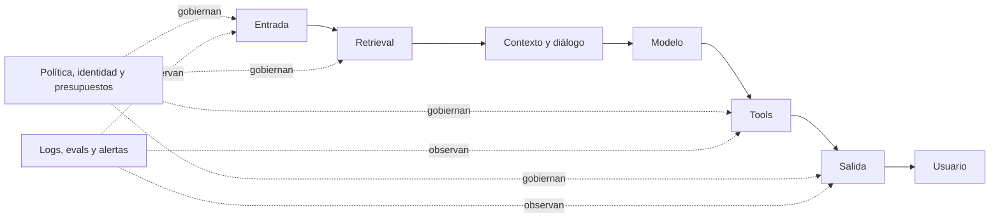
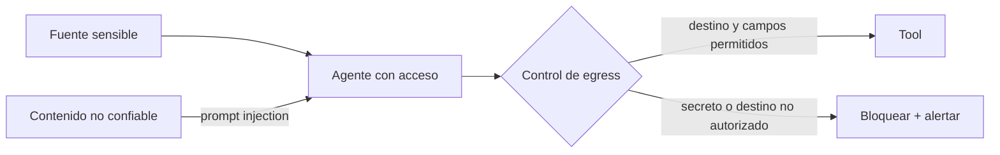
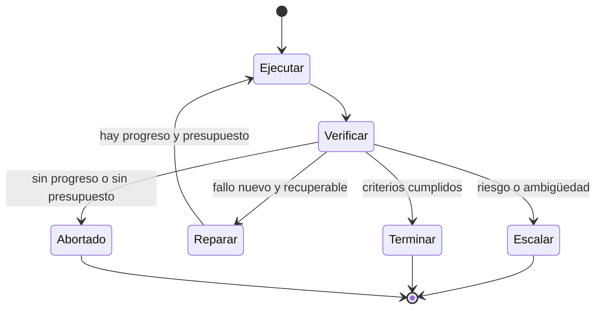

# Guardarraíles, evals y control de fallos

Un sistema de IA fiable no se obtiene añadiendo al prompt «no alucines» o «actúa de forma segura». Se construye colocando controles alrededor del modelo, midiendo si funcionan y definiendo qué ocurre cuando alguno falla. A esos controles se les suele llamar **guardarraíles** o *guardrails*.

Un guardarraíl no tiene que ser otro modelo. Puede ser un tipo, una lista de permisos, una consulta a una fuente, un límite de pasos, un sandbox, una aprobación humana o una regla que detiene la ejecución. Los controles deterministas son preferibles cuando la propiedad puede expresarse con código; los clasificadores y jueces LLM son útiles para criterios semánticos, pero también se equivocan.

## Qué es —y qué no es— un guardarraíl

Un guardarraíl contiene cuatro decisiones explícitas:

```text
riesgo -> punto de control -> criterio -> respuesta al fallo
```

Ejemplo:

```text
riesgo: transferencia no autorizada
punto: antes de ejecutar la tool bancaria
criterio: identidad válida + importe dentro de límite + aprobación fresca
fallo: no ejecutar, registrar y pedir revisión
```

Una instrucción blanda como «ten cuidado» puede orientar al modelo, pero no impide una acción. Una barrera dura vive fuera de su texto y no puede ser ignorada mediante prompting.

| No es suficiente | Control más fuerte |
|---|---|
| «No reveles secretos» | el modelo nunca recibe secretos que no necesita |
| «Usa solo estas herramientas» | el runtime expone únicamente esas tools |
| «No inventes» | evidencia obligatoria, verificador y abstención |
| «No repitas pasos» | contador, detección de progreso y *circuit breaker* |
| «Pide permiso» | gate de aprobación en código antes del efecto |
| «Devuelve JSON» | esquema validado y rechazo o reparación acotada |

## Defensa en profundidad: dónde colocar controles

No existe un filtro único que proteja toda la aplicación. La documentación de [NeMo Guardrails](https://docs.nvidia.com/nemo/guardrails/latest/about/rail-types.html) organiza los controles en entrada, retrieval, diálogo, ejecución y salida. A esa división conviene añadir la capa operativa.



### Entrada

Comprueba tamaño, formato, idioma soportado, contenido prohibido, datos personales y señales de abuso. Separa las instrucciones del usuario de documentos no confiables y limita frecuencia y presupuesto por identidad.

Un detector de *prompt injection* puede ayudar, pero no debe ser la única defensa. Asume que alguna entrada maliciosa pasará y limita lo que el agente puede hacer después.

### Retrieval y contexto

Aplica ACL antes de recuperar datos, conserva procedencia, filtra documentos caducados y marca el contenido recuperado como **datos**, no como nuevas instrucciones. Un fragmento relevante no es necesariamente verdadero, autorizado ni reciente.

Si el usuario no puede abrir un documento, el agente tampoco debería recuperarlo en su nombre. La base vectorial no sustituye el control de acceso del sistema original.

### Diálogo y estado

Valida transiciones, separa hechos de hipótesis y evita que una frase generada se convierta en permiso. Define estados terminales como `completed`, `blocked`, `needs_human` y `failed`; no mantengas una conversación indefinida esperando que el modelo decida cuándo parar.

### Ejecución de herramientas

Es la frontera más importante cuando una alucinación puede convertirse en acción:

- lista permitida de tools por tarea e identidad;
- argumentos con esquema y reglas de negocio;
- credenciales de mínimo privilegio;
- sandbox y límites de red o filesystem;
- simulación o *dry run* antes de acciones sensibles;
- idempotencia para que un reintento no duplique efectos;
- aprobación humana mostrando objetivo, argumentos y consecuencias;
- validación de la respuesta de la tool antes de devolverla al modelo.

El gate debe estar en el runtime. Si el modelo puede elegir una ruta alternativa para evitarlo, no era un gate.

### Salida

Comprueba esquema, políticas, datos sensibles, afirmaciones no soportadas y requisitos del producto. Una respuesta que falla no siempre debe bloquearse: puede repararse, reducirse a las partes verificadas o convertirse en una abstención útil.

### Operación

Añade cuotas, timeouts, cancelación, alertas, auditoría, gestión de secretos, rollback y un *kill switch*. Los logs de seguridad deben residir fuera del espacio que el agente puede modificar.

## Reducir alucinaciones sin prometer eliminarlas

«Sistema antialucinación» es una etiqueta demasiado fuerte. Ninguna técnica general garantiza que un LLM nunca invente. Conviene distinguir varios fallos:

| Fallo | Ejemplo | Mitigación principal |
|---|---|---|
| Conocimiento ausente | inventa una fecha | fuente actual o abstención |
| Retrieval fallido | no recupera el documento correcto | eval de recall, búsqueda híbrida, reranking |
| Contexto contaminado | un documento introduce una instrucción | procedencia, aislamiento y filtros de retrieval |
| Síntesis infiel | la fuente está, pero la contradice | verificación afirmación–evidencia |
| Cálculo o lógica | operación plausible pero incorrecta | intérprete, test, solver o regla determinista |
| Fuente obsoleta | responde un dato que cambió | frescura, fecha de corte y consulta en vivo |
| Exceso de confianza | oculta incertidumbre | salida con estados `supported`, `uncertain`, `unknown` |

### Grounding con procedencia

RAG solo ayuda si recupera evidencia adecuada y el generador la usa. Conserva para cada afirmación material el identificador del fragmento, versión o fecha y un pasaje de apoyo. Después comprueba por separado:

1. **retrieval:** ¿apareció la evidencia necesaria?;
2. **entailment:** ¿el fragmento sostiene realmente la afirmación?;
3. **frescura y autoridad:** ¿la fuente sirve para esta decisión?;
4. **cobertura:** ¿quedaron afirmaciones materiales sin soporte?

Una cita existente no demuestra soporte. Una página que abre puede decir lo contrario de la frase que acompaña.

### Herramientas antes que memoria paramétrica

Usa calculadora para aritmética, base de datos para estado, tests para código y una API autoritativa para datos cambiantes. El LLM puede decidir qué consultar y explicar el resultado; no necesita recrear una operación que otro sistema comprueba mejor.

### Abstención útil

Permite respuestas como:

```json
{
  "status": "insufficient_evidence",
  "known": ["..."],
  "missing": ["precio vigente", "jurisdicción"],
  "next_action": "consultar la fuente oficial"
}
```

Evalúa tanto la **falsa aceptación** —responder sin soporte— como la **falsa abstención** —negarse cuando había evidencia suficiente—. Un sistema que bloquea todo parece seguro, pero deja de ser útil.

### Verificación independiente

La crítica del mismo modelo puede mejorar forma y coherencia, pero comparte conocimiento y sesgos con el generador. Para afirmaciones importantes, añade una señal que no controle: fuente autoritativa, ejecución, test, segundo canal de datos, juez calibrado o revisión humana.

## Data exfiltration: cuando los datos salen por una ruta permitida

La **exfiltración de datos** ocurre cuando información a la que el sistema puede acceder termina en un destino no autorizado. No requiere romper el servidor. Un documento con prompt injection puede ordenar al agente que lea un secreto y lo incluya en:

- una URL o query de búsqueda;
- el cuerpo de una petición HTTP;
- un issue, email o mensaje externo;
- argumentos de una tool aparentemente legítima;
- una respuesta mostrada al usuario equivocado;
- trazas, analytics, errores o datasets de evaluación.



### Controles de fuente y destino

- clasifica los datos y propaga etiquetas de sensibilidad;
- recupera con identidad y ACL del usuario, no con una cuenta omnipotente;
- entrega al modelo el mínimo fragmento necesario;
- separa tools de lectura y escritura;
- usa listas permitidas de dominios, métodos y campos de salida;
- bloquea red arbitraria, URLs construidas por el modelo y canales encubiertos obvios;
- inspecciona argumentos y resultados antes de cruzar fronteras;
- solicita aprobación para publicar, enviar o compartir;
- redacta secretos y PII de logs, trazas y mensajes de error;
- añade casos de exfiltración directa e indirecta al red team.

Un detector de prompt injection no sustituye el control de egress. Diseña el sistema suponiendo que el contenido hostil puede llegar al agente.

## PII redaction, masking y pseudonimización

Sí es una técnica relevante para IA. **PII** (*personally identifiable information*) incluye datos que identifican o hacen identificable a una persona según el contexto: nombre, email, teléfono, documento, dirección, identificadores online y combinaciones de atributos.

La redacción puede aplicarse:

```text
entrada -> detectar PII -> redactar/tokenizar -> modelo
retrieval -> aplicar ACL -> minimizar fragmento -> modelo
salida -> comprobar PII -> permitir/redactar/bloquear
trazas y evals -> sanitizar antes de persistir/exportar
```

| Técnica | Resultado | Cuándo sirve | Riesgo |
|---|---|---|---|
| Redaction | elimina el valor | el dato no es necesario | pérdida irreversible de contexto |
| Masking | oculta una parte | mostrar últimos dígitos o formato | puede seguir siendo identificable |
| Reemplazo tipado | `<PERSON_1>`, `<EMAIL_1>` | conservar estructura lingüística | mapa de sustitución sensible |
| Pseudonimización/tokenización | ID estable separado | unir eventos sin exponer identidad directa | sigue pudiendo ser dato personal y requiere proteger el mapa |
| Hash | huella del valor | coincidencia limitada | valores predecibles pueden atacarse; usa sal y diseño correcto |
| Cifrado | valor reversible con clave | recuperación autorizada posterior | gestión de claves y permisos |

[Presidio](https://microsoft.github.io/presidio/) combina reconocedores, reglas y modelos para detectar y anonimizar PII, con operadores de reemplazo, redacción, máscara, hash o cifrado. Su propia documentación advierte que la detección automática no garantiza encontrar toda la información sensible.

### Diseñar la redacción correctamente

- define categorías, idiomas y formatos del dominio;
- combina regex/checksum para patrones rígidos con NER para lenguaje;
- evalúa precision y recall por categoría: DNI, email, persona, dirección…;
- prueba falsos positivos que alteren código, IDs técnicos o nombres de productos;
- conserva offsets o placeholders estables si la tarea necesita coherencia;
- no envíes PII a un servicio externo para decidir si es PII sin evaluar esa transferencia;
- aplica minimización y retención aunque el texto esté pseudonimizado;
- permite una ruta autorizada sin redacción cuando la finalidad legítima necesite el dato.

Redactar antes del prompt reduce exposición, pero no corrige accesos indebidos en la fuente ni elimina copias ya presentes en cachés, backups, índices vectoriales o logs.

## Evitar bucles infinitos y agentes que deambulan

Un agente no necesita repetir exactamente el mismo texto para estar atrapado. Puede alternar dos acciones, reformular el mismo plan o consumir nuevas páginas sin acercarse al objetivo.

Todo bucle debe tener:

- máximo de pasos, tiempo, tokens, coste y llamadas a tools;
- límite por tool y por tipo de error;
- estado de progreso medible;
- detección de repetición semántica o de estado;
- reintentos solo para fallos recuperables;
- cambio de estrategia tras fallos repetidos;
- ruta a persona, abstención o fallo explícito;
- posibilidad real de cancelación.



### Detección de no progreso

Define un vector observable:

```text
progreso = {
  requisitos_cumplidos: 7/10,
  tests_superados: 18/20,
  afirmaciones_sin_soporte: 2,
  errores_de_esquema: 0
}
```

Si dos o tres iteraciones no mejoran ninguna dimensión, se repite el mismo error normalizado o reaparece el mismo hash de estado, abre el circuito. No permitas que el modelo se conceda más presupuesto a sí mismo.

### Reintentos, backoff y circuit breaker

Un `429`, un timeout o una caída temporal pueden merecer reintento con *backoff* y *jitter*. Un permiso denegado, un esquema imposible o una afirmación sin fuente no se arreglan repitiendo la misma petición.

El **circuit breaker** detiene temporalmente llamadas a una dependencia que falla repetidamente. Evita que cien agentes conviertan una incidencia externa en una tormenta de tráfico y costes.

### Handoffs y delegación acotados

Limita profundidad de delegación, número total de agentes y retornos entre los mismos especialistas. Cada handoff debe transferir objetivo, evidencia, presupuesto restante y criterio de aceptación; no todo el historial sin estructura.

## Métodos de evaluación: una escalera completa

Una eval es el test suite del comportamiento. Las [buenas prácticas de evaluación de OpenAI](https://developers.openai.com/api/docs/guides/evaluation-best-practices) recomiendan evaluación específica de tarea, registro continuo de casos y criterios que permitan comparar alternativas. Para riesgos, el [perfil de IA generativa de NIST](https://doi.org/10.6028/NIST.AI.600-1) sitúa las pruebas antes del despliegue y la evaluación continua dentro de un proceso más amplio de gobierno y gestión.

| Nivel | Qué prueba | Ejemplos |
|---|---|---|
| Unitario determinista | una propiedad local y reproducible | esquema, permisos, rangos, sanitización |
| Componente | una pieza probabilística aislada | retrieval, router, detector, juez |
| End-to-end | el objetivo con tools y estado reales | éxito de tarea, efectos y recuperación |
| Regresión | un fallo histórico no reaparece | incidentes y casos corregidos |
| Adversarial / red team | abuso y combinaciones no previstas | injection, exfiltración, evasión, coste inducido |
| Humano de dominio | utilidad y riesgo contextual | medicina, legal, RR. HH., soporte técnico |
| Shadow o canary | comportamiento con tráfico real limitado | deriva, latencia, coste y fallos raros |
| Monitorización | lo que ocurre después de publicar | alertas, incidentes, feedback y rollback |

### Evalúa cada guardarraíl como clasificador

Para un control que permite o bloquea existen cuatro resultados:

| Realidad | Permite | Bloquea |
|---|---|---|
| Caso seguro | acierto útil | falso positivo / sobrebloqueo |
| Caso peligroso | falso negativo / bypass | bloqueo correcto |

No publiques solo «99 % de precisión». Indica la distribución, falsos negativos, falsos positivos, idiomas, ataques probados, versión y umbral. Un 1 % de bypass puede ser inaceptable si la acción transfiere dinero; un 5 % de sobrebloqueo puede inutilizar soporte al cliente.

### Dataset por capas y por riesgo

Incluye:

- tráfico normal representativo;
- bordes, ambigüedad y datos incompletos;
- respuestas correctas que se parecen a contenido bloqueable;
- instrucciones directas e indirectas dentro de documentos;
- ataques con codificación, varios idiomas y múltiples turnos;
- acciones de alto impacto sin autorización;
- fuentes contradictorias, ausentes y caducadas;
- dependencias lentas, caídas y respuestas corruptas;
- tareas sin solución donde el sistema debe detenerse;
- regresiones tomadas de incidentes reales.

Separa desarrollo de un conjunto retenido. Si optimizas el guardarraíl mirando todos los ataques, acabas memorizando el examen.

### Métricas que deben convivir

```text
calidad:
  task_success, factual_support, citation_coverage
seguridad:
  unsafe_pass, unauthorized_action, secret_exposure
utilidad:
  false_refusal, unnecessary_escalation
control:
  loop_exhaustion, duplicate_effect, recovery_rate
operación:
  p50/p95_latency, cost, tool_calls, availability
```

Define restricciones duras. Una mejora de calidad media no compensa una subida de acciones no autorizadas.

## Guardarraíles que también necesitan guardarraíles

Un juez LLM puede ser engañado por el mismo contenido que evalúa. Un detector de PII puede omitir un formato raro. Una política demasiado amplia puede bloquear a grupos lingüísticos de manera desigual. Un moderador externo puede caerse.

Por eso:

- valida los controles contra etiquetas humanas y reglas conocidas;
- separa el modelo generador del juez cuando aporte independencia real;
- protege prompts, datasets y respuestas de referencia;
- registra qué versión y umbral emitieron cada decisión;
- monitoriza deriva y desacuerdos;
- ofrece fallback seguro si el control no está disponible;
- evita que el agente edite sus propias políticas, tests o logs;
- revisa manualmente muestras de permitidos y bloqueados.

La [guía de guardarraíles y revisión humana de OpenAI](https://developers.openai.com/api/docs/guides/agents/guardrails-approvals) insiste en combinar controles de entrada/salida con aprobación de herramientas. La idea general es defensa en profundidad, no confianza en un único clasificador.

## Patrón de implementación

```python
state = initialize(max_steps=12, max_cost=2.00, deadline_seconds=90)

while not state.terminal:
    enforce_budget(state)                 # código, no decisión del LLM
    request = build_minimum_context(state)
    candidate = model.generate(request)
    validate_shape(candidate)

    if candidate.tool_call:
        authorize(candidate.tool_call, identity, policy)
        require_approval_if_needed(candidate.tool_call)
        observation = execute_idempotently(candidate.tool_call)
        state.record(observation)

    report = verify_with_external_evidence(state, candidate)
    state.record(report)

    if report.passes_hard_checks:
        state.complete(candidate)
    elif report.requires_human:
        state.escalate(report)
    elif state.no_progress() or state.budget_exhausted():
        state.fail_explicitly(report)
    else:
        state.prepare_bounded_repair(report)
```

El código es ilustrativo. Lo importante es que autorización, presupuesto y parada no dependan de que el modelo recuerde obedecer.

## Checklist antes de producción

- [ ] Hay un threat model ligado al caso de uso.
- [ ] Cada guardarraíl nombra riesgo, punto, criterio y respuesta al fallo.
- [ ] Las restricciones duras viven fuera del prompt.
- [ ] Retrieval conserva ACL, procedencia y frescura.
- [ ] Las afirmaciones materiales pueden vincularse a evidencia.
- [ ] Las tools tienen esquema, mínimo privilegio e idempotencia.
- [ ] Las acciones sensibles requieren aprobación significativa.
- [ ] Todo bucle tiene presupuestos, no progreso, terminales y cancelación.
- [ ] Se miden falsos negativos y falsos positivos.
- [ ] Hay evals unitarias, end-to-end, adversariales y de regresión.
- [ ] Producción tiene trazas, alertas, rollback y kill switch.
- [ ] Cambiar modelo, prompt, tool o política obliga a reevaluar.

## Idea para recordar

**Un guardarraíl sin eval es una intención; una eval sin respuesta al fallo es un informe; un sistema fiable necesita ambos.**

Continúa con [verificadores, jueces y evals](../13-prompting-loop-graph-engineering/05-verificacion-jueces-y-evals.md), practica el [laboratorio de un loop verificable](../13-prompting-loop-graph-engineering/07-laboratorio-loop-verificable.md) y profundiza en [seguridad y evaluación avanzada](../14-ampliacion-avanzada/05-seguridad-y-evaluacion.md).
