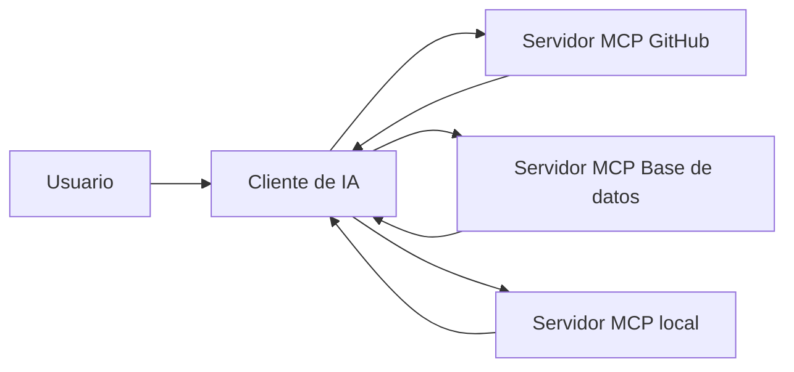

# 2024 — MCP: un contrato común para contexto y herramientas

Anthropic publicó Model Context Protocol el 25 de noviembre de 2024 como estándar abierto para conectar aplicaciones de IA con sistemas externos. [Anuncio original](https://www.anthropic.com/news/model-context-protocol).

## La analogía USB-C, con cuidado

MCP estandariza **cómo descubrir e invocar capacidades**, no hace que todas sean seguras ni idénticas. Un cliente MCP (la aplicación agente) se conecta a servidores que exponen:

| Primitiva | Qué representa | Ejemplo |
|---|---|---|
| Tools | Acción invocable | consultar BD, crear issue |
| Resources | Contexto legible | archivo, esquema, documento |
| Prompts | Plantilla reutilizable | flujo de revisión |

## Qué cambió

Antes: cada producto implementaba cada integración. Con MCP: un servidor puede ser reutilizado por clientes compatibles y sus capacidades se describen de forma estructurada.

En diciembre de 2025, Anthropic donó MCP a la Agentic AI Foundation bajo Linux Foundation, junto con AGENTS.md y Goose como proyectos fundacionales. [Anuncio de la donación](https://www.anthropic.com/news/donating-the-model-context-protocol-and-establishing-of-the-agentic-ai-foundation).

## Qué no hace MCP

- No concede permisos automáticamente.
- No verifica que el servidor sea honesto.
- No impide prompt injection.
- No garantiza semántica equivalente entre herramientas.
- No sustituye autenticación, auditoría ni aprobación.

**Idea clave:** MCP estandariza la tubería. La política de seguridad sigue perteneciendo al cliente, servidor y operador.
