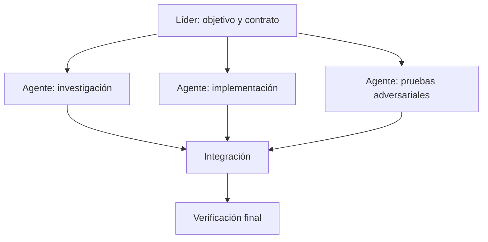

# 2025–hoy — Agentes de larga duración y equipos de agentes

Los coding agents de 2025–2026 pasaron de sugerir fragmentos a trabajar en entornos propios, abrir ramas/PR, ejecutar tests y pedir revisión. GitHub lanzó su coding agent en *preview* en mayo de 2025 y lo declaró GA en septiembre. [Changelog de GitHub](https://github.blog/changelog/2025-09-25-copilot-coding-agent-is-now-generally-available/).

## Qué cambió de verdad

- mejor razonamiento y uso de herramientas;
- contextos mayores y compresión de historial;
- entornos aislados reproducibles;
- identidad Git y flujos de revisión;
- observabilidad de pasos;
- ejecución asíncrona y objetivos durables;
- coordinación de subagentes.

## Cuándo usar varios agentes

Paraleliza subtareas realmente independientes: investigar cuatro módulos, ejecutar suites separadas o comparar alternativas. No paralelices ediciones sobre el mismo archivo sin estrategia de integración.

La coordinación consume contexto. A veces un solo agente con buen plan es más fiable que cinco conversando.

## Objetivos largos

Un objetivo durable necesita estado explícito:

- resultado observable;
- plan actual y checkpoints;
- presupuesto de cómputo/tiempo;
- artefactos producidos;
- bloqueos y autoridad;
- criterio de completado;
- posibilidad de pausa/reanudación sin repetir.

## El nuevo cuello de botella

Cuando producir código se abarata, revisar intención, arquitectura, seguridad y mantenimiento se vuelve más caro. El throughput de PR no es valor si los humanos no pueden verificarlo.
