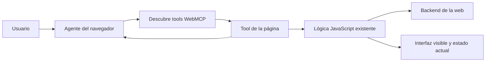

# 2026 — WebMCP: cuando una página declara herramientas para agentes

Un agente puede usar una web mirando capturas, leyendo el DOM o buscando botones en el árbol de accesibilidad. Es una solución general, pero frágil: un rediseño cambia las posiciones, un modal oculta el control y cada paso exige interpretar de nuevo qué significa la interfaz.

**WebMCP** propone que la propia página publique acciones con nombre, descripción y esquema estructurado: `buscar_vuelos`, `filtrar_resultados`, `añadir_tarea` o `ejecutar_diagnóstico`. Un agente compatible puede descubrirlas y pedir su ejecución sin adivinar una secuencia de clics.

## Estado actual: incubación, no estándar consolidado

Esta lección refleja el estado comprobado a **29 de agosto de 2026**.

La [especificación de WebMCP](https://webmachinelearning.github.io/webmcp/) es un **Draft Community Group Report** publicado el 26 de agosto de 2026 por el Web Machine Learning Community Group. El propio documento advierte que **no es todavía un estándar W3C ni forma parte del W3C Standards Track**. Sus APIs, nombres, permisos y comportamiento pueden cambiar.

| Superficie | Estado documentado en agosto de 2026 |
|---|---|
| Chrome | origin trial desde Chrome 149 y flag para desarrollo local |
| Edge | origin trial documentado para Edge 150 |
| Brave | soporte experimental asociado a Leo |
| ChatGPT Desktop | incluido en el registro de implementaciones del proyecto |
| Firefox y Safari | discusiones, incidencias o posiciones de estándares; no asumir soporte general |

La tabla no garantiza que una versión concreta esté habilitada para todos los usuarios. Antes de desarrollar una integración, comprueba la [situación de implementaciones](https://github.com/webmachinelearning/webmcp/blob/main/implementation-status.md) y prueba el navegador y agente que vayas a soportar.

## El problema que intenta resolver

La automatización visual trabaja desde fuera de la interfaz:

```text
observar pantalla/DOM → inferir control → hacer clic → observar otra vez
```

WebMCP permite que la aplicación exponga intención explícita:

```text
descubrir tool → validar argumentos → ejecutar lógica de página → recibir resultado
```



Esto aporta tres ventajas funcionales:

- **semántica:** la web explica para qué sirve la acción;
- **estructura:** JSON Schema describe los argumentos esperados;
- **estado compartido:** la tool vive en la página que el usuario está viendo y puede reutilizar su contexto interactivo.

No elimina la interfaz humana. La propuesta está orientada a colaboración dentro del navegador: el agente actúa sobre la misma experiencia que la persona puede observar, corregir y confirmar.

## WebMCP, MCP backend y browser automation

Aunque el nombre sugiera una relación directa, no son la misma capa.

| Enfoque | Dónde vive la capacidad | Descubrimiento | Ventaja | Límite principal |
|---|---|---|---|---|
| MCP remoto/local | servidor o proceso separado | el cliente se conecta al servidor configurado | funciona fuera de una página y desacopla UI/backend | necesita autenticación, transporte e integración propios |
| WebMCP | documento web abierto | el agente consulta las tools activas de la página | comparte sesión, estado y lógica cliente con la UI | exige visitar la web y soporte del navegador/agente |
| DOM/accesibilidad | estructura renderizada | el agente inspecciona controles | no requiere que la web adopte una API nueva | debe inferir intención y soportar cambios de UI |
| Computer Use | píxeles, ratón y teclado | percepción visual | máxima compatibilidad superficial | mayor latencia, ambigüedad y fragilidad |
| API/OpenAPI directa | backend | contrato conocido o catálogo | estable, testeable y eficiente | puede perder estado y experiencia interactiva de la página |

La especificación aclara un matiz importante: **no obliga al navegador a transportar las tools mediante el protocolo MCP**. Una implementación puede traducirlas a MCP, a su propio formato de function calling o a otra interfaz. «WebMCP» describe la superficie web y su interacción con agentes, no un transporte de red obligatorio.

WebMCP complementa las otras opciones. Si la página no expone la acción necesaria, el agente todavía puede recurrir al DOM o a automatización visual. Para procesos de servidor sin interfaz, MCP u otra API sigue siendo una frontera más natural.

## API imperativa: registrar una función de la aplicación

La forma imperativa usa JavaScript y `document.modelContext.registerTool()`. Un ejemplo simplificado:

```js
const registration = new AbortController()

document.modelContext.registerTool({
  name: 'filter-products',
  description: 'Filtra los productos visibles por categoría y precio máximo',
  inputSchema: {
    type: 'object',
    properties: {
      category: { type: 'string' },
      maxPrice: { type: 'number', minimum: 0 },
    },
    required: ['category'],
  },
  async execute({ category, maxPrice }) {
    const visibleProducts = await filterProducts({ category, maxPrice })
    return { count: visibleProducts.length }
  },
}, { signal: registration.signal })

// Cuando la tool deja de ser válida:
registration.abort()
```

La aplicación puede registrar o retirar tools según la ruta, selección o permisos actuales. Una tool `confirm-order` no debería existir si no hay pedido pendiente, y una acción de administración no debe registrarse para un usuario sin ese rol.

El esquema valida la **forma** de los argumentos. La función y el backend siguen teniendo que comprobar autorización, rangos, existencia, estado y reglas de negocio.

## API declarativa: convertir formularios en tools

La propuesta también trabaja en una vía declarativa para aprovechar HTML semántico. Un formulario anotado puede producir automáticamente el nombre, descripción y esquema de una tool a partir de sus campos.

```html
<form
  toolname="search-flights"
  tooldescription="Busca vuelos disponibles sin realizar una reserva">
  <input
    name="origin"
    toolparamdescription="Código IATA del aeropuerto de origen"
    required>
  <input
    name="destination"
    toolparamdescription="Código IATA del destino"
    required>
  <button type="submit">Buscar</button>
</form>
```

Esta sintaxis continúa evolucionando. El valor conceptual es estable: enriquecer controles HTML ya accesibles en vez de duplicar toda la lógica en una integración invisible. No copies atributos de un borrador a producción sin comprobar la versión de la especificación y del navegador.

La posibilidad de envío automático requiere especial cuidado. Rellenar un buscador es distinto de presentar una solicitud, aceptar condiciones, publicar, comprar o borrar. El diseño debe conservar una confirmación humana clara cuando existe un efecto sensible.

## Ciclo de una tool

1. La página registra una tool mientras el documento y estado pertinentes están activos.
2. El navegador o agente observa la lista, el origen y los schemas disponibles.
3. El modelo propone una llamada con argumentos estructurados.
4. El runtime aplica permisos, política y, si corresponde, solicita confirmación.
5. La función de la página revalida los argumentos y ejecuta lógica cliente/backend.
6. Devuelve un resultado estructurado o error.
7. El agente incorpora el resultado como dato no necesariamente confiable.
8. La página retira o actualiza la tool si deja de representar el estado actual.

Este ciclo evita pensar en una tool como un botón permanente. Las páginas cambian de ruta, usuario, carrito, documento y permisos; el catálogo debe cambiar con ellas sin aplicar argumentos antiguos a una definición nueva.

## Seguridad: la sesión del usuario amplía el impacto

WebMCP se ejecuta cerca de una sesión web autenticada. Eso facilita reutilizar contexto, pero también permite que una llamada afecte datos reales con la autoridad del usuario.

La especificación enumera riesgos que siguen abiertos o en desarrollo:

### Tool poisoning y prompt injection

El nombre, la descripción, los parámetros o el resultado de una tool pueden contener instrucciones maliciosas destinadas al agente. Todo metadato y salida procedente de una web es contenido de un origen externo, no una instrucción de sistema.

### Intención mal representada

Una tool puede prometer «preparar pedido» y finalizar una compra, o una descripción ambigua puede impedir distinguir vista previa de confirmación. La UI debe enseñar objetivo, argumentos, destino y efecto antes de autorizar una acción sensible.

### Sobreparametrización y privacidad

Pedir dirección, historial o correo cuando la función solo necesita un código postal aumenta la posibilidad de exfiltración. El esquema debe aceptar el mínimo de datos y la llamada no debe heredar todo el contexto que el agente conoce.

### Orígenes e iframes

La API se integra con una Permissions Policy denominada `tools`, cuyo valor por defecto se limita a `self`. Compartir tools con iframes de otro origen es una decisión explícita. El origen de cada tool debe conservarse como señal de seguridad; no combines resultados entre sitios como si compartieran confianza.

### Resultados no confiables

Una respuesta estructurada puede contener texto adversarial. Anotaciones como `untrustedContentHint`, discutidas en la especificación, ayudan a señalar la frontera, pero no sustituyen el aislamiento, la minimización de contexto ni las políticas del agente.

## Checklist para una WebMCP tool

- usa un nombre específico y una descripción fiel al efecto;
- separa consultar, preparar y confirmar;
- define schemas estrechos, límites y enumeraciones;
- revalida todo en la función y otra vez en el backend;
- aplica autorización por usuario y recurso, no por presencia de la tool;
- no expongas secretos en descripción, argumentos o resultados;
- registra la tool solo cuando sea válida y retírala al cambiar el estado;
- solicita interacción humana para pagos, publicación, borrado o permisos;
- haz idempotentes las operaciones que puedan repetirse;
- devuelve errores accionables sin filtrar detalles internos;
- etiqueta contenido no confiable y evalúa prompt injection;
- conserva una interfaz usable y accesible sin agente;
- prueba versiones reales de navegador y agente, no solo mocks.

## Qué debería evaluar un equipo

Compara la misma tarea mediante UI y WebMCP:

| Métrica | Qué revela |
|---|---|
| éxito completo | si la tool resuelve realmente el objetivo |
| número de pasos | reducción de navegación e interpretación |
| tiempo y tokens | eficiencia del enfoque estructurado |
| argumentos inválidos | calidad de schema y descripciones |
| confirmaciones correctas | si se conserva control humano |
| efectos duplicados | idempotencia y manejo de reintentos |
| ataques aceptados | resistencia a tool/output injection |
| datos enviados de más | minimización y privacidad |
| fallback a UI | cobertura real del catálogo de tools |
| compatibilidad | diferencias entre implementaciones experimentales |

Incluye cambios dinámicos: cerrar sesión, cambiar de cuenta, vaciar el carrito, navegar a otra ruta, retirar permisos o modificar la definición mientras existe una llamada pendiente.

## Qué puede cambiar si madura

Si varios navegadores y agentes convergen, una web podría mantener tres interfaces coordinadas:

1. **visual**, para personas;
2. **semántica y accesible**, mediante HTML/ARIA;
3. **agéntica**, mediante tools estructuradas ligadas al documento.

Eso reduciría parte de la navegación visual frágil y permitiría que la aplicación conserve su UI, marca, estado y puntos de confirmación. También convertiría el diseño de tools en una disciplina frontend: nombres, schemas, estados, efectos, permisos y evals pasarían a formar parte del contrato de una página.

El resultado no está garantizado. WebMCP todavía debe demostrar interoperabilidad, seguridad, utilidad para accesibilidad, experiencia de consentimiento y adopción más allá de implementaciones iniciales. Es una dirección relevante del presente, no una infraestructura universal consumada.

## Idea para recordar

**MCP conecta agentes con capacidades de procesos y servidores; WebMCP permite que una página abierta declare capacidades ligadas a su estado. La estructura reduce clics ambiguos, pero no elimina autorización, confirmación, validación ni desconfianza hacia el contenido web.**

Repasa [Browser y Computer Use](../06-era-agent-tools/03-browser-computer-use-y-coding-agents.md), [qué es MCP](../07-era-mcp/01-que-es-mcp.md), [seguridad de MCP](../07-era-mcp/02-seguridad-de-mcp-y-herramientas.md) y [guardarraíles y control de fallos](../06-era-agent-tools/07-guardarrailes-evals-y-control-de-fallos.md).
