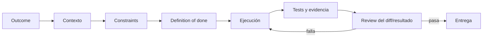

# Codex a fondo: guía práctica actual

**Última revisión:** 2026-08-25.  
**Fuente principal:** documentación oficial de OpenAI; la disponibilidad depende de plan, plataforma, región, rollout y políticas del workspace.

## Primero, una aclaración de nombres

**Cowork** es el nombre de una experiencia de Anthropic/Claude. En el ecosistema actual de OpenAI, la superficie comparable para trabajo de conocimiento es **ChatGPT Work**; **Codex** es la experiencia orientada a construir, comprender, probar y revisar software. Ambos conviven en la app de escritorio de ChatGPT. [Mapa oficial de superficies](https://learn.chatgpt.com/).

## El sistema mental correcto

| Necesidad | Superficie de Codex/ChatGPT |
|---|---|
| Conversar o explorar | Chat |
| Definir un cambio antes de implementarlo | Modo plan: propuesta, revisión y alcance |
| Crear entregables de conocimiento | ChatGPT Work |
| Trabajar con repos y terminal | Codex local/CLI/IDE/app |
| Trabajo aislado paralelo | Worktree o cloud environment |
| Repetir un método | Skill |
| Conectar datos/acciones | Plugin, connector o MCP |
| Convención durable de repo | `AGENTS.md` |
| Objetivo de horas/días | Goal mode |
| Repetición temporal | Scheduled task / automation creada desde app o web |
| Recuperar manualmente el cupo cuando OpenAI lo ha concedido | Crédito gratuito de reset de Codex |
| Ver y depurar UI | Browser + Computer Use/CDP |

## Bucle de alto rendimiento

Un buen prompt de Codex contiene objetivo, contexto, restricciones y verificación. OpenAI recomienda tratarlo como un compañero configurable: contexto correcto, `AGENTS.md` para orientación durable, MCP para sistemas externos, skills para flujos repetidos y automatizaciones solo cuando el flujo ya sea estable. [Best practices oficiales](https://learn.chatgpt.com/guides/best-practices).

## Índice

1. [Skills, MCP, plugins y AGENTS.md](01-skills-mcp-plugins-y-agents.md)
2. [Browser, Worktrees, Goal y automatizaciones](02-browser-worktrees-goal-y-automatizaciones.md)
3. [Recetas para sacar el máximo partido, incluido modo plan](03-recetas-de-trabajo.md)

La primera lección muestra cómo un plugin puede empaquetar directamente skills y configuración MCP. La segunda explica los [resets manuales que puede regalar OpenAI](02-browser-worktrees-goal-y-automatizaciones.md#resets-manuales-que-puede-regalar-openai), cómo comprobar si la cuenta dispone de alguno y por qué sólo se activa con autorización explícita. También incluye cómo [crear y gobernar tareas automatizadas](02-browser-worktrees-goal-y-automatizaciones.md#scheduled-tasks--automations), qué diferencia una tarea independiente de una que vuelve al mismo chat y por qué Goal no equivale a una programación temporal.

## Sección hermana: de usar Codex a diseñar el proceso

Para mejorar la corrección de cualquier sistema —no solo Codex— continúa con [Prompt, context, loop y graph engineering](../13-prompting-loop-graph-engineering/README.md). Allí se separan el contrato de la llamada, la información visible, la evolución del estado y la topología del proceso mediante métricas explícitas.

## Regla de seguridad

Dar un Goal no amplía permisos. Instalar un plugin no aprueba todas sus acciones. Conectar una cuenta no convierte sus datos en instrucciones confiables. Conserva mínimo privilegio y revisa operaciones con impacto real.
