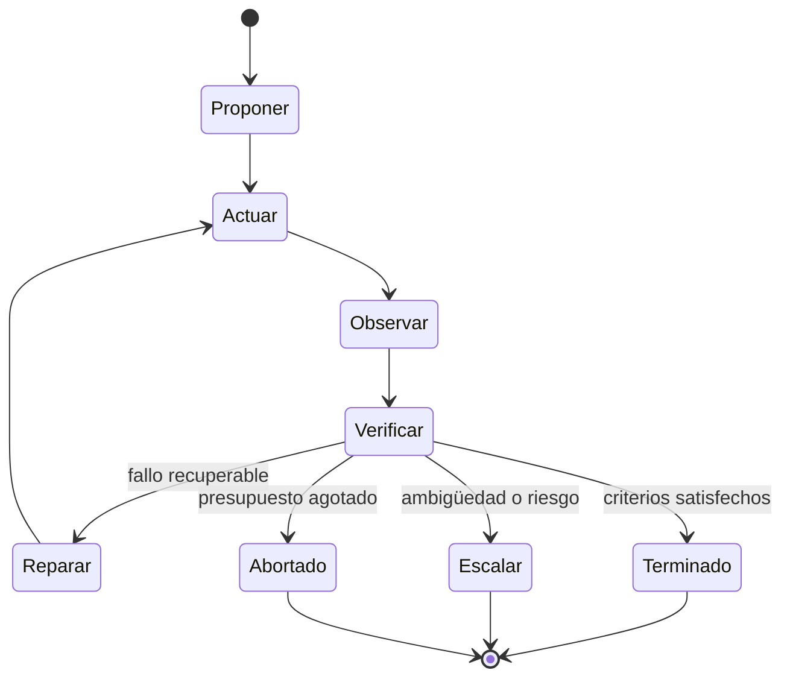

# 3. Loop engineering: observar, verificar y reparar

Un bucle convierte una generación aislada en un proceso adaptativo. La unidad básica no es «pensar otra vez», sino:



[ReAct](https://arxiv.org/abs/2210.03629) popularizó la intercalación de razonamiento, acciones y observaciones. La pieza decisiva es la observación: el entorno puede aportar información que no estaba en el modelo.

## Anatomía de un bucle robusto

### 1. Estado explícito

Incluye objetivo, intento, artefactos, checks, errores normalizados, presupuesto y siguiente transición. El historial conversacional puede acompañarlo, pero no sustituirlo.

### 2. Acción acotada

Cada iteración debe intentar un avance concreto: ejecutar una consulta, modificar un archivo, recuperar una fuente o comprobar una propiedad. Acciones demasiado grandes producen feedback ambiguo.

### 3. Observación sin reinterpretar

Conserva primero la salida bruta: código de retorno, stdout, respuesta HTTP, filas recuperadas o diff. Después crea una interpretación. Si solo guardas el resumen del modelo pierdes la evidencia que permitiría auditarlo.

### 4. Verificador

Decide si se cumplen criterios predefinidos. Orden de preferencia aproximado:

1. regla determinista o tipo;
2. ejecución, test, solver o simulador;
3. comparación con fuente autoritativa;
4. evaluador especializado independiente;
5. LLM como juez con rúbrica;
6. revisión humana.

La persona no siempre está al final: debe aparecer antes de una acción de alto impacto o cuando el criterio sea normativo y ambiguo.

### 5. Reparación dirigida por evidencia

No envíes «sigue mejorando». Devuelve un informe de fallo estructurado:

```json
{
  "check": "citation_entailment",
  "status": "fail",
  "claim_id": "C7",
  "reason": "La fuente habla de disponibilidad, no de rendimiento.",
  "allowed_changes": ["claim", "source"],
  "must_preserve": ["C1", "C2", "C3"]
}
```

Esto reduce regresiones y evita reescribir partes ya aprobadas.

### 6. Condición de parada

Todo bucle necesita al menos:

- éxito observable;
- máximo de intentos;
- máximo de coste, tiempo y tool calls;
- detección de falta de progreso;
- ruta de escalado;
- estado terminal explícito.

`while not perfect` es un incidente esperando ocurrir.

## Patrones de bucle

### Generar → criticar → revisar

[Self-Refine](https://arxiv.org/abs/2303.17651) estudia refinamiento iterativo mediante feedback generado por el propio modelo. Es útil para claridad, estilo o cumplimiento de rúbricas, pero no convierte conocimiento interno en evidencia externa.

Uso adecuado:

- redacción y estructura;
- encontrar inconsistencias visibles;
- proponer tests o contraejemplos;
- reparar a partir de feedback ya obtenido.

Uso débil:

- verificar una fecha sin consultar una fuente;
- aprobar su propia afirmación factual;
- revisar una vulnerabilidad solo con el mismo prompt y contexto.

La investigación ha encontrado que la autocorrección intrínseca puede incluso degradar razonamiento cuando no existe feedback externo ([Huang et al., 2023](https://arxiv.org/abs/2310.01798)). La conclusión práctica no es «nunca critiques», sino «la crítica gana fuerza cuando recibe una señal que el generador no controla».

### Ejecutar → leer error → reparar

Es el patrón más potente en software:

```text
1. Reproduce el fallo.
2. Guarda comando, código de salida y traza.
3. Formula la hipótesis mínima.
4. Aplica un cambio acotado.
5. Ejecuta primero la prueba específica.
6. Ejecuta después checks de regresión.
7. Revisa el diff y los efectos no cubiertos.
```

El test actúa como feedback externo, aunque un test mal diseñado puede aprobar una solución incorrecta. Comprueba que falle antes del arreglo cuando sea viable.

### Recuperar → responder → comprobar soporte

Separa quien redacta de quien verifica la relación afirmación–fuente. Si el verificador devuelve `partial` o `none`, el reparador debe eliminar la frase, suavizarla o buscar evidencia adicional.

### Muestrear → agregar

[Self-consistency](https://arxiv.org/abs/2203.11171) genera varias rutas y agrega la respuesta coincidente. Funciona mejor cuando existe una respuesta bien definida y los errores son diversos.

No equivale a verdad: cinco muestras pueden compartir el mismo sesgo, dato obsoleto o premisa falsa. Combínala con un verificador y evita pagar diversidad en tareas deterministas que una herramienta resuelve directamente.

### Reflexión con memoria

[Reflexion](https://arxiv.org/abs/2303.11366) convierte feedback de episodios anteriores en notas lingüísticas para el siguiente intento. Guarda lecciones concretas («la API devuelve 429 y requiere backoff»), no autobiografías vagas («debo tener más cuidado»). Versiona y caduca esa memoria.

## Progreso y estancamiento

Define una puntuación multidimensional, no una sensación:

```text
score = {
  tests_passed: 18/20,
  unsupported_claims: 1,
  schema_errors: 0,
  policy_violations: 0
}
```

Detén o cambia de estrategia si dos iteraciones no mejoran ninguna dimensión, si aparece repetidamente el mismo error o si mejorar una dimensión degrada una restricción dura.

## Pseudocódigo de referencia

```python
state = initialize(task, max_attempts=3, tool_budget=12)

while not state.terminal:
    candidate = propose(state.allowed_context())
    observation = execute_safely(candidate.action)
    report = verify(candidate, observation, state.criteria)
    state.record(candidate, observation, report)

    if report.all_hard_checks_pass:
        state.finish(candidate.artifact)
    elif report.requires_human or report.security_risk:
        state.escalate(report)
    elif state.no_progress() or state.budget_exhausted():
        state.abort(report)
    else:
        state.prepare_repair(report)
```

El modelo no decide unilateralmente `all_hard_checks_pass`, `security_risk` ni `budget_exhausted`; esas propiedades pertenecen al orquestador.

Siguiente: [graph engineering](04-graph-engineering.md).
