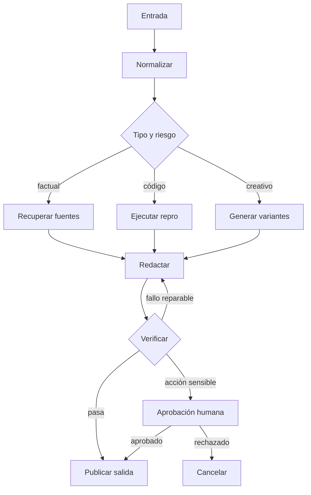
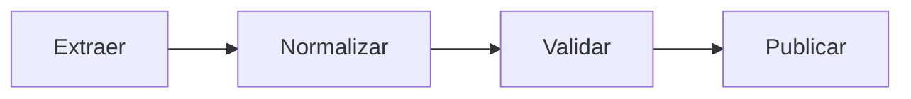
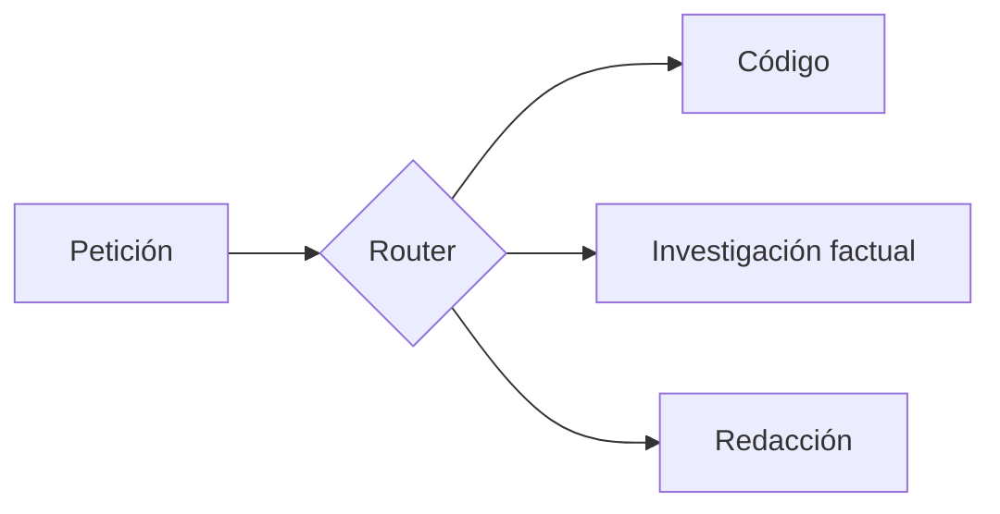
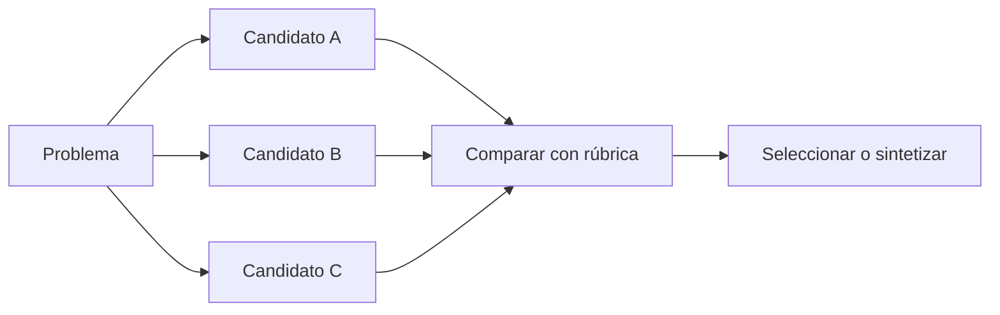
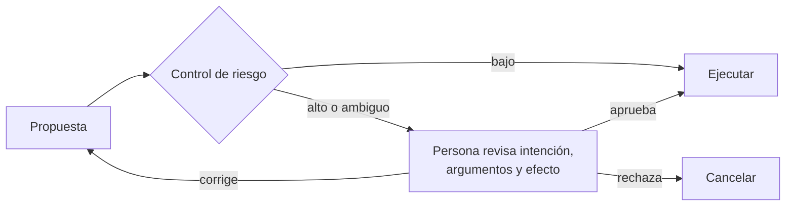

# 4. Graph engineering: convertir el proceso en arquitectura

Un grafo de agentes no tiene por qué contener muchos agentes. Es una máquina de estados donde cada **nodo** realiza una operación y cada **arista** expresa una transición permitida.



## Por qué un grafo mejora el control

En una conversación monolítica, el modelo puede mezclar planificación, ejecución y aprobación. En un grafo, las garantías pueden vivir fuera del modelo:

- un nodo valida el esquema;
- un router aplica reglas deterministas;
- un gate bloquea acciones sin aprobación;
- un contador limita reintentos;
- un checkpoint permite reanudar;
- una traza conserva entradas, salidas y decisiones.

El grafo no hace al modelo más inteligente. Hace al sistema más **inspeccionable, recuperable y gobernable**.

## Componentes

| Componente | Responsabilidad | No debería decidir |
|---|---|---|
| Nodo generativo | Proponer, resumir, clasificar, transformar | Su propia autorización final |
| Nodo de tool | Obtener una observación o ejecutar una acción | Si la intención estaba autorizada |
| Router | Elegir una ruta desde estado validado | Inventar estado ausente |
| Verificador | Emitir checks y evidencia | Reparar silenciosamente el candidato |
| Gate | Aplicar política o pedir aprobación | Delegar una prohibición dura al prompt |
| Checkpoint | Persistir estado reanudable | Guardar secretos o contexto innecesario |
| Supervisor | Coordinar dependencias y presupuestos | Convertirse en único punto generativo para todo |

## Patrones topológicos

### Pipeline



Úsalo cuando el orden es fijo. Es sencillo de probar, pero una decisión equivocada pronto puede propagarse. Valida contratos entre nodos.

### Router especializado



Sirve si las clases requieren herramientas, prompts o verificadores distintos. Añade una ruta `unknown` y mide la matriz de confusión; forzar toda entrada a una clase conocida produce fallos silenciosos.

### Fan-out / fan-in



Genera diversidad en paralelo. Haz que los candidatos sean realmente distintos: diferentes estrategias, fuentes o descomposiciones. Tres llamadas idénticas con baja diversidad pueden producir tres copias del mismo error.

### Evaluator–optimizer

El generador entrega un candidato; el evaluador devuelve defectos concretos; el optimizador modifica solo lo necesario. Es el bucle de la lección anterior expresado como subgrafo.

### Map–reduce

Divide un corpus, procesa fragmentos y agrega. Riesgo: el reduce puede perder excepciones o contar duplicados. Conserva IDs de origen y permite que la agregación solicite el fragmento original.

### Árbol de búsqueda

[Tree of Thoughts](https://arxiv.org/abs/2305.10601) explora varias continuaciones, puntúa estados y retrocede. Es útil cuando decisiones tempranas cierran posibilidades y existe una heurística razonable. Sus costes crecen con anchura y profundidad; poda pronto usando restricciones baratas.

### Grafo de pensamientos

[Graph of Thoughts](https://arxiv.org/abs/2308.09687) generaliza la estructura: ramas pueden combinarse, refinarse y realimentarse. En ingeniería de producto, la idea útil es permitir dependencias no lineales entre artefactos, no simular complejidad porque sí.

### Búsqueda con entorno

[Language Agent Tree Search](https://arxiv.org/abs/2310.04406) combina búsqueda, acciones, feedback del entorno y reflexión. Es apropiado cuando se puede probar un estado intermedio. Si la función de valor es solo la opinión del mismo LLM, la búsqueda puede optimizar una ilusión compartida.

### Human-in-the-loop



La aprobación debe mostrar qué ocurrirá, sobre qué recursos y con qué impacto. Un botón «aprobar» debajo de un resumen vago no es supervisión significativa.

## Diseño desde el final

Empieza por los estados terminales:

```text
COMPLETED_VERIFIED
COMPLETED_WITH_WARNINGS
INSUFFICIENT_EVIDENCE
NEEDS_HUMAN
FAILED_RETRYABLE
FAILED_TERMINAL
CANCELLED
```

Después define qué evidencia permite entrar en cada uno. Finalmente añade nodos capaces de producir esa evidencia. Este orden evita grafos vistosos que no saben cuándo terminar.

## Transiciones como contratos

Una arista debe tener una condición comprobable:

```text
draft -> verify
  require artifact_uri, artifact_hash, criteria_version

verify -> complete
  require hard_checks == pass AND unsupported_claims == 0

verify -> repair
  require retryable_failures > 0 AND attempts < max_attempts

verify -> human
  require policy_review == required OR ambiguity_score > threshold
```

Evita transiciones como «si parece correcto». Si necesitas un LLM para clasificarlas, registra su evidencia y conserva una ruta de incertidumbre.

## Fiabilidad de sistemas distribuidos

Los agentes heredan problemas clásicos de backend:

- **Idempotencia:** repetir una tool no debe duplicar un pago o comentario.
- **Timeouts:** una llamada colgada no puede bloquear todo el grafo.
- **Retries selectivos:** reintenta 429 o fallos transitorios; no una validación semántica idéntica.
- **Backoff y jitter:** evita tormentas de reintentos.
- **Deduplicación:** usa claves de idempotencia para efectos externos.
- **Compensación:** define cómo revertir pasos parciales cuando sea posible.
- **Checkpoints:** persiste después de hitos, no solo al final.
- **Versionado:** guarda versión de prompt, modelo, tools, esquema y rúbrica.

## El grafo mínimo que funciona

Empieza con tres nodos: `generate → verify → finish/repair`. Añade rutas solo si una eval muestra una clase de error que la topología actual no puede resolver. Más agentes crean más superficies de fallo, coste y latencia.

Siguiente: [verificadores, jueces y evals](05-verificacion-jueces-y-evals.md).
