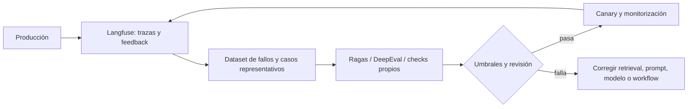

# 5. Verificadores, jueces y evals

## La jerarquía de evidencia

No todos los checks responden a la misma pregunta:

| Check | Demuestra | No demuestra |
|---|---|---|
| JSON Schema | La salida tiene forma válida | Los valores son ciertos |
| Type checker | Ciertas relaciones de tipos se cumplen | El producto satisface al usuario |
| Unit test | El caso codificado se comporta como se espera | Ausencia total de bugs |
| Ejecución/repro | El comportamiento observado ocurre en ese entorno | Generalización a todos los entornos |
| Cita existente | La fuente puede abrirse | La fuente sostiene la afirmación |
| Entailment de cita | El fragmento respalda la frase | La fuente es correcta o actual |
| Consenso de modelos | Varias muestras coinciden | La conclusión es verdad |
| LLM judge | Cumple una rúbrica según el juez | Objetividad o ausencia de sesgo |
| Revisión humana | Una persona acepta bajo el contexto visto | Infalibilidad |

Diseña un **portafolio de checks** que cubra fallos distintos.

## Verificadores deterministas primero

Si una propiedad puede comprobarse con código, no la conviertas innecesariamente en una opinión del modelo:

- parsear y validar esquema;
- ejecutar tests y linters;
- comprobar que una suma cuadra;
- confirmar que una URL responde;
- contrastar un identificador contra la base de datos;
- aplicar límites y permisos;
- verificar presencia, unicidad o rango.

Son más reproducibles, baratos y fáciles de depurar. Un LLM sigue siendo útil para generar el candidato o explicar el fallo.

## LLM-as-a-judge

Un juez LLM es útil cuando la propiedad es semántica: claridad, cobertura, fidelidad, tono o comparación entre respuestas. El estudio de [MT-Bench y Chatbot Arena](https://arxiv.org/abs/2306.05685) también documentó sesgos de posición, verbosidad y auto-preferencia.

### Rúbrica fuerte

```text
Evalúa únicamente fidelidad a las fuentes.

Para cada afirmación material devuelve:
- claim_id
- source_id
- verdict: entailed | partially_entailed | not_entailed | unverifiable
- evidence_span
- one_sentence_reason

No premies estilo, longitud ni confianza. Si no hay fragmento suficiente,
usa unverifiable. No repares la respuesta.
```

Buenas prácticas:

- una dimensión por grader cuando sea posible;
- categorías con definiciones y ejemplos frontera;
- orden aleatorio o evaluación en ambos órdenes para comparaciones;
- ocultar identidad del modelo y metadatos irrelevantes;
- exigir evidencia localizada;
- calibrar contra etiquetas humanas;
- usar un modelo/judge distinto cuando el coste lo permita;
- monitorizar desacuerdos y deriva.

Un grader compuesto o equivalente puede combinar checks de string, código y jueces de modelo; el principio importante es que las restricciones duras no dependan solo de una nota subjetiva. [Buenas prácticas de evaluación de OpenAI](https://developers.openai.com/api/docs/guides/evaluation-best-practices).

## Evals: el test suite del comportamiento

Una eval no es una demostración bonita. Es un conjunto versionado de casos que representa la distribución real y sus riesgos.

### Dataset mínimo

Incluye:

- casos normales frecuentes;
- bordes y entradas incompletas;
- contradicciones entre fuentes;
- instrucciones incrustadas y prompt injection;
- casos donde la respuesta correcta es abstenerse;
- regresiones históricas;
- acciones prohibidas o que requieren aprobación;
- casos recientes que prueben actualización.

Divide en desarrollo y test retenido. Si ajustas prompts mirando todos los casos, acabas entrenando artesanalmente contra el examen.

### Métricas multidimensionales

```text
quality:
  task_success_rate
  factual_support_rate
  false_abstention_rate
  unsafe_action_rate
operations:
  p50/p95_latency
  tokens_and_cost
  tool_calls
  retries
reliability:
  invalid_state_rate
  timeout_rate
  human_escalation_rate
```

Una media puede esconder un fallo crítico. Define restricciones: por ejemplo, mejorar éxito no compensa aumentar acciones no autorizadas.

## Ragas, DeepEval y Langfuse

Estas herramientas aparecen juntas en muchas stacks, pero resuelven capas distintas.

| Herramienta | Papel principal | Capacidades relevantes | No sustituye |
|---|---|---|---|
| [Ragas](https://docs.ragas.io/en/latest/) | Biblioteca de evaluación para aplicaciones RAG y agentes | context precision/recall, faithfulness, relevancia, tool-call y goal accuracy, métricas personalizadas | etiquetas de dominio, tests deterministas ni observabilidad de producción |
| [DeepEval](https://deepeval.com/docs/metrics-introduction) | Framework de testing para sistemas LLM | test cases, métricas RAG/agente/conversación, G-Eval, DAG metrics, umbrales y ejecución en CI | decidir qué riesgo importa ni calibrar automáticamente al juez |
| [Langfuse](https://langfuse.com/docs/evaluation/core-concepts) | Observabilidad, datasets y experimentación | trazas, observaciones, sesiones, scores, experimentos offline y evaluación online | un framework de métricas especializado ni la telemetría general de toda la aplicación |

Pueden combinarse:



### Ragas

Ragas es especialmente útil para descomponer un RAG. Su catálogo actual incluye métricas de contexto, fidelidad de la respuesta y tareas agénticas. Esto permite preguntar por separado:

- ¿el retriever encontró la evidencia?;
- ¿los fragmentos relevantes quedaron arriba?;
- ¿la respuesta está soportada por el contexto?;
- ¿el agente eligió correctamente las herramientas y cumplió el objetivo?

Varias métricas utilizan un LLM o embeddings para puntuar, por lo que pueden ser no deterministas y heredar sesgos del juez. Fija versión, modelo, prompt y configuración; repite muestras y calibra contra anotación humana.

### DeepEval

DeepEval aproxima las evals a un test suite: cada caso contiene entrada, salida real, salida esperada o contexto según la métrica. Permite expresar un umbral y ejecutarlo en desarrollo o CI.

Sus métricas predefinidas cubren RAG, trayectorias de agentes, conversación, seguridad y criterios personalizados. Muchas usan LLM-as-a-judge. Un test verde significa «este juez y este umbral aprobaron el caso», no «la respuesta es verdadera».

### Langfuse

Langfuse observa ejecuciones y relaciona trazas con scores, datasets y experimentos. Es útil para responder:

- ¿qué prompt, modelo, retrieval y tools participaron?;
- ¿en qué paso aumentaron coste o latencia?;
- ¿qué versión introdujo la regresión?;
- ¿qué fallos de producción deben entrar en la eval offline?;

No envíes indiscriminadamente prompts, documentos, secretos o PII a una plataforma de trazas. Clasifica campos, redacta o tokeniza datos antes de exportarlos, aplica retención y acceso, y evalúa si necesitas despliegue propio.

### Criterio de selección

- Usa **Ragas** si necesitas métricas y experimentación específicas de RAG/agentes.
- Usa **DeepEval** si quieres casos y umbrales expresados como tests ejecutables.
- Usa **Langfuse** si necesitas trazabilidad, comparación de experimentos y el bucle producción → dataset → regresión.
- Usa checks propios cuando la regla de negocio sea determinista.

Empieza por el dataset y el criterio; después elige herramienta. Migrar un runner es más sencillo que descubrir que has optimizado durante meses una métrica que no representa el producto.

## Matriz de error

Clasifica antes de optimizar:

| Clase | Síntoma | Intervención probable |
|---|---|---|
| Instrucción | Ignora una restricción | Aclarar contrato o eliminar conflicto |
| Contexto | Falta/mezcla información | Recuperación, reranking, versionado |
| Razonamiento | Contexto correcto, conclusión errónea | Herramienta, descomposición, búsqueda |
| Tool | Tool incorrecta o argumentos inválidos | Descripción, esquema, permisos, router |
| Verificación | Aprueba un candidato malo | Nuevo check o mejor rúbrica |
| Orquestación | Repite, se bloquea o salta un gate | Estado, transición, timeout, idempotencia |
| Capacidad | Falla aun con diseño correcto | Modelo mejor o tarea más acotada |

Cambiar el prompt no arregla un permiso mal configurado; añadir un agente no arregla una fuente obsoleta.

## Comparar cambios correctamente

1. Congela dataset, versión de tools y condiciones.
2. Registra prompt, modelo, parámetros y semilla cuando exista.
3. Ejecuta baseline y variante sobre los mismos casos.
4. Inspecciona diferencias por clase, no solo la media.
5. Revisa manualmente una muestra de ganadores, perdedores y desacuerdos.
6. Calcula coste y latencia junto a calidad.
7. Promueve solo si pasan umbrales y restricciones de seguridad.
8. Mantén rollback.

## Correctness case: expediente de una respuesta

Para trabajos de alto impacto, entrega un paquete:

```text
resultado.md
claims.json              afirmación → evidencia
checks.json              verificador → estado → detalle
sources.lock             URLs/IDs, fecha, versión o hash
trace.jsonl              nodos, tools, transiciones y costes
limitations.md           supuestos, huecos y alcance
```

No garantiza perfección, pero permite a otra persona reproducir qué se hizo y por qué se aceptó.

Siguiente: [patrones y plantillas](06-patrones-y-plantillas.md).
