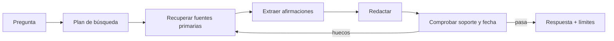

# 6. Patrones y plantillas reutilizables

Estas recetas son esqueletos. Adapta las fuentes, riesgos y criterios; no copies ceremonias que no aporten una señal de corrección.

## A. Investigación factual con citas

### Grafo



### Prompt del investigador

```text
Objetivo: responder [pregunta] con información vigente a [fecha].

Autoridad: prioriza [documentación/paper/dataset/ley oficial]. Usa fuentes
secundarias solo para localizar primarias. Registra fecha y versión.

Entrega:
1. respuesta breve;
2. tabla claim_id → afirmación → source_id → localización;
3. conflictos entre fuentes;
4. desconocidos y supuestos.

No completes con memoria ningún dato cambiante que no hayas verificado.
```

### Gate

No publicar si una afirmación material carece de fuente, la fecha de vigencia no puede determinarse o la cita no implica lo afirmado.

## B. Cambio de código verificable

```text
Resultado: [comportamiento esperado].
Reproducción: [pasos/comando/fallo].
Alcance: [archivos o módulos].
Restricciones: [API, compatibilidad, seguridad, estilo].

Proceso:
- reproduce antes de editar;
- identifica la causa con evidencia;
- aplica el cambio mínimo coherente;
- añade una prueba que falle antes y pase después;
- ejecuta la prueba específica y los checks relevantes;
- revisa el diff por cambios accidentales.

Entrega comandos, resultados, archivos cambiados y riesgos no verificados.
No declares resuelto si no pudiste ejecutar la prueba; usa «no verificado».
```

El bucle debe distinguir fallo de código, fallo de test, dependencia ausente y entorno no disponible. Repetir el mismo comando sin cambiar ninguna condición no es progreso.

## C. Extracción de datos confiable

### Esquema

```json
{
  "items": [
    {
      "value": "string",
      "source_span": "string",
      "normalized_value": "string|null",
      "confidence_class": "explicit|derived|ambiguous"
    }
  ],
  "unresolved": []
}
```

### Verificaciones

1. JSON Schema.
2. Cada valor tiene `source_span` literal.
3. Normalización por código, no por texto libre cuando sea posible.
4. Reglas de dominio y duplicados.
5. Muestra humana de ambiguos.

## D. Decisión con alternativas

```text
Decisión: [qué hay que elegir].
Restricciones duras: [presupuesto, plazo, compatibilidad].
Criterios ponderados: [lista y pesos].
Evidencia disponible: [fuentes y mediciones].

Genera tres alternativas materialmente diferentes. Para cada una:
- supuestos;
- evidencia a favor/en contra;
- coste y riesgo;
- condición que la descartaría.

Aplica primero las restricciones duras. Puntúa después los criterios blandos.
Haz análisis de sensibilidad cambiando los dos pesos más inciertos.
Si falta una medición decisiva, recomienda el experimento más barato que la obtenga.
```

El objetivo no es que tres agentes «debatan» retóricamente, sino exponer dependencias y qué dato podría cambiar la decisión.

## E. Generador y verificador separados

### Generador

```text
Produce un candidato que satisfaga los criterios. No lo apruebes.
Asocia cada decisión a un criterio y declara supuestos.
```

### Verificador

```text
No edites ni mejores el candidato. Evalúa cada criterio de forma independiente.
Devuelve pass/fail/unknown, evidencia localizada y el contraejemplo mínimo.
Una redacción convincente no cuenta como evidencia.
```

### Reparador

```text
Repara únicamente los checks fail. Conserva los elementos pass salvo que exista
una dependencia explícita. Devuelve un diff conceptual de cambios y solicita
nueva verificación; no cambies el estado a pass.
```

## F. Acción con herramientas y aprobación

```yaml
proposal:
  tool: issue_tracker.update
  target_ids: [ISSUE-184]
  operation: close
  arguments:
    resolution: fixed
  expected_effect: "Cierra un issue visible para el equipo"
  reversible: true
  rollback: "Reabrir ISSUE-184"
  evidence:
    - "tests/run-882: pass"
authorization:
  scope_match: true
  human_approval_required: true
  approved_by: null
```

El modelo propone. Un control externo valida herramienta, alcance, argumentos y autorización. Solo después se ejecuta. La respuesta de la tool vuelve como observación y se comprueba el efecto real.

## G. Respuesta calibrada

```text
Responde con:
- conclusión;
- evidencia más fuerte;
- supuestos que podrían cambiarla;
- resultado del check independiente;
- estado: verified | supported_with_limits | insufficient_evidence;
- siguiente prueba si el estado no es verified.

No inventes un porcentaje de confianza. Usa el estado según las definiciones.
```

## H. Prompt para diseñar el propio workflow

```text
Diseña el workflow mínimo para [tarea].

Antes de proponer nodos, define:
1. estados terminales;
2. evidencia requerida para cada estado;
3. fallos de mayor impacto;
4. qué checks pueden ser deterministas;
5. dónde hace falta una fuente, tool o persona;
6. presupuestos y condición de no progreso.

Después entrega nodos, estado tipado, transiciones, retries, gates,
telemetría y un conjunto inicial de evals. Justifica cada llamada LLM:
si una regla o programa basta, usa eso.
```

## I. Planificación con revisión antes de ejecutar

Aplica este patrón cuando haya decisiones costosas o requisitos ambiguos. Es una propuesta de workflow, no una promesa de que cualquier producto llamado *Plan Mode* imponga estos mismos controles.

```text
Fase 1 — Explorar y proponer:
Inspecciona el sistema dentro del alcance permitido, sin implementar cambios.
Entrega objetivo, restricciones, evidencia, alternativas, pasos dependientes,
riesgos, preguntas decisivas, pruebas y condiciones para revisar el plan.

Fase 2 — Revisar:
La persona confirma decisiones y alcance. Registra qué queda sin autorizar.

Fase 3 — Implementar y verificar:
Ejecuta lo aprobado. Si cambia una premisa relevante, vuelve a la revisión.
Entrega evidencia de los resultados; marcar un paso como hecho no es una prueba.
```

Si lo implementas como grafo, el paso de planificación sólo recibe las herramientas necesarias para inspeccionar. La transición a ejecución comprueba la autorización en código. Añade una salida para «no hay evidencia suficiente» y presupuestos para no permanecer indefinidamente planificando.

Antes de aprobar, pregunta: ¿el plan resuelve el requisito o sólo desarrolla la solución sugerida por el usuario? Así conectas la [evolución del modo plan](../06-era-agent-tools/05-evolucion-del-modo-plan.md) con la [prevención de sicofancia](01-prompting-para-exactitud.md#evitar-la-sicofancia-sin-forzar-el-desacuerdo).

## Tabla de elección

| Si el error principal es… | Añade primero… |
|---|---|
| Formato inválido | Esquema + validador |
| Dato inventado | Recuperación + soporte por afirmación |
| Cálculo incorrecto | Código/solver + invariantes |
| Primera estrategia mala | Candidatos diversos + búsqueda |
| Regresión durante reparación | Patch acotado + checks ya aprobados |
| Acción peligrosa | Gate determinista + aprobación |
| Bucle infinito | Presupuesto + detección de progreso |
| Juez inconsistente | Rúbrica atómica + calibración humana |
| Acuerdo injustificado con el usuario | Evidencia independiente + pruebas de postura |
| Implementación prematura o fuera de alcance | Plan revisable + autorización antes de ejecutar |

Vuelve al [índice de la unidad](README.md).
