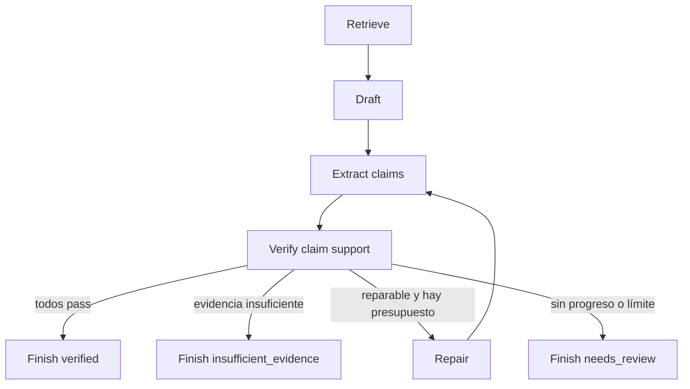

# 7. Laboratorio: construir y medir un sistema autocorrectivo

## Objetivo

Construir un workflow pequeño que responda preguntas sobre un conjunto de documentos y solo marque una respuesta como `verified` cuando cada afirmación material tenga soporte. No necesitas un framework de grafos: una función por nodo y un estado serializable son suficientes.

## Qué aprenderás

- convertir una intención en criterios ejecutables;
- separar generación y verificación;
- reparar usando informes de fallo;
- detectar estancamiento;
- comparar el loop contra un baseline de una sola llamada.

## Dataset

Prepara entre 20 y 40 casos con:

- documentos autoritativos cortos;
- pregunta y respuesta de referencia cuando exista;
- afirmaciones obligatorias y prohibidas;
- al menos cinco casos sin evidencia suficiente;
- versiones contradictorias o fechas distintas;
- dos documentos con instrucciones maliciosas incrustadas;
- metadatos de fuente, versión y fecha.

No uses todos los casos mientras escribes prompts. Reserva al menos un 25 % como test retenido.

## Estado

```json
{
  "case_id": "case-017",
  "attempt": 0,
  "max_attempts": 3,
  "question": "...",
  "source_ids": [],
  "candidate": null,
  "verification": null,
  "status": "retrieve",
  "history": [],
  "cost": {"model_calls": 0, "tool_calls": 0}
}
```

## Grafo



### Contratos de nodos

| Nodo | Entrada | Salida | Check local |
|---|---|---|---|
| Retrieve | pregunta, catálogo | IDs y fragmentos | fuente permitida, fecha/version |
| Draft | pregunta, fragmentos | respuesta + source_ids | esquema |
| Extract claims | respuesta | claims atómicas | cada claim tiene ID |
| Verify | claims, fragmentos | verdict por claim | evidencia localizada |
| Repair | candidato, fallos | candidato nuevo | preserva claims aprobadas |
| Finish | estado | paquete final | terminal válido |

## Implementación incremental

### Fase 1: baseline

Una llamada recibe pregunta y documentos y devuelve respuesta. Mide:

- exactitud de respuesta;
- tasa de afirmaciones no soportadas;
- abstenciones correctas e incorrectas;
- coste y latencia.

### Fase 2: salida tipada

Añade `answer`, `claims`, `source_ids`, `unknowns` y `status`. Valida esquema. Vuelve a medir. Observa qué errores desaparecen y cuáles siguen: probablemente mejore integración, no verdad factual.

### Fase 3: verificador

Evalúa cada claim contra fragmentos. El verificador no ve la respuesta de referencia; solo decide soporte. Calibra 30–50 decisiones del juez con etiquetas humanas y registra falsos positivos, que son los fallos más peligrosos.

### Fase 4: reparación

Permite hasta dos reparaciones. Cada una recibe únicamente claims fallidas, evidencia y restricciones de preservación. Marca `insufficient_evidence` si el problema es ausencia de fuente; no dejes que el reparador invente una.

### Fase 5: control de progreso

Guarda la firma de fallos:

```text
signature = sorted((claim_id, verdict, source_id) for each failed check)
```

Si se repite sin mejorar, detén el loop. También detén si aumentan las claims no soportadas o se agota el presupuesto.

## Eval

| Métrica | Baseline | Loop | Restricción |
|---|---:|---:|---:|
| Respuestas correctas | | | maximizar |
| Claims sin soporte publicadas | | | **0 en casos críticos** |
| Abstención correcta | | | maximizar |
| Falsa abstención | | | vigilar |
| Llamadas medias | 1 | | ≤ presupuesto |
| Latencia p95 | | | objetivo local |
| Casos que agotan reintentos | 0 | | investigar |

No declares éxito solo porque el loop supera al baseline en una media. Revisa que no consiga más cobertura publicando errores con más confianza.

## Ablaciones: descubre qué pieza aporta valor

Ejecuta el mismo test retenido con:

1. baseline;
2. baseline + mejor prompt;
3. + salida estructurada;
4. + verificador;
5. + una reparación;
6. + dos reparaciones;
7. verificador sin acceso a fragmentos;
8. generador y juez iguales frente a distintos, si está disponible.

La comparación revela si la ganancia viene del prompt, de la evidencia o simplemente de gastar más tokens.

## Ataques y bordes

Incluye pruebas donde:

- un documento ordena ignorar el sistema;
- la fuente más reciente contradice a una antigua;
- dos fuentes primarias discrepan;
- la pregunta presupone algo falso;
- la respuesta correcta requiere «no determinado»;
- una cita menciona palabras similares pero no implica la claim;
- la reparación arregla C2 pero rompe C1;
- la tool devuelve timeout o resultado parcial.

## Criterio de terminado

El laboratorio está completo cuando puedes contestar con datos:

- qué clase de error redujo cada nodo;
- cuántos falsos positivos tiene el verificador;
- cuándo el loop se detiene y escala;
- cuánto cuesta cada punto de mejora;
- qué casos todavía requieren una persona.

## Extensiones

- Sustituye documentos por un repositorio y claims por requisitos de código.
- Añade fan-out de consultas y deduplicación de fuentes.
- Introduce un gate humano para afirmaciones de alto impacto.
- Versiona prompts y ejecuta la eval en CI.
- Exporta trazas para reconstruir cada transición.

Vuelve al [índice de la unidad](README.md) o conecta estas técnicas con las [recetas de Codex](../12-codex/03-recetas-de-trabajo.md).
