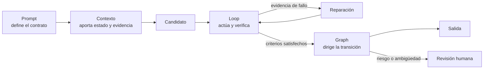

# Prompt engineering, context engineering, loop engineering y graph engineering

> Cómo diseñar sistemas que no solo produzcan una respuesta plausible, sino que acumulen **evidencia de que es correcta**.

Esta unidad es hermana de [Codex a fondo](../12-codex/README.md). Codex explica una herramienta concreta; aquí se estudia el método general que sirve con cualquier LLM, agente u orquestador.

## La idea esencial

Un **prompt** define el contrato de una llamada. El **contexto** decide qué información, memoria, herramientas y estado puede ver el modelo. Un **bucle** permite observar, comprobar y corregir. Un **grafo** decide qué pasos pueden ejecutarse, repetirse, bifurcarse o requerir aprobación.

La precisión no sale de pedir «piensa mejor» muchas veces. Sale de combinar:

- una especificación comprobable;
- contexto relevante y fuentes trazables;
- herramientas que devuelven observaciones reales;
- verificadores distintos del generador cuando sea posible;
- límites de coste, iteraciones y permisos;
- evaluaciones sobre casos representativos.

## Índice

1. [Prompting orientado a resultados correctos](01-prompting-para-exactitud.md)
2. [Contexto, fuentes y salidas estructuradas](02-contexto-evidencia-y-estructura.md)
3. [Loop engineering: observar, verificar y reparar](03-loop-engineering.md)
4. [Graph engineering: convertir el proceso en arquitectura](04-graph-engineering.md)
5. [Verificadores, jueces y evals](05-verificacion-jueces-y-evals.md)
6. [Patrones y plantillas reutilizables](06-patrones-y-plantillas.md)

## Ruta rápida por necesidad

| Necesidad | Patrón inicial | Verificación preferida |
|---|---|---|
| Responder con hechos actuales | Recuperar → responder → comprobar citas | Fuente primaria y fecha |
| Modificar código | Reproducir → parchear → probar → revisar diff | Tests, tipos, lint y repro |
| Extraer datos | Prompt + esquema tipado + reintento acotado | Validador de esquema y reglas |
| Resolver lógica o cálculo | Descomponer → calcular → comprobar | Código, solver o invariantes |
| Crear contenido abierto | Variantes → rúbrica → selección → edición | Rúbrica + revisión humana |
| Ejecutar una acción sensible | Proponer → validar política → aprobar → ejecutar | Control determinista + persona |

## Cuatro estrategias que no conviene confundir

| Nivel | Qué controlas | Ejemplo |
|---|---|---|
| Prompt engineering | Una llamada al modelo | Objetivo, contexto, formato y límites |
| Context engineering | Lo que el modelo puede ver en cada paso | Recuperación, memoria, estado, tools, prioridad y compactación |
| Loop engineering | La evolución del estado | Generar, usar tool, verificar, reparar, parar |
| Graph engineering | La topología del sistema | Rutas, paralelismo, gates, subgrafos y recuperación |

No son cuatro modas sucesivas ni alternativas excluyentes. Un grafo contiene bucles; cada vuelta construye un contexto; cada llamada usa un prompt. La frontera útil es saber **dónde vive cada garantía**:

- cambia el **prompt** si el objetivo, formato o criterio están mal expresados;
- cambia el **contexto** si falta evidencia, sobra ruido o se perdió el estado relevante;
- cambia el **loop** si el agente no observa, verifica, repara o termina correctamente;
- cambia el **grafo** si la ruta, delegación, aprobación, paralelismo o recuperación son incorrectos.

El modelo propone; el contexto le proporciona el mundo visible; el bucle aprende de observaciones; el grafo gobierna el proceso; la política autoriza; el evaluador mide; la persona asume las decisiones que no deben automatizarse.

### Escalera práctica de orquestación

| Síntoma | Primera estrategia | Sube de nivel cuando… |
|---|---|---|
| La salida no cumple el encargo | Prompt engineering | el contrato ya es claro pero faltan datos o estado |
| La respuesta ignora evidencia o arrastra ruido | Context engineering | necesita actuar y corregirse con resultados reales |
| El primer intento falla de forma recuperable | Loop engineering | aparecen ramas, especialistas, aprobaciones o reanudación |
| El proceso tiene rutas y riesgos distintos | Graph engineering | necesitas además un runtime persistente que opere sesiones, canales y agentes |

Los productos de orquestación como **OpenClaw** ocupan un nivel operativo superior: empaquetan runtime, sesiones, routing, tools, memoria y superficies de interacción. No sustituyen estas cuatro estrategias; las alojan y las hacen persistentes. Consulta [Frameworks y orquestadores de agentes](../06-era-agent-tools/06-frameworks-de-agentes.md#openclaw-del-script-agentico-al-runtime-persistente).

## Regla de oro

> Si no puedes describir cómo sabrás que la respuesta es correcta, todavía no has terminado de diseñar la petición.

Esto no significa que toda tarea tenga una verdad binaria. En tareas creativas, «correcto» puede significar cumplir una rúbrica, respetar la voz de marca y no inventar datos. En tareas factuales o ejecutables, debe significar algo más fuerte: citas que sostienen cada afirmación, tests que pasan, cálculos reproducibles o invariantes satisfechas.

**Última revisión:** 2026-09-02. Las recomendaciones de producto se contrastan con la [guía oficial de prompting de OpenAI](https://learn.chatgpt.com/docs/prompting); los patrones de investigación enlazan sus papers primarios en cada lección.
