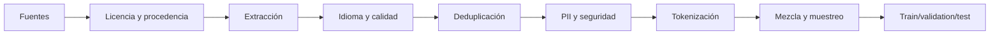

# 6. Datos de entrenamiento: la arquitectura invisible

Dos modelos con la misma arquitectura pueden comportarse de forma muy distinta por los datos, su orden y la proporción de dominios. El dataset no es un saco de texto: es una **política editorial ejecutada a escala**.

## Del documento al batch



Cada flecha puede introducir sesgo. Un clasificador de «calidad» entrenado con prosa académica puede eliminar dialectos, conversación o código poco documentado. Un filtro de idioma puede tratar contenido bilingüe como ruido. Deduplicar demasiado puede borrar expresiones legítimamente frecuentes.

## Procedencia antes que volumen

Para cada fuente registra:

| Campo | Pregunta |
|---|---|
| Origen | ¿De dónde salió y cuándo se descargó? |
| Derechos | ¿Qué licencia, términos o consentimiento la cubren? |
| Transformaciones | ¿Qué filtros y normalizaciones se aplicaron? |
| Sensibilidad | ¿Puede contener PII, secretos o contenido dañino? |
| Versión | ¿Puede reproducirse exactamente el snapshot? |
| Exclusiones | ¿Cómo se tramitan retirada y opt-out? |

Sin linaje no puedes explicar una capacidad, retirar datos ni investigar contaminación.

## Calidad no es una propiedad única

Un documento puede ser gramaticalmente pobre y, aun así, imprescindible para aprender soporte técnico, habla coloquial o errores reales de programadores. Evalúa por dimensiones:

- legibilidad y estructura;
- densidad informativa;
- autoridad factual;
- diversidad de idioma, dominio y registro;
- riesgo legal o de privacidad;
- toxicidad contextual;
- utilidad para capacidades objetivo.

[DataComp-LM](https://arxiv.org/abs/2406.11794) mostró mediante experimentos controlados que el diseño del dataset y el filtrado basado en modelos afectan materialmente al resultado. La lección no es adoptar un filtro universal, sino comparar recetas bajo el mismo cómputo.

## Deduplicación

Hay tres escalas:

1. **Exacta:** hash del documento normalizado.
2. **Casi duplicado:** MinHash/LSH, shingles o similitud semántica.
3. **Subdocumento:** fragmentos repetidos dentro de páginas diferentes.

La investigación de [Lee et al.](https://arxiv.org/abs/2107.06499) encontró que deduplicar reducía memorización y solapamiento train–test. Pero define el umbral por dominio: cabeceras legales o plantillas de código generan coincidencias que no significan duplicación total.

## Contaminación de evaluación

Si las respuestas del examen aparecen en entrenamiento, el benchmark puede medir recuerdo. Protege el test antes de construir el corpus:

```text
1. Congelar y hashear benchmarks.
2. Buscar coincidencia exacta y aproximada en cada fase.
3. Eliminar no solo respuestas, también formatos que revelan la tarea.
4. Mantener un test privado o temporal.
5. Documentar qué pudo contaminarse y cuánto cambia el resultado limpio.
```

La contaminación no siempre es binaria: ver el texto fuente sin la pregunta puede aportar conocimiento legítimo. Registra niveles y realiza análisis de sensibilidad.

## Tokenizador como impuesto por idioma

El tokenizador decide qué secuencias son baratas de representar. Si una frase en un idioma ocupa el doble de tokens que su traducción, ese idioma recibe:

- menos contenido por ventana;
- más coste de entrenamiento e inferencia;
- dependencias más largas;
- menor batch efectivo.

Antes de fijarlo, mide `bytes/token`, `caracteres/token` y longitud por dominio. Incluye código, números, Unicode, idiomas sin espacios, emojis y texto con ruido. Cambiar vocabulario después impide reutilizar directamente embeddings y cabeza de salida.

## Mezcla de dominios

Muestrear proporcionalmente al volumen haría que la web dominante ahogue ciencia, código o idiomas minoritarios. Se usan pesos y *temperature sampling* para sobrerrepresentar dominios valiosos. [DoReMi](https://arxiv.org/abs/2305.10429) estudia aprender pesos mediante un modelo proxy.

La mezcla es un vector de objetivos. Controla:

- porcentaje de tokens por dominio e idioma;
- tasa de repetición de fuentes pequeñas;
- evolución de pérdidas por dominio;
- capacidades ganadas y regresiones;
- exposición a datos sintéticos.

## Escalado conjunto

[Chinchilla](https://arxiv.org/abs/2203.15556) mostró que, bajo un presupuesto fijo, parámetros y tokens deben planificarse conjuntamente. Un modelo enorme entrenado con pocos tokens puede estar infraentrenado; uno pequeño con demasiadas épocas puede memorizar y agotar el retorno marginal.

No conviertas una ley empírica en constante universal. Arquitectura, calidad de datos, objetivo de inferencia y reutilización posterior cambian el óptimo.

## Datos sintéticos

Sirven para cubrir formatos, idiomas o habilidades con ejemplos verificables. Riesgos:

- amplificar sesgos del profesor;
- reducir diversidad;
- enseñar explicaciones plausibles pero falsas;
- contaminar evals;
- crear bucles de entrenamiento sobre generaciones propias.

Guarda modelo generador, prompt, filtros y verificador. Mezcla con datos reales y mide por separado.

## Señales operativas

Durante pretraining observa loss global **y por dominio**, grad norm, ratio de tokens descartados, duplicación, throughput, muestras decodificadas y evals tempranas. Una loss suave puede ocultar que un idioma desapareció del pipeline.

Siguiente: [adaptación, RAG, LoRA y preferencias](07-adaptacion-rag-finetuning-lora-dpo.md).
