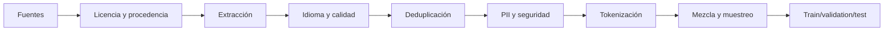
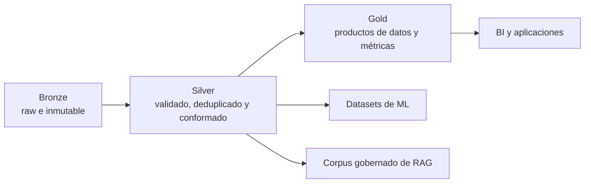
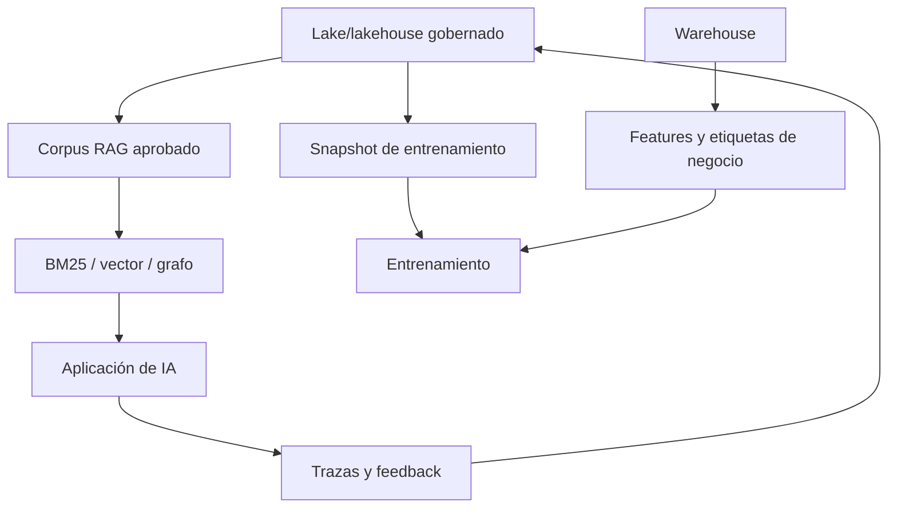

# 6. Datos de entrenamiento: la arquitectura invisible

Dos modelos con la misma arquitectura pueden comportarse de forma muy distinta por los datos, su orden y la proporción de dominios. El dataset no es un saco de texto: es una **política editorial ejecutada a escala**.

## Del documento al batch



Cada flecha puede introducir sesgo. Un clasificador de «calidad» entrenado con prosa académica puede eliminar dialectos, conversación o código poco documentado. Un filtro de idioma puede tratar contenido bilingüe como ruido. Deduplicar demasiado puede borrar expresiones legítimamente frecuentes.

## Procedencia antes que volumen

Para cada fuente registra:

| Campo | Pregunta |
|---|---|
| Origen | ¿De dónde salió y cuándo se descargó? |
| Derechos | ¿Qué licencia, términos o consentimiento la cubren? |
| Transformaciones | ¿Qué filtros y normalizaciones se aplicaron? |
| Sensibilidad | ¿Puede contener PII, secretos o contenido dañino? |
| Versión | ¿Puede reproducirse exactamente el snapshot? |
| Exclusiones | ¿Cómo se tramitan retirada y opt-out? |

Sin linaje no puedes explicar una capacidad, retirar datos ni investigar contaminación.

## Data lake, data warehouse y lakehouse

Estos términos describen arquitecturas para almacenar y preparar datos a escala. No son modelos de IA, pero condicionan qué datos pueden entrenar un modelo, alimentar un RAG, construir features o formar un dataset de evaluación.

### Data lake: conservar primero, interpretar después

Un **data lake** almacena grandes volúmenes de datos estructurados, semiestructurados y no estructurados, normalmente sobre object storage. Puede recibir Parquet, JSON, CSV, imágenes, audio, logs y documentos sin transformarlos primero a un modelo relacional único.

```text
CRM ─┐
ERP ─┼─> ingestión -> object storage -> SQL / Spark / ML / pipelines
web ─┤
PDF ─┘
```

Fortalezas:

- almacenamiento escalable y relativamente económico;
- conserva originales y formatos diversos;
- separa almacenamiento de motores de cómputo;
- favorece exploración, ciencia de datos y entrenamiento.

Riesgos:

- convertirse en un **data swamp** sin catálogo, propietarios ni calidad;
- múltiples copias sin autoridad clara;
- archivos pequeños, particiones deficientes y consultas lentas;
- schema cambiante descubierto demasiado tarde;
- PII, secretos o datos sin licencia acumulados «por si acaso».

*Schema-on-read* no significa ausencia de schema. Significa que parte de la interpretación ocurre al leer; los contratos, versiones y validaciones siguen siendo necesarios.

### Data warehouse: datos preparados para preguntas compartidas

Un **data warehouse** organiza datos estructurados y curados para SQL, BI, reporting y métricas empresariales. Suele aplicar schema antes o durante la carga y modelar hechos, dimensiones y definiciones comunes.

```text
fuentes -> ETL/ELT -> tablas conformadas -> modelo semántico -> BI/SQL
```

Fortalezas:

- consultas analíticas predecibles y optimizadas;
- calidad y significado de negocio más controlados;
- dimensiones, métricas y permisos compartidos;
- buena experiencia para analistas y dashboards.

Limitaciones habituales:

- más fricción para datos crudos, binarios o experimentales;
- transformar antes de comprender puede eliminar detalle útil;
- duplicar datos entre lake y warehouse añade sincronización;
- un schema pensado para ventas mensuales quizá no sirve para entrenar sobre eventos individuales.

Un warehouse no es «más correcto» por definición: lo es si sus pipelines, contratos y propietarios mantienen esa promesa.

### Lakehouse: tablas fiables sobre almacenamiento de lake

Un **lakehouse** intenta combinar la apertura y economía del data lake con propiedades que se esperan de un warehouse: tablas, transacciones ACID, schema enforcement/evolution, catálogo, control de acceso, snapshots y rendimiento SQL.

La pieza clave suele ser una capa de metadatos y formato de tabla sobre archivos del object storage. Delta Lake, Apache Iceberg y Apache Hudi son ejemplos de tecnologías de tabla; no son sinónimos de toda la arquitectura.

El lakehouse permite que distintos motores trabajen sobre datos gobernados sin copiar todo a un almacén propietario. Aun así, necesita:

- catálogo y política de identidad;
- mantenimiento de archivos, particiones y estadísticas;
- aislamiento de workloads;
- compatibilidad real entre motores;
- control de costes de lectura y cómputo;
- diseño de tablas para cada patrón de acceso.

### Comparación funcional

| Dimensión | Data lake | Data warehouse | Lakehouse |
|---|---|---|---|
| Datos principales | crudos y diversos | estructurados y curados | crudos y tablas curadas |
| Schema | flexible, a menudo al leer | definido para carga/consumo | contratos y evolución sobre tablas del lake |
| Almacenamiento típico | object storage y archivos abiertos | motor analítico administrado | object storage + formato de tabla + catálogo |
| Consumidores | data engineering, ciencia de datos, ML | BI, SQL, analistas | BI, ingeniería, ML y aplicaciones de datos |
| Fortalezas | volumen, formatos y exploración | rendimiento SQL y semántica de negocio | unificar workloads y reducir copias |
| Riesgo característico | pantano sin gobierno | rigidez y duplicación | complejidad operativa disfrazada de plataforma única |

No siempre hay que elegir uno. Una arquitectura puede conservar originales en un lake, publicar dimensiones y métricas en un warehouse y compartir algunas tablas mediante un lakehouse.

## Arquitectura medallion: raw, validado y consumible

La arquitectura **bronze / silver / gold** organiza el refinamiento:



- **Bronze:** copia reproducible de lo recibido, con fecha, fuente y controles de acceso.
- **Silver:** tipos corregidos, identidades resueltas, duplicados tratados, PII clasificada y reglas de calidad aplicadas.
- **Gold:** tablas y productos de datos optimizados para una audiencia o decisión.

Las medallas describen calidad y propósito, no necesariamente tres productos ni tres copias completas. [Microsoft](https://learn.microsoft.com/en-us/fabric/onelake/onelake-medallion-lakehouse-architecture) documenta incluso combinaciones donde bronze/silver viven en lakehouses y gold en un warehouse.

## Cómo encaja en sistemas de IA



### Entrenamiento y fine-tuning

Fija un snapshot con hashes, schema, licencia, filtros y exclusiones. El lakehouse puede aportar versionado de tablas, pero la reproducibilidad exige guardar también código, configuración y artefactos externos. No entrenes leyendo «la tabla actual» si cambia durante la ejecución.

### RAG

El lake o lakehouse puede ser la fuente gobernada de documentos; BM25, la base vectorial y el knowledge graph son índices derivados para servir consultas. Deben poder reconstruirse desde una versión conocida.

El índice no debería convertirse accidentalmente en fuente de verdad. Guarda en él IDs y referencias a originales, aplica ACL durante la indexación y consulta, y propaga borrados o rectificaciones.

### Features y etiquetas

El warehouse suele contener métricas y entidades empresariales conformadas: churn confirmado, fraude revisado o ingresos netos. Pueden servir como labels o features, pero evita leakage temporal: una tabla gold calculada después del evento puede revelar el futuro al entrenamiento.

### Evals y observabilidad

Conserva datasets de eval versionados y separa el conjunto retenido de los datos usados para mejorar prompts. Las trazas de producción pueden alimentar nuevos casos, después de aplicar minimización, PII redaction, consentimiento, retención y control de acceso.

## Qué elegir

| Necesidad dominante | Punto de partida razonable |
|---|---|
| dashboards y métricas compartidas | data warehouse |
| originales, multimedia, logs y exploración | data lake gobernado |
| BI y ML sobre tablas abiertas compartidas | lakehouse |
| aplicación operacional de baja latencia | base operacional o índice de serving, no consulta directa al lake |
| búsqueda semántica | índice vectorial derivado de la fuente gobernada |
| relaciones de varios saltos | base de grafos derivada o sistema de verdad apropiado |

Evalúa volumen, latencia, formatos, skills del equipo, lock-in, gobierno, residencia, recuperación y coste total. «Lakehouse» en la página comercial no demuestra interoperabilidad ni elimina un warehouse ya útil.

## Anti-patrones

- Volcar datos sin catálogo, propietario o política de retención.
- Copiar PII a cada capa e índice sin propagar eliminaciones.
- Usar carpetas como única definición de schema y versión.
- Consultar archivos raw directamente desde dashboards críticos.
- Entrenar y evaluar sobre una tabla mutable sin snapshot.
- Tratar la base vectorial como archivo histórico definitivo.
- Duplicar métricas de negocio en SQL, notebooks y prompts con definiciones distintas.
- Adoptar bronze/silver/gold como nombres sin gates de calidad verificables.

La [documentación de AWS](https://aws.amazon.com/what-is/data-lake/) distingue el lake orientado a datos diversos y ML del warehouse estructurado para análisis; su [descripción de lakehouse](https://aws.amazon.com/what-is/data-lakehouse/) presenta la unificación como arquitectura, no como ausencia de modelado. La decisión práctica sigue dependiendo del workload y del gobierno.

## Calidad no es una propiedad única

Un documento puede ser gramaticalmente pobre y, aun así, imprescindible para aprender soporte técnico, habla coloquial o errores reales de programadores. Evalúa por dimensiones:

- legibilidad y estructura;
- densidad informativa;
- autoridad factual;
- diversidad de idioma, dominio y registro;
- riesgo legal o de privacidad;
- toxicidad contextual;
- utilidad para capacidades objetivo.

[DataComp-LM](https://arxiv.org/abs/2406.11794) mostró mediante experimentos controlados que el diseño del dataset y el filtrado basado en modelos afectan materialmente al resultado. La lección no es adoptar un filtro universal, sino comparar recetas bajo el mismo cómputo.

## Deduplicación

Hay tres escalas:

1. **Exacta:** hash del documento normalizado.
2. **Casi duplicado:** MinHash/LSH, shingles o similitud semántica.
3. **Subdocumento:** fragmentos repetidos dentro de páginas diferentes.

La investigación de [Lee et al.](https://arxiv.org/abs/2107.06499) encontró que deduplicar reducía memorización y solapamiento train–test. Pero define el umbral por dominio: cabeceras legales o plantillas de código generan coincidencias que no significan duplicación total.

## Contaminación de evaluación

Si las respuestas del examen aparecen en entrenamiento, el benchmark puede medir recuerdo. Protege el test antes de construir el corpus:

```text
1. Congelar y hashear benchmarks.
2. Buscar coincidencia exacta y aproximada en cada fase.
3. Eliminar no solo respuestas, también formatos que revelan la tarea.
4. Mantener un test privado o temporal.
5. Documentar qué pudo contaminarse y cuánto cambia el resultado limpio.
```

La contaminación no siempre es binaria: ver el texto fuente sin la pregunta puede aportar conocimiento legítimo. Registra niveles y realiza análisis de sensibilidad.

## Tokenizador como impuesto por idioma

El tokenizador decide qué secuencias son baratas de representar. Si una frase en un idioma ocupa el doble de tokens que su traducción, ese idioma recibe:

- menos contenido por ventana;
- más coste de entrenamiento e inferencia;
- dependencias más largas;
- menor batch efectivo.

Antes de fijarlo, mide `bytes/token`, `caracteres/token` y longitud por dominio. Incluye código, números, Unicode, idiomas sin espacios, emojis y texto con ruido. Cambiar vocabulario después impide reutilizar directamente embeddings y cabeza de salida.

## Mezcla de dominios

Muestrear proporcionalmente al volumen haría que la web dominante ahogue ciencia, código o idiomas minoritarios. Se usan pesos y *temperature sampling* para sobrerrepresentar dominios valiosos. [DoReMi](https://arxiv.org/abs/2305.10429) estudia aprender pesos mediante un modelo proxy.

La mezcla es un vector de objetivos. Controla:

- porcentaje de tokens por dominio e idioma;
- tasa de repetición de fuentes pequeñas;
- evolución de pérdidas por dominio;
- capacidades ganadas y regresiones;
- exposición a datos sintéticos.

## Escalado conjunto

[Chinchilla](https://arxiv.org/abs/2203.15556) mostró que, bajo un presupuesto fijo, parámetros y tokens deben planificarse conjuntamente. Un modelo enorme entrenado con pocos tokens puede estar infraentrenado; uno pequeño con demasiadas épocas puede memorizar y agotar el retorno marginal.

No conviertas una ley empírica en constante universal. Arquitectura, calidad de datos, objetivo de inferencia y reutilización posterior cambian el óptimo.

## Datos sintéticos

Sirven para cubrir formatos, idiomas o habilidades con ejemplos verificables. Riesgos:

- amplificar sesgos del profesor;
- reducir diversidad;
- enseñar explicaciones plausibles pero falsas;
- contaminar evals;
- crear bucles de entrenamiento sobre generaciones propias.

Guarda modelo generador, prompt, filtros y verificador. Mezcla con datos reales y mide por separado.

## Señales operativas

Durante pretraining observa loss global **y por dominio**, grad norm, ratio de tokens descartados, duplicación, throughput, muestras decodificadas y evals tempranas. Una loss suave puede ocultar que un idioma desapareció del pipeline.

Siguiente: [adaptación, RAG, LoRA y preferencias](07-adaptacion-rag-finetuning-lora-dpo.md).
