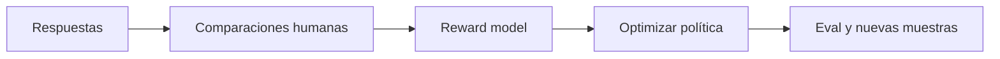

# 7. Adaptar un modelo: prompt, RAG, fine-tuning y preferencias

La pregunta correcta no es «¿cómo hago fine-tuning?», sino «¿qué parte del comportamiento quiero cambiar y dónde debe vivir?».

## Mapa de decisión

| Necesidad | Primera opción | Motivo |
|---|---|---|
| Instrucción o formato puntual | Prompt + esquema | Barato y reversible |
| Hechos privados o que cambian | RAG/tool | Actualizable y trazable |
| Estilo o tarea repetitiva | SFT/LoRA | Comprime ejemplos en pesos |
| Mejor uso de documentos recuperados | RAG + adaptación | Enseña a citar/ignorar distractores |
| Preferir unas respuestas a otras | DPO/RLHF | Optimiza preferencias comparativas |
| Nueva capacidad ausente | Datos + entrenamiento; quizá modelo mayor | Un prompt no crea capacidad fiable |

Combinar es habitual: fine-tuning para conducta, RAG para conocimiento y un verificador para corrección.

## Supervised fine-tuning (SFT)

Entrena al modelo para imitar pares `entrada → respuesta deseada`. La loss sigue siendo predicción de tokens, pero normalmente se enmascara la parte del usuario para aprender principalmente la respuesta.

Decisiones importantes:

- diversidad y calidad de instrucciones;
- plantilla exacta de chat y tokens especiales;
- longitud, packing y truncado;
- learning rate y número de épocas;
- mezcla con datos generales para evitar olvido;
- eval retenida por habilidad y por seguridad.

Más épocas no implican más inteligencia. Señales de sobreajuste: respuestas calcadas, pérdida de flexibilidad, validación que empeora y cumplimiento rígido de patrones irrelevantes.

## Full fine-tuning frente a PEFT

El ajuste completo actualiza todos los pesos y requiere memoria para pesos, gradientes y estados del optimizador. PEFT actualiza una fracción.

[LoRA](https://arxiv.org/abs/2106.09685) congela la matriz original y aprende una actualización de bajo rango:

```text
W' = W + escala · A · B
```

No hace falta dominar la fórmula: en lugar de reescribir una tabla enorme, aprende dos tablas estrechas cuya composición expresa el cambio.

Parámetros prácticos:

- `rank`: capacidad del adaptador;
- `alpha`: escala de la actualización;
- módulos objetivo: atención, MLP o ambos;
- dropout;
- módulos que sí se guardan completos;
- merge del adaptador para serving.

Un rank mayor puede memorizar más y consumir más memoria; no garantiza generalización.

## QLoRA

[QLoRA](https://arxiv.org/abs/2305.14314) mantiene el modelo base cuantizado a 4 bits para ahorrar memoria y entrena adaptadores en mayor precisión. Durante el forward, los pesos se dequantizan para el cálculo; no se «entrenan enteros de 4 bits» de forma ingenua.

Cuida:

- tipo NF4 frente a formatos de inferencia;
- precisión de cómputo (`bf16` cuando el hardware lo soporte);
- memoria de activaciones, que la cuantización de pesos no elimina;
- compatibilidad entre versión del base y adaptador;
- caída específica en idiomas, código o razonamiento.

## Preferencias: RLHF y DPO

En RLHF clásico:



La reward es un proxy. Si se optimiza demasiado, el modelo explota fallos del evaluador: verbosidad, tono confiado o patrones superficiales.

[DPO](https://arxiv.org/abs/2305.18290) evita entrenar explícitamente un reward model y aprende directamente de pares `chosen/rejected`, regularizado respecto a un modelo de referencia. Es más simple operacionalmente, pero hereda sesgos y cobertura del dataset de preferencias. «Preferido» no significa factual ni seguro.

## RAG y tuning no son sustitutos perfectos

| Propiedad | RAG | Fine-tuning |
|---|---|---|
| Actualizar un hecho | Reindexar | Reentrenar y comprobar efectos |
| Mostrar procedencia | Natural | Difícil |
| Latencia | Recuperación extra | Puede ser menor |
| Conducta/formato | Limitado | Fuerte |
| Conocimiento exacto | Depende del retrieval | Puede memorizar incorrectamente |
| Derecho al borrado | Eliminar documento | Difícil garantizar olvido |

[RAFT](https://arxiv.org/abs/2403.10131) es un ejemplo híbrido: adapta el modelo a responder con documentos de dominio y distractores.

## Pipeline experimental

1. Construye un baseline de prompt/RAG.
2. Define eval retenida y regresiones generales.
3. Limpia, deduplica y versiona el dataset.
4. Entrena el cambio mínimo: primero LoRA/QLoRA.
5. Evalúa base, adaptador y combinación con RAG.
6. Mide exactitud, abstención, formato, seguridad, coste y latencia.
7. Inspecciona pérdidas por subgrupo.
8. Versiona base + tokenizer + chat template + adapter.
9. Despliega con canary y rollback.

## Fallos frecuentes

- Entrenar hechos que deberían recuperarse.
- Evaluar con ejemplos parafraseados del train.
- Olvidar la plantilla de chat usada en entrenamiento.
- Hacer merge sobre una revisión distinta del modelo base.
- Usar respuestas sintéticas sin verificador.
- Mejorar el caso feliz y degradar abstención o seguridad.
- Confundir menor training loss con mejor producto.

Siguiente: [contexto largo y RAG avanzado](08-contexto-largo-y-rag-avanzado.md).
