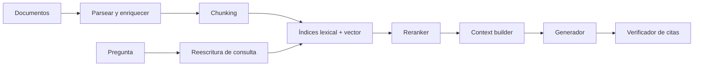

# 8. Contexto largo y RAG avanzado

Una ventana de 200k tokens indica cuánto puede **aceptar** el sistema, no cuánto puede usar con la misma precisión. Contexto largo y recuperación son estrategias complementarias para decidir qué información llega a la atención.

## Tres límites diferentes

1. **Límite técnico:** máximo de tokens aceptado.
2. **Límite efectivo:** longitud a la que mantiene rendimiento en la tarea.
3. **Límite económico:** longitud que cumple coste y latencia del producto.

[Lost in the Middle](https://arxiv.org/abs/2307.03172) encontró sensibilidad a la posición de la evidencia. [RULER](https://arxiv.org/abs/2404.06654) amplió las pruebas más allá de encontrar una aguja: varias agujas, agregación y seguimiento multihop.

## Por qué cuesta

En atención densa, el prefill relaciona tokens entre sí y el coste crece aproximadamente de forma cuadrática con la longitud. En decode, cada nuevo token consulta la KV cache acumulada, cuya memoria crece con capas, longitud, heads KV y dimensión.

Técnicas:

- FlashAttention reduce movimientos de memoria, no la cantidad conceptual de relaciones;
- ventanas locales y atención dispersa omiten pares;
- GQA/MQA reducen KV heads;
- posiciones como RoPE permiten representar orden, con problemas al extrapolar;
- chunking distribuye o resume;
- [Ring Attention](https://arxiv.org/abs/2310.01889) reparte secuencias entre dispositivos.

## Pipeline RAG completo



La generación es solo la última parte. La mayoría de mejoras se localizan midiendo cada etapa.

## Chunking

| Estrategia | Ventaja | Riesgo |
|---|---|---|
| Tamaño fijo | Simple | Corta unidades semánticas |
| Por párrafo/sección | Conserva estructura | Tamaños irregulares |
| Semántico | Agrupa contenido relacionado | Más coste y variabilidad |
| Padre–hijo | Recupera preciso, entrega contexto amplio | Índice y metadatos complejos |
| Ventana deslizante | Protege fronteras | Duplicación |

Guarda título, jerarquía, fecha, versión, ACL y offset original. Sin metadatos no puedes filtrar permisos ni citar exactamente.

## Recuperación híbrida

- **Lexical/BM25:** excelente para nombres, códigos, mensajes de error y coincidencia exacta.
- **Dense embeddings:** encuentra similitud semántica y paráfrasis.
- **Filtros:** restringen tenant, fecha, tipo o permisos antes de generar.
- **Reranker cross-encoder:** evalúa pares consulta–documento con más precisión y coste.

Combina rankings con una regla como Reciprocal Rank Fusion en vez de mezclar scores incompatibles directamente.

## Reescritura y descomposición

Una petición conversacional puede depender de pronombres o contener varias preguntas. Genera consultas autónomas, pero conserva la original para que el rewriter no cambie la intención. Para multihop:

```text
pregunta → subpregunta A → evidencia A
         → subpregunta B condicionada por A → evidencia B
         → síntesis con cadena de procedencia
```

Limita la expansión; un agente de búsqueda sin presupuesto puede perseguir tangentes.

## Construcción de contexto

No concatenes el top-k sin más. El context builder:

- elimina duplicados;
- ordena por utilidad y autoridad;
- conserva diversidad de fuentes;
- resuelve versiones;
- cabe en presupuesto;
- delimita datos no confiables;
- asigna IDs estables para citar.

Incluye instrucciones separadas de documentos para reducir prompt injection. Las ACL deben aplicarse antes de recuperar, no mediante «no menciones documentos privados» en el prompt.

## Evaluar por capas

| Capa | Métricas |
|---|---|
| Corpus | cobertura, frescura, duplicación, permisos |
| Retrieval | recall@k, MRR, nDCG, hit rate |
| Reranking | nDCG/precision sobre candidatos |
| Contexto | evidencia útil por token, diversidad |
| Respuesta | corrección, fidelidad, completitud, abstención |
| Citas | existencia, corrección y soporte por claim |
| Sistema | p95, coste, errores, cache hit |

Un generador no puede usar un documento que retrieval nunca encontró. Separa errores de recuperación de errores de generación.

## ¿Meter todo o recuperar?

Usa contexto largo cuando el corpus es pequeño, la consulta requiere relaciones globales y el coste cabe. Usa RAG cuando el corpus cambia, es grande, tiene ACL, necesitas trazabilidad o muchas consultas. Usa ambos cuando recuperas documentos completos o varios capítulos y luego razonas sobre una ventana amplia.

Siguiente: [multimodalidad](09-multimodal-imagen-audio-video.md).
