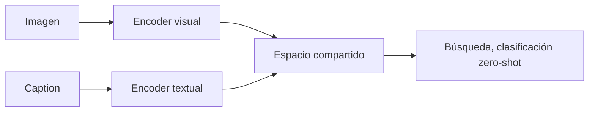
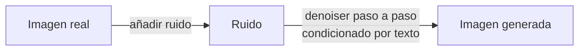

# 9. Multimodalidad: alinear texto, imagen, audio y vídeo

Un modelo multimodal necesita convertir señales muy distintas en representaciones que puedan relacionarse. «Entender una imagen» puede significar clasificarla, localizar objetos, leer texto, describir relaciones o decidir una acción; son capacidades diferentes.

## Tres familias funcionales

| Familia | Objetivo | Ejemplo de uso |
|---|---|---|
| Encoder | Convertir señal en representación | búsqueda, clasificación, embeddings |
| Modelo generativo | Producir una modalidad | imagen, voz, vídeo |
| Modelo multimodal autoregresivo | Razonar/responder sobre varias modalidades | asistente visual, VLA |

## Aprendizaje contrastivo

[CLIP](https://arxiv.org/abs/2103.00020) entrena un encoder de imagen y otro de texto para acercar pares correctos y separar pares incorrectos dentro de un batch.

No produce una descripción por sí solo. Produce vectores comparables. La calidad depende de captions, negativos del batch y cobertura cultural/visual del dataset.

## Conectar visión con un LLM

Una arquitectura tipo [LLaVA](https://arxiv.org/abs/2304.08485) usa:

1. encoder visual que genera patches/features;
2. projector que los lleva al espacio del LLM;
3. LLM que recibe tokens visuales y textuales;
4. instruction tuning multimodal.

Variantes usan *cross-attention*, resamplers o encoders entrenados conjuntamente. El número y resolución de patches afectan texto pequeño, diagramas y coste.

## Grounding: hablar no es localizar

Una respuesta puede nombrar un objeto sin saber dónde está. Para grounding se necesitan salidas como bounding boxes, puntos, máscaras o referencias a regiones. Evalúa por separado:

- presencia y atributos;
- relaciones espaciales;
- OCR;
- conteo;
- localización;
- cambios entre frames;
- incertidumbre visual.

Los modelos tienden a usar priors lingüísticos: si una escena parece una cocina pueden inventar un horno que no se ve. Obliga a distinguir `visible`, `inferido` y `no observable`.

## Difusión

[DDPM](https://arxiv.org/abs/2006.11239) aprende a invertir un proceso que añade ruido gradualmente:

En *latent diffusion* el proceso ocurre en un espacio comprimido por un autoencoder, reduciendo coste. Componentes típicos:

- text encoder;
- denoiser U-Net o Transformer;
- scheduler de ruido;
- VAE encoder/decoder;
- guidance que refuerza el prompt a costa de diversidad.

Fallos: manos/geometría, texto exacto, consistencia de identidad, relaciones negadas, copyright/procedencia y edición localizada.

## Audio

El audio se representa como onda o espectrograma. Un sistema puede ser:

- ASR: audio → texto;
- TTS: texto → audio;
- audio encoder: clasificación/embeddings;
- speech-to-speech: comprensión y generación preservando prosodia.

[Whisper](https://arxiv.org/abs/2212.04356) usa un encoder–decoder Transformer entrenado con gran supervisión débil multilingüe. En producción mide WER/CER por idioma, ruido, acento y vocabulario; una media oculta fallos en nombres o números críticos.

La voz introduce riesgos propios: clonación, consentimiento, biometría, latencia de turn-taking, interrupciones y detección de final de turno.

## Vídeo

Vídeo añade tiempo. Procesar todos los frames es caro y redundante. Se usan:

- muestreo de frames;
- encoders temporales;
- compresión en tokens latentes;
- atención espacio-temporal;
- memoria de eventos;
- difusión o autoregresión temporal para generar.

Evalúa coherencia de objetos, movimiento, física, continuidad de escena, sincronía audio–vídeo y seguimiento de instrucciones. Un frame bonito no implica un vídeo coherente.

## Fusión temprana y tardía

| Diseño | Qué hace | Ventaja | Riesgo |
|---|---|---|---|
| Temprana | Mezcla tokens pronto | Interacciones profundas | Coste y entrenamiento complejo |
| Tardía | Combina decisiones/embeddings | Modular y reemplazable | Pierde detalle cruzado |
| Tool-based | LLM llama OCR/detector/ASR | Verificable y especializado | Orquestación y latencia |

No siempre necesitas un modelo omni. Para leer facturas, OCR especializado + reglas + LLM puede ser más controlable.

Consulta [OCR y Document AI](../03-era-chatgpt/06-ocr-document-ai-y-comprension-documental.md) para separar reconocimiento de texto, análisis de layout, extracción estructurada y razonamiento documental, además de medir CER/WER y métricas de negocio.

## Eval multimodal

Construye casos con oclusión, imágenes adversariales, texto diminuto, múltiples idiomas, audio ruidoso, contradicción entre caption e imagen y preguntas cuya respuesta no es visible. Comprueba que el evaluador realmente mire la modalidad: un benchmark puede resolverse por pistas textuales.

Siguiente: [entrenamiento distribuido](10-entrenamiento-distribuido.md).
