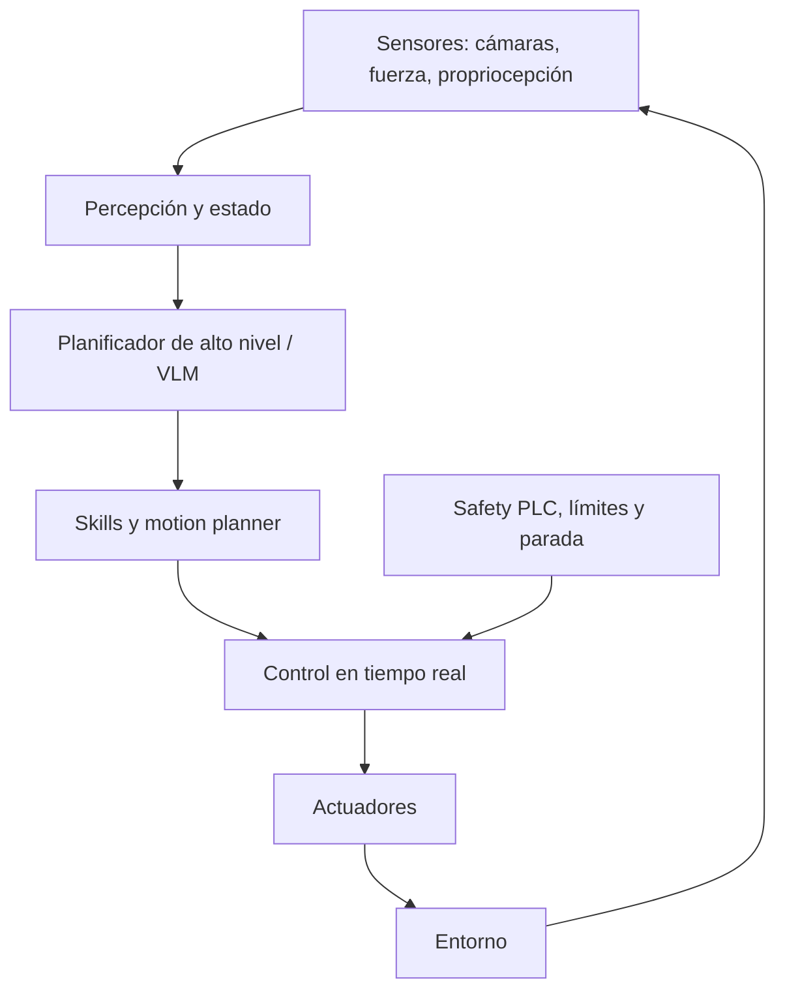

# 14. Robótica e IA encarnada

Un agente digital puede reintentar una consulta. Un robot tiene masa, inercia, latencia y capacidad de dañar. La IA encarnada conecta percepción, lenguaje y acción con controles físicos que no pueden depender solo de un LLM.

## La pila



Las capas inferiores operan a frecuencias y garantías que un servicio generativo remoto no ofrece.

## Grounding y affordances

Un LLM puede proponer «coge el vaso», pero el robot debe saber si el vaso existe, está alcanzable, pesa demasiado o contiene líquido caliente. [SayCan](https://arxiv.org/abs/2204.01691) combina plausibilidad lingüística con value functions de skills que estiman viabilidad física.

Esta separación sigue siendo poderosa:

- el modelo aporta conocimiento semántico y descomposición;
- percepción aporta estado;
- skills definen acciones ejecutables;
- affordance/value filtra lo posible;
- controller garantiza trayectoria y límites.

## Vision-Language-Action (VLA)

[RT-2](https://arxiv.org/abs/2307.15818) representa acciones robóticas como tokens y coentrena datos web visual-lingüísticos con trayectorias. [OpenVLA](https://arxiv.org/abs/2406.09246) ofrece una implementación abierta entrenada sobre demostraciones de múltiples robots.

Una VLA aprende:

```text
imagen(es) + instrucción + estado → chunk/secuencia de acciones
```

Decisiones:

- frecuencia y horizonte de action chunks;
- discretización frente a acciones continuas;
- una o varias cámaras;
- propriocepción y fuerza;
- latencia on-device;
- adaptación entre embodiments;
- detección de éxito y recuperación.

## Datos de robot

Son caros, correlacionados y específicos del hardware. Fuentes:

- teleoperación;
- demostraciones humanas;
- play data;
- simulación;
- políticas anteriores;
- vídeo web sin acciones, útil para representación pero no control directo.

Registra calibración, embodiment, escena, operador, fallo y resets. Una trayectoria «exitosa» puede contener movimientos inseguros que no deben imitarse.

## Sim-to-real

La simulación permite volumen y fallos baratos, pero tiene *reality gap*: fricción, iluminación, deformación, latencia y sensores no coinciden. Técnicas:

- domain randomization;
- system identification;
- fine-tuning con datos reales;
- adaptación visual;
- políticas robustas a perturbaciones;
- tests hardware-in-the-loop.

Una simulación que no modela el mecanismo del fallo puede dar confianza falsa.

## Planificación y control

Mantén horizontes distintos:

| Horizonte | Ejemplo | Mecanismo |
|---|---|---|
| Alto nivel | «prepara la mesa» | agente/VLM/task planner |
| Skill | abrir cajón | policy aprendida |
| Movimiento | trayectoria sin colisión | motion planner |
| Control | torque/posición | controller determinista |
| Emergencia | parada | circuito independiente |

El modelo de lenguaje no debe emitir torque directo sin una capa que imponga restricciones.

## Seguridad en capas

- límites de fuerza, velocidad y espacio;
- collision avoidance;
- zonas y estados prohibidos;
- detección de humano;
- watchdog de latencia;
- parada física independiente;
- aprobación para planes de riesgo;
- incertidumbre y estado seguro;
- logging sincronizado de sensores y acciones.

La familia Gemini Robotics reciente ilustra la dirección hacia VLAs multi-embodiment y modelos on-device; sus propias model cards restringen usos safety-critical. Consulta la información vigente de [Gemini Robotics 2](https://deepmind.google/blog/gemini-robotics-2-brings-whole-body-intelligence-to-robots/) y su [model card](https://deepmind.google/models/model-cards/gemini-robotics-er-2/).

## Evaluación

No basta task success. Mide:

- éxito y completitud;
- colisiones y near-misses;
- fuerza/velocidad máximas;
- tiempo y energía;
- intervención humana;
- recuperación tras perturbación;
- generalización de objeto, escena, instrucción y embodiment;
- capacidad de rechazar una orden peligrosa;
- detección correcta de éxito.

Usa suficientes trials y separa in-distribution de generalización. Publica resets, ayudas humanas y condiciones excluidas.

## Estado de frontera

Los vídeos demo seleccionan éxitos; no equivalen a disponibilidad general. Pregunta siempre: número de trials, tasa base, objetos, resets, teleoperación oculta, velocidad real, hardware, distribución y qué ocurre al fallar.

Siguiente: [hardware, energía y economía](15-hardware-energia-y-economia.md).
