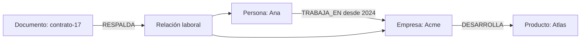
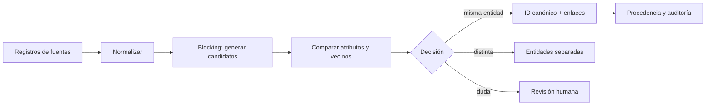
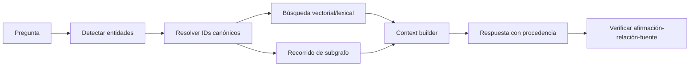

# 16. Grafos de conocimiento, bases de grafos y GNN

Los datos empresariales rara vez son una colección de textos independientes. Una persona trabaja para una empresa, una empresa vende un producto, un producto depende de un componente y una incidencia afecta a una versión concreta. Un **grafo** representa esas conexiones como parte principal del modelo, no como coincidencias que hay que reconstruir en cada consulta.

Esta lección une tres capas diferentes:

1. **modelado de conocimiento:** qué entidades, relaciones y reglas existen;
2. **base de datos de grafos:** cómo se almacenan y consultan esas relaciones;
3. **aprendizaje sobre grafos:** cómo producir embeddings o entrenar GNN para encontrar patrones.

No deben confundirse con [Graph Engineering](../13-prompting-loop-graph-engineering/04-graph-engineering.md), donde un grafo representa pasos de ejecución, ni con LangGraph, que orquesta el estado de un agente.

## Del dominio al grafo

Un grafo contiene:

- **nodos o vértices:** objetos con identidad, como `Persona`, `Empresa` o `Documento`;
- **aristas o relaciones:** conexiones tipadas, como `TRABAJA_EN` o `CITA`;
- **propiedades:** valores como nombre, fecha o versión;
- **procedencia:** fuente, momento y método que justifican cada dato.



La relación laboral del ejemplo tiene fuente y fechas propias. En un property graph puede representarse como arista con propiedades o como nodo intermedio. La decisión depende de las preguntas que necesite contestar el sistema.

## Schema, ontología y modelo de datos

### Schema: la forma permitida

Un **schema** define qué tipos existen, qué propiedades admiten y qué relaciones son válidas. Puede expresar reglas como:

```text
Persona(id único, nombre, email?)
Empresa(id único, razón_social)
TRABAJA_EN(Persona -> Empresa, desde, hasta?)
```

Sirve para validar y mantener consistencia. Un grafo sin schema explícito no es automáticamente flexible: a menudo es un sistema donde cada importador escribe nombres distintos para la misma idea.

### Ontología: el significado compartido

Una **ontología** va más allá de la forma. Define vocabulario, jerarquías, equivalencias, restricciones y relaciones con significado compartido. Por ejemplo:

```text
IngenieroSoftware es una subclase de ProfesionalTecnológico
TRABAJA_EN tiene dominio Persona y rango Organización
DIRIGE es una especialización de TRABAJA_EN
```

El estándar [OWL 2 de W3C](https://www.w3.org/TR/owl-overview/) permite representar vocabularios formales e inferir conocimiento implícito. No todo proyecto necesita OWL: una taxonomía versionada y un modelo de property graph pueden bastar. La ontología compensa cuando varias fuentes o equipos necesitan compartir significado y razonar sobre él.

### Preguntas de competencia antes de dibujar

Empieza escribiendo preguntas que el grafo debe resolver:

- ¿qué proveedores afectan indirectamente a este producto?;
- ¿qué documentos respaldan una afirmación?;
- ¿dos registros representan a la misma persona?;
- ¿qué usuarios tienen acceso heredado a un recurso?;
- ¿qué camino conecta una incidencia con una versión desplegada?

Después modela los caminos de consulta. La [guía de modelado de Neo4j](https://neo4j.com/docs/getting-started/data-modeling/) recomienda precisamente partir del dominio y de los casos de uso, probar con datos y refactorizar el modelo según las consultas y su rendimiento.

## Property graph frente a RDF

Son dos familias importantes de grafos de conocimiento.

| Aspecto | Labeled property graph | RDF / Semantic Web |
|---|---|---|
| Unidad | nodos y aristas con propiedades | triples sujeto–predicado–objeto |
| Identidad | ID de nodo definido por la base/aplicación | IRI global o *blank node* |
| Tipos | etiquetas y tipos de relación | clases y propiedades RDF/RDFS/OWL |
| Consulta habitual | Cypher, openCypher, Gremlin o AQL | SPARQL |
| Fortalezas | desarrollo de aplicaciones y recorridos operativos | interoperabilidad, vocabularios y semántica formal |
| Dificultad típica | mantener significado consistente entre equipos | mayor curva conceptual y verbosidad |

RDF 1.2 define un grafo como un conjunto de triples. Una triple sencilla se lee así:

```text
<ana> <trabajaEn> <acme>
```

Un property graph puede guardar `desde: 2024` directamente en la arista. En RDF existen varios patrones para describir una afirmación con metadatos. No elijas por moda: elige según interoperabilidad, reglas, consultas, herramientas y operación.

## Resolución de entidades: saber cuándo dos registros son el mismo

Un knowledge graph pierde utilidad si crea tres nodos para la misma empresa:

```text
ACME S.L.
Acme SL
ACME, Sociedad Limitada
```

La **resolución de entidades** enlaza o fusiona registros que representan a la misma entidad real. No es solo eliminar duplicados exactos.

### Pipeline funcional



1. **Normalizar:** mayúsculas, acentos, teléfonos, direcciones e identificadores.
2. **Blocking:** evita comparar cada registro con todos; forma candidatos por claves aproximadas.
3. **Features:** nombre, email, fecha, dirección y también relaciones compartidas.
4. **Score o reglas:** estima si el par coincide.
5. **Decisión:** fusionar, mantener separado o pedir revisión.
6. **Identidad canónica:** asigna un ID estable sin perder registros originales.
7. **Procedencia:** conserva por qué se decidió y cómo revertirlo.

### Fusionar no siempre es correcto

Dos personas pueden compartir nombre y fecha. Un falso positivo mezcla historiales y puede causar un daño mayor que mantener dos nodos temporalmente. Una estrategia prudente crea relaciones `POSSIBLY_SAME_AS` o un nodo canónico que agrupa registros fuente sin destruirlos.

Evalúa precisión y recall sobre pares, pero también calidad de clusters: una única fusión errónea puede contaminar un grupo entero. Separa umbrales automáticos de la zona que requiere revisión humana.

## Bases de datos de grafos: cuatro opciones relevantes

No hay una ganadora universal. Compara modelo, lenguaje, operación, latencia, analítica y encaje con tu plataforma.

| Sistema | Modelo y consultas | Encaja especialmente cuando… | Cautela |
|---|---|---|---|
| [Neo4j](https://neo4j.com/docs/) | labeled property graph y Cypher | quieres un ecosistema maduro, modelado expresivo, tooling y algoritmos de grafos | revisa edición, licencias, operación y requisitos de clustering |
| [Memgraph](https://memgraph.com/docs) | property graph, Cypher y procesamiento orientado a datos dinámicos | necesitas recorridos y analítica de grafo con actualizaciones frecuentes o baja latencia | valida compatibilidad Cypher y durabilidad sobre tu carga exacta |
| [Amazon Neptune](https://docs.aws.amazon.com/neptune/) | property graph con Gremlin/openCypher y RDF con SPARQL | quieres servicio administrado en AWS o necesitas soportar ambas familias de grafo | considera coste, límites del servicio, red, IAM y portabilidad |
| [ArangoDB](https://docs.arango.ai/arangodb/stable/graphs/) | multimodelo: documentos JSON, property graph, búsqueda/vector y AQL | quieres combinar documentos y recorridos de grafo en un mismo motor | una plataforma multimodelo no elimina la necesidad de modelar e indexar cada acceso |

Otras opciones —JanusGraph, TigerGraph, FalkorDB, Stardog, GraphDB o almacenes RDF— pueden ser mejores según escala, semántica, licencia o infraestructura. Diseña primero una prueba representativa.

## Consultas prácticas

### Cypher / openCypher

Encontrar productos afectados hasta tres saltos por un proveedor:

```cypher
MATCH path = (supplier:Company {id: $supplierId})
             -[:SUPPLIES|DEPENDS_ON*1..3]->
             (product:Product)
RETURN product.id, length(path) AS hops
ORDER BY hops
```

Cypher expresa el patrón de nodos y relaciones de forma visual. Limita profundidad y cardinalidad: un recorrido sin cota puede explotar en grafos densos.

### SPARQL

Consultar personas que trabajan en una organización o cualquiera de sus filiales:

```sparql
SELECT ?person ?organization
WHERE {
  ?person :worksFor ?organization .
  ?organization (:subsidiaryOf)* :acmeGroup .
}
```

SPARQL opera sobre triples y permite rutas de propiedades. RDF/OWL pueden añadir inferencia, pero debes saber si la consulta usa datos explícitos, materializados o inferidos.

### AQL

En ArangoDB, un recorrido puede combinar documentos y aristas:

```aql
FOR vertex, edge, path IN 1..3 OUTBOUND @startId GRAPH "supply_chain"
  FILTER vertex.status == "active"
  RETURN { id: vertex._key, depth: LENGTH(path.edges) }
```

Mide cada consulta con datos y distribución de grado realistas. Un ejemplo de diez nodos no revela supernodos, rutas explosivas ni particiones problemáticas.

## Knowledge Graph + LLM: GraphRAG

Un GraphRAG usa estructura de grafo para recuperar evidencia. Puede complementar la búsqueda vectorial:



Resulta útil para preguntas *multihop*, jerarquías, dependencias, fraude, permisos, causalidad documentada y cadenas de suministro. No arregla automáticamente las alucinaciones: si la extracción creó una relación falsa o resolvió mal una entidad, el recorrido ofrece evidencia estructurada pero incorrecta.

### Pipeline de construcción

1. extraer entidades, relaciones y afirmaciones desde fuentes;
2. mapearlas al schema u ontología;
3. resolver identidades;
4. validar tipos, rangos y procedencia;
5. cargar o actualizar de forma idempotente;
6. recuperar subgrafos con límites y ACL;
7. combinar el subgrafo con fragmentos originales;
8. generar y verificar cada afirmación material.

Nunca conviertas silenciosamente una inferencia del LLM en un hecho. Guarda `source`, `extractor_version`, `confidence`, `valid_from`, `valid_to` y estado de revisión.

## Embeddings de grafos

Un **graph embedding** convierte nodos, relaciones o grafos completos en vectores. Nodos cercanos en el espacio vectorial deberían compartir alguna propiedad útil para la tarea.

| Familia | Intuición | Ejemplos de uso |
|---|---|---|
| Caminatas aleatorias | vecinos que aparecen en recorridos parecidos obtienen vectores próximos | similitud, comunidades, recomendación |
| Knowledge graph embeddings | modelan relaciones tipadas entre sujeto y objeto | predicción de enlaces, entidades candidatas |
| GNN | agregan features y estructura de vecinos mediante capas aprendidas | clasificación, fraude, predicción de enlaces |
| Embedding de grafo completo | resume una red o molécula | clasificación de moléculas o transacciones |

[Node2vec](https://arxiv.org/abs/1607.00653) aprende representaciones a partir de caminatas sesgadas. Modelos como TransE representan relaciones como transformaciones entre vectores. Estos métodos permiten ranking aproximado, pero el vector no conserva cada hecho exacto: para explicar una relación vuelve a la arista y a su procedencia.

### Transductivo e inductivo

Un método **transductivo** aprende embeddings para los nodos vistos durante entrenamiento. Añadir una entidad puede exigir recalcular o entrenar de nuevo. Un método **inductivo**, como [GraphSAGE](https://arxiv.org/abs/1706.02216), aprende una función que puede generar representaciones para nodos nuevos a partir de sus features y vecinos.

## GNN: aprender pasando mensajes por el grafo

Una **Graph Neural Network** actualiza la representación de cada nodo combinando su información con la de sus vecinos:

```text
nuevo_vector(nodo) = combinar(
  vector_propio,
  agregar(vectores_de_vecinos, tipos_de_relación)
)
```

Una capa recoge información de un salto; varias capas permiten que llegue información más lejana. No necesitas imaginar una convolución de imágenes: piensa en mensajes que viajan por relaciones y se agregan de una forma que no depende del orden de los vecinos.

### GCN: agregación regular

Una [Graph Convolutional Network](https://arxiv.org/abs/1609.02907) transforma y combina features de vecinos con normalización. Es un buen baseline para clasificación de nodos y otros problemas donde las conexiones locales son informativas.

Limitaciones frecuentes:

- vecinos distintos pueden pesar de forma demasiado parecida;
- muchas capas pueden hacer que los nodos se vuelvan indistinguibles —*oversmoothing*—;
- funciona peor si vecinos conectados suelen ser deliberadamente diferentes;
- muestrear y entrenar sobre grafos enormes exige diseño de sistemas.

### GAT: atención sobre los vecinos

Una [Graph Attention Network](https://arxiv.org/abs/1710.10903) aprende coeficientes de atención para combinar vecinos. Puede dar más peso a unas conexiones que a otras y utilizar varias cabezas.

La atención no convierte automáticamente el modelo en explicable: un peso alto indica influencia dentro del cálculo, no una causa comprobada. GAT también añade coste y puede sobreajustar si hay pocos datos.

### Relaciones tipadas y nodos nuevos

- **R-GCN** modela distintos tipos de relación, útil en knowledge graphs multi-relacionales.
- **GraphSAGE** muestrea y agrega vecindarios, con enfoque inductivo.
- **GIN** ofrece un baseline potente para distinguir estructuras de grafos.

Empieza por heurísticas y algoritmos clásicos —PageRank, comunidades, caminos, similitud— antes de una GNN. Si una consulta Cypher resuelve la pregunta exactamente, entrenar un modelo añade incertidumbre sin necesidad.

## Tareas y evaluaciones

### Por capa

| Capa | Qué medir |
|---|---|
| Schema/ontología | violaciones, términos sin mapear, consistencia y cobertura |
| Entity resolution | precision/recall de pares, calidad de clusters, coste de revisión |
| Base de datos | corrección de consultas, p95, throughput, coste y recuperación |
| GraphRAG | recall del subgrafo, caminos relevantes, soporte y procedencia por afirmación |
| Embeddings | MRR, Hits@K, vecinos relevantes y estabilidad temporal |
| GNN | métrica de tarea, calibración, slices, robustez y coste de inferencia |

### Evitar leakage

En predicción de enlaces, no dejes la arista objetivo ni una copia equivalente en las features. En grafos temporales, separa train y test por tiempo; una partición aleatoria puede permitir que el modelo vea relaciones futuras. En entity resolution, separa grupos de entidades completos para evitar que registros gemelos aparezcan en ambos conjuntos.

Compara contra baselines:

- frecuencia o regla de negocio;
- similitud de atributos;
- búsqueda vectorial sin grafo;
- algoritmo clásico de grafos;
- modelo sin relaciones;
- GCN antes de GAT o arquitecturas más complejas.

La estructura solo aporta valor si mejora la tarea fuera del conjunto usado para diseñarla.

## Cómo elegir la tecnología

| Necesidad dominante | Punto de partida |
|---|---|
| transacciones tabulares y agregaciones conocidas | base relacional |
| documentos y estructura flexible | document store |
| similitud semántica sobre contenido | índice vectorial |
| recorridos, dependencias y caminos variables | property graph |
| vocabulario compartido e inferencia interoperable | RDF/OWL + SPARQL |
| documentos + grafo en un motor | multimodelo como ArangoDB |
| AWS administrado con property graph y RDF | Neptune |
| patrones probabilísticos en estructura | embeddings o GNN, después de un baseline |

Muchos sistemas combinan SQL como fuente de verdad, un índice vectorial para similitud y un grafo derivado para recorridos. Define reconciliación, frescura y propietario de cada dato; tres almacenes sin autoridad clara producen tres versiones de la realidad.

## Práctica recomendada

Construye un grafo pequeño de repositorios de software:

```text
Developer -[CONTRIBUTED_TO]-> Repository
Repository -[DEPENDS_ON]-> Package
Issue -[AFFECTS]-> PackageVersion
PullRequest -[FIXES]-> Issue
Document -[SUPPORTS]-> Claim
```

1. Define cinco preguntas de competencia.
2. Diseña el schema y reglas de identidad.
3. Carga el mismo subconjunto en una opción local.
4. Resuelve autores y paquetes duplicados conservando procedencia.
5. Escribe consultas de uno, dos y tres saltos.
6. Añade búsqueda vectorial sobre issues y compara con recorrido de grafo.
7. Crea una tarea de predicción de enlaces con baseline heurístico.
8. Prueba GCN y GAT solo si el baseline no basta.
9. Separa train/test por fecha y revisa leakage.
10. Documenta qué respuesta puede explicarse mediante un camino real.

## Idea para recordar

**El schema dice qué forma tiene el conocimiento; la ontología aclara qué significa; la resolución de entidades decide de quién hablamos; la base de grafos conserva conexiones; los embeddings y las GNN aprenden patrones aproximados sobre ellas.**

Vuelve a [RAG avanzado](08-contexto-largo-y-rag-avanzado.md) para integrar GraphRAG y continúa con [serving en producción](11-serving-produccion-y-capacidad.md) para operar el sistema completo.
