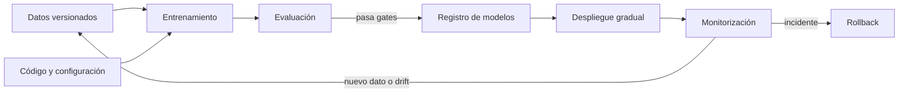
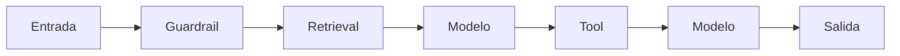
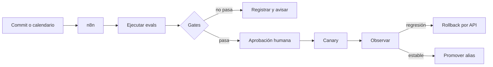

# MLOps, LLMOps y AgentOps: operar IA sin depender de la suerte

Un prototipo demuestra que un modelo puede resolver un ejemplo. Un sistema en producción debe demostrar algo más difícil: que puede repetirse, medirse, desplegarse, vigilarse y revertirse cuando cambian los datos, el modelo o el entorno.

**MLOps** aplica prácticas de ingeniería al ciclo de vida del *machine learning*. **LLMOps** adapta y amplía esas prácticas para aplicaciones construidas con modelos fundacionales, prompts y recuperación. **AgentOps** añade la operación de agentes que conservan estado, eligen herramientas y pueden producir efectos en sistemas externos. No son productos concretos ni sinónimos de «subir un modelo a una API».

## MLOps: del notebook a un sistema reproducible

MLOps combina desarrollo, datos, entrenamiento y operación. Su objetivo es que el camino desde un experimento hasta producción no dependa de pasos manuales imposibles de reconstruir.



| Capacidad | Pregunta que resuelve |
|---|---|
| Versionado de código, datos y configuración | «¿Con qué se produjo este modelo?» |
| Seguimiento de experimentos | «¿Qué cambió entre dos ejecuciones?» |
| Pipeline reproducible | «¿Puede CI reconstruirlo sin el portátil del autor?» |
| Registro de modelos (*model registry*) | «¿Qué artefacto está aprobado para cada entorno?» |
| Despliegue y serving | «¿Cómo recibe tráfico y cómo se escala?» |
| Monitorización | «¿Sigue funcionando técnica y estadísticamente?» |
| Reentrenamiento controlado | «¿Cuándo y con qué evidencia se crea un candidato nuevo?» |
| Gobierno y linaje | «¿Quién aprobó qué datos, modelo y uso?» |

La documentación de arquitectura de Google resume la evolución mediante **CI**, **CD** y **CT**: integración continua de código y componentes, entrega continua del pipeline y entrenamiento continuo cuando existe una señal justificada. CT no significa reentrenar ciegamente cada noche. Un modelo nuevo sigue siendo un candidato que debe superar evaluaciones y aprobación.

## Por qué LLMOps necesita una capa adicional

En ML predictivo, gran parte del comportamiento reside en un artefacto entrenado. En una aplicación generativa, el resultado emerge de muchas piezas que pueden cambiar por separado:

| Pieza mutable | Ejemplo de cambio | Riesgo |
|---|---|---|
| Modelo o proveedor | alias del proveedor apunta a una revisión nueva | cambia estilo, tool calling, seguridad, coste o latencia |
| Prompt | se añade una instrucción o ejemplo | mejora un caso y rompe otro idioma o formato |
| Parámetros | temperatura, límite de tokens, reasoning effort | coste y variabilidad distintos |
| Retriever | nuevo embedding, chunking, filtros o reranker | evidencia omitida, obsoleta o perteneciente a otro usuario |
| Corpus e índice | documentos actualizados | freshness mejor, pero permisos o citas incorrectos |
| Tools | cambia un esquema o una API | argumentos inválidos o efectos laterales inesperados |
| Bucle agéntico | router, memoria, compactador o límite de pasos | bucles, pérdida de contexto o rutas nuevas |
| Guardarraíles | nueva política o clasificador | bypass o sobrebloqueo |
| Código de aplicación | parser, UI o regla de negocio | salida correcta procesada de forma incorrecta |

Por eso, **versionar solo el nombre del modelo no reproduce una respuesta**. LLMOps opera la aplicación completa y añade evaluación semántica, trazas por paso, feedback humano, costes por tarea y controles sobre datos y herramientas.

## AgentOps: operar decisiones, tools y efectos

Un chatbot normalmente recibe una entrada y produce una salida. Un agente puede decidir qué hacer después, llamar una herramienta, guardar estado, pedir ayuda, reintentar y modificar el mundo. **AgentOps** es la disciplina que hace observable, evaluable y gobernable ese recorrido.

No sustituye a LLMOps: lo amplía. Un mismo sistema puede necesitar las tres capas:

| Capa | Unidad que opera | Fallo característico |
|---|---|---|
| MLOps | datos, features, entrenamiento, modelo y endpoint | modelo irreproducible o degradado |
| LLMOps | modelo, prompt, contexto, retrieval, eval y traza | respuesta no fundamentada, regresión semántica o coste inesperado |
| AgentOps | grafo, estado, tools, permisos, memoria, delegación y efectos | bucle, acción duplicada, escalado de privilegios o tarea abandonada |

Una traza agéntica útil no se limita al texto del modelo. Debe permitir reconstruir:

- estado anterior y posterior a cada transición;
- nodo, router o regla que eligió el siguiente paso;
- versión y esquema de la tool, decisión de autorización y resultado;
- clave de idempotencia para no repetir una acción durante un retry;
- checkpoint usado para pausar, reanudar o entregar la tarea;
- presupuesto consumido de tiempo, tokens, coste y pasos;
- aprobación humana, delegación o *handoff*;
- razón de parada: objetivo cumplido, límite, rechazo, error o intervención.

Los controles mínimos son un número máximo de pasos, timeout global y por tool, detección de repetición, tools con privilegio mínimo, separación entre lectura y escritura, aprobación para efectos sensibles, sandbox cuando se ejecuta código y un *kill switch*. Para desplegar, conviene pasar por replay en simulación, modo shadow con tools simuladas o de solo lectura y un canary limitado a tareas de bajo riesgo.

## La unidad de despliegue: un manifiesto del sistema

Cada release debería poder describirse mediante un manifiesto inmutable o reconstruible:

```yaml
release: soporte-2026-08-29.3
app_commit: 37ff0c6
model: proveedor/modelo@revision
prompt: soporte-principal@12
tool_schema: tools@7
agent_graph: soporte-agent@9
memory_schema: conversation-state@4
budgets: {max_steps: 12, max_cost_eur: 0.35}
approval_policy: support-actions@6
retrieval:
  corpus_snapshot: kb@2026-08-28
  embedding: modelo-embedding@2
  chunker: semantic-800-v3
  reranker: reranker@1
policy: soporte-eu@5
eval_suite: soporte-golden@18
```

El formato exacto importa menos que la relación. Una traza de producción debe apuntar a esa versión para responder «¿qué sistema produjo esto?» sin reconstruirlo por intuición.

No guardes secretos, datos personales ni prompts de usuarios dentro del manifiesto. Registra identificadores y hashes; resuelve credenciales desde un gestor de secretos con identidad y alcance mínimos.

## CI, CD, CT y evaluación continua

Las siglas se entienden mejor como gates diferentes:

| Bucle | En MLOps | En LLMOps |
|---|---|---|
| **CI** | tests de transformaciones, features, entrenamiento y contratos | tests de prompts, parsers, tool schemas, retrieval, políticas y datasets de eval |
| **CD** | empaquetar y promover modelo/servicio | promover una configuración completa mediante shadow, canary o alias versionado |
| **CT** | producir un modelo candidato con datos nuevos | suele aplicar a fine-tuning, embeddings o rerankers propios; no a un modelo externo cerrado |
| **CE: continuous evaluation** | comprobar rendimiento con datos recientes | evaluar trazas, feedback, seguridad, groundedness, coste, latencia y éxito de tarea |

LLMOps suele necesitar más **CE** que CT. Si consumes un modelo por API, no controlas su entrenamiento; sí puedes detectar que el comportamiento cambió, comparar un candidato y fijar, enrutar o retirar una versión.

## Evals como contrato de release

Una release no debería pasar porque «las respuestas parecen mejores». Define un scorecard con límites y trade-offs.

1. **Tests deterministas:** esquema, citas existentes, permisos, argumentos, idioma, regex y reglas de negocio.
2. **Evals de componente:** retrieval recall, precision, reranking, selección de tools y calidad de argumentos.
3. **Evals de sistema:** éxito de tarea, groundedness, utilidad y cumplimiento de instrucciones.
4. **Seguridad:** prompt injection, exfiltración, PII, abuso de tools y separación entre tenants.
5. **Operación:** p50/p95/p99, timeouts, tokens, coste, errores del proveedor y número de pasos.
6. **Revisión humana:** muestras calibradas por expertos, desacuerdos y casos de alto impacto.

```text
candidato
  -> tests duros
  -> eval offline contra baseline
  -> revisión de seguridad
  -> shadow o canary
  -> eval online + métricas operativas
  -> promover, mantener o revertir
```

Una media global puede ocultar regresiones. Separa por idioma, producto, longitud, tipo de usuario, herramienta, fuente y nivel de riesgo. Mantén un conjunto retenido para evitar optimizar el prompt contra todas las preguntas conocidas.

## Trazas: observar el recorrido, no solo la respuesta

Un log HTTP dice que la petición tardó dos segundos. Una traza LLMOps debe explicar dónde se emplearon:



Registra por span, cuando sea apropiado:

- release, modelo y configuración;
- versión del prompt, tools y política;
- documentos recuperados, scores y permisos aplicados;
- llamadas a tools, duración, error e identificador idempotente;
- tokens, caché, coste estimado y latencia;
- criterio de parada, reintentos y handoffs;
- scores automáticos y feedback posterior.

La observabilidad también crea riesgo. Una traza puede contener prompts, secretos, PII, documentos internos o resultados de herramientas. Aplica minimización, redacción, control de acceso, cifrado, muestreo y retención. «Necesario para depurar» no autoriza conservarlo indefinidamente.

## Drift: no todo cambio es deriva del modelo

**Drift** significa que la distribución o relación observada ya no se parece lo suficiente a la usada para diseñar y validar el sistema.

| Tipo | Señal posible | Respuesta |
|---|---|---|
| Data drift | cambian idioma, longitud o temas de las entradas | analizar slices y actualizar evals |
| Concept drift | cambia la relación entre entrada y respuesta correcta | revisar labels, reglas y quizá reentrenar |
| Corpus drift | documentación envejece o cambian permisos | refrescar índice y comprobar freshness/ACL |
| Provider drift | cambia un alias, filtro o comportamiento remoto | fijar versión si es posible y ejecutar eval comparativa |
| Cost drift | suben tokens, pasos o llamadas repetidas | inspeccionar contexto, bucles, caché y routing |
| Quality drift | baja feedback o groundedness sin error técnico | muestrear trazas y localizar el componente |
| Policy drift | cambian regulación o reglas internas | versionar política, revalidar y documentar aprobación |

Una alerta de drift no debería ejecutar automáticamente un fine-tuning. Primero determina qué capa cambió. Reentrenar el modelo no arregla un corpus sin permisos, una tool rota ni un prompt contradictorio.

## Despliegue gradual y rollback

Las respuestas probabilísticas hacen especialmente valioso comparar versiones con tráfico controlado:

- **offline:** replay sobre un dataset fijo, sin usuarios;
- **shadow:** el candidato procesa copias sin controlar la respuesta real;
- **canary:** recibe un porcentaje pequeño y reversible de tráfico;
- **A/B:** compara experiencias con asignación estable y métricas definidas;
- **blue/green:** dos stacks completas permiten conmutar rápidamente;
- **champion/challenger:** el candidato compite contra la versión aprobada.

Un rollback completo restaura algo más que el contenedor: modelo, prompt, índices compatibles, tool schemas, políticas y configuración. Si el corpus nuevo ejecutó efectos irreversibles, volver al código anterior no deshace esos efectos; necesitas idempotencia, registro de auditoría y procedimientos de compensación.

## n8n dentro de LLMOps y AgentOps

[n8n](https://docs.n8n.io/) puede ser una buena **capa de automatización y orquestación** porque expresa triggers, ramas, llamadas a APIs, esperas, reintentos y aprobaciones como un workflow visible. Puede conectar Git, un registro, un evaluador, una plataforma de trazas, Slack/Teams y servicios de modelos sin construir cada integración desde cero. En AgentOps puede implementar workflows explícitos con espera y aprobación, pero no sustituye el runtime del agente, su política de autorización ni una traza completa de las decisiones.



### Usos adecuados

- refrescar un corpus RAG al publicarse documentos y lanzar controles de calidad;
- ejecutar una suite de evals al cambiar prompt, modelo o workflow;
- comparar candidato y baseline, guardar resultados y solicitar aprobación;
- promover un alias o disparar un despliegue mediante una API autorizada;
- convertir trazas seleccionadas y revisadas en candidatos para el dataset de eval;
- alertar sobre coste, latencia, errores o degradación de calidad;
- coordinar un fallback determinista cuando falla un proveedor.

La documentación actual de n8n incluye evaluaciones ligeras y basadas en métricas, nodos de evaluación, historial de ejecuciones y entornos apoyados en Git. Son piezas útiles, pero **n8n no se convierte por ello en toda la plataforma LLMOps**.

### Límites y anti-patrones

| Evita | Por qué |
|---|---|
| Usar el canvas como única fuente de verdad | dificulta review, diff, promoción reproducible y recuperación |
| Guardar prompts, datasets o credenciales como texto disperso en nodos | rompe linaje, seguridad y reutilización |
| Dejar que un score de modelo despliegue sin gates duros | el juez también es probabilístico y puede estar sesgado |
| Ejecutar acciones no idempotentes en un retry | puede duplicar mensajes, cargos o modificaciones |
| Conceder a n8n una credencial administradora compartida | amplía el radio de impacto de cada workflow |
| Mezclar desarrollo y producción en el mismo flujo editable | una prueba puede convertirse en cambio real |
| Conservar todos los datos de ejecución | crea un repositorio secundario de información sensible |

Mantén código, definiciones exportables, configuración y evaluaciones en control de versiones. Separa entornos y credenciales. Los workflows deberían llamar interfaces estables y registrar los identificadores de las versiones ejecutadas.

## Airflow, Argo, Kubeflow y las plataformas cloud

Estos nombres suelen aparecer juntos, pero resuelven niveles distintos. Elegirlos por popularidad conduce a duplicar orquestadores y metadatos.

| Tecnología | Qué es realmente | Encaja especialmente cuando | Límite que conviene recordar |
|---|---|---|---|
| [Apache Airflow](https://airflow.apache.org/docs/apache-airflow/stable/index.html) | Orquestador de workflows como código, expresados como DAGs de Python | ETL, preparación de datos, evaluaciones periódicas, backfills y trabajos batch con inicio y final | No es por sí solo un registry, servidor de modelos ni runtime interactivo de agentes |
| [Argo Workflows](https://argo-workflows.readthedocs.io/en/latest/) | Motor container-native que ejecuta pasos y DAGs como recursos de Kubernetes | Cada etapa ya es un contenedor y el equipo opera Kubernetes; jobs paralelos de entrenamiento, datos o CI | Obliga a asumir la complejidad operativa de Kubernetes y no aporta semántica ML completa |
| [Kubeflow Pipelines](https://www.kubeflow.org/docs/components/pipelines/concepts/pipeline/) | Capa de pipelines de ML sobre Kubernetes, con componentes, artefactos, caché y metadatos | Se quiere una plataforma ML reproducible y portable alrededor de Kubernetes | Es una plataforma, no solo una librería; puede ser excesiva para un equipo pequeño |
| [Amazon SageMaker AI](https://docs.aws.amazon.com/sagemaker/latest/dg/pipelines-overview.html) | Plataforma gestionada de AWS con procesamiento, entrenamiento, Pipelines, registry, endpoints y monitorización | La organización ya vive en AWS y prefiere integrar el ciclo ML con servicios gestionados | Comodidad a cambio de coste, acoplamiento y contratos específicos del proveedor |
| [Azure Machine Learning](https://learn.microsoft.com/azure/machine-learning/concept-ml-pipelines) | Plataforma gestionada de Azure para assets, jobs, pipelines, registros, endpoints y gobierno | El stack empresarial usa Azure, Entra ID, redes privadas y gobierno de Microsoft | También introduce acoplamiento; no elimina el diseño de evals, permisos o rollback |

Airflow y Argo son **motores generales de workflow**. Kubeflow, SageMaker y Azure ML construyen una experiencia más específica de ML encima de cómputo, artefactos, registro y despliegue. Es posible combinarlos, pero debe existir una frontera clara: por ejemplo, Airflow coordina datos corporativos y dispara un pipeline de entrenamiento en SageMaker, mientras el registry de SageMaker decide qué modelo puede promoverse.

### MLflow: seguimiento y registro, no orquestador universal

[MLflow](https://mlflow.org/docs/latest/) empezó alrededor del seguimiento de experimentos, empaquetado y registro de modelos. Su superficie moderna incorpora evaluación y trazas de aplicaciones generativas. Es útil como plano de metadatos para comparar runs, artefactos, métricas, prompts y modelos, y puede desplegarse de forma independiente o integrarse en servicios gestionados como SageMaker.

MLflow no reemplaza automáticamente a Airflow, Argo o Kubeflow. Puede registrar lo que ocurrió dentro de un pipeline, mientras otro motor decide cuándo y dónde ejecutar los pasos. Tampoco basta con «tener trazas»: hay que definir redacción, retención, control de acceso y qué gates convierten una observación en una decisión.

### LlamaIndex: capa de aplicación y datos

[LlamaIndex](https://developers.llamaindex.ai/python/framework/) ayuda a conectar fuentes de datos con LLM, construir índices y retrievers, componer RAG y expresar workflows o agentes. Por tanto, puede ser una pieza del sistema que está siendo operado, especialmente en retrieval y flujos agénticos.

No es una plataforma MLOps completa ni un sustituto directo de MLflow, Kubeflow o SageMaker. Una aplicación LlamaIndex todavía necesita versiones de corpus y prompts, evals, trazas, secretos, despliegue, métricas, límites y rollback. Esta distinción evita confundir el **framework que ejecuta la lógica de IA** con la **plataforma que gobierna su ciclo de vida**.

## Herramientas por responsabilidad

No necesitas una plataforma que lo haga todo. Necesitas que cada responsabilidad tenga dueño y una interfaz clara.

| Responsabilidad | Ejemplos de categoría |
|---|---|
| Experimentos, artefactos y registro | MLflow, Weights & Biases, SageMaker Model Registry, Azure ML registries |
| Orquestación batch general | Airflow, Argo Workflows, Temporal y motores gestionados |
| Pipelines y plataformas de ML | Kubeflow Pipelines, Vertex AI Pipelines, SageMaker AI, Azure Machine Learning |
| Trazas LLM/agentes | MLflow Tracing, Langfuse, LangSmith, Arize Phoenix, OpenTelemetry |
| Evals | Ragas, DeepEval, promptfoo, harness propio y jueces calibrados |
| Framework de aplicación/RAG | LlamaIndex, LangChain/LangGraph, Semantic Kernel o código propio |
| Feature/data quality | feature stores, validadores de esquema, catálogo y observabilidad de datos |
| Serving y routing | runtimes propios, gateways de modelos y servicios gestionados |
| Automatización entre sistemas | n8n, CI/CD, Airflow, Temporal u otros motores de workflow |

La lista no es una recomendación universal. Evalúa compatibilidad con tu stack, exportación de datos, privacidad, operación, coste y capacidad real de reproducir una release.

## Mínimo viable para un equipo pequeño

No hace falta empezar con Kubernetes y seis plataformas. Para una primera aplicación LLM seria:

1. conserva código y prompts en Git;
2. identifica modelo, configuración, tools y snapshot de conocimiento;
3. crea un dataset pequeño con casos normales, límites y ataques;
4. ejecuta tests deterministas y evals al cambiar el sistema;
5. traza retrieval, modelo y tools con redacción de datos;
6. mide éxito, errores, latencia, tokens y coste por tarea;
7. despliega gradualmente y conserva una versión conocida para rollback;
8. revisa muestras reales y convierte fallos confirmados en tests;
9. documenta quién puede promover, revertir y acceder a trazas;
10. automatiza con n8n o CI solo los pasos cuyo contrato ya entiendas.

## Práctica: construir un pequeño loop LLMOps

Elige un flujo RAG o de clasificación y prepara dos versiones. Cambia una sola variable: prompt, modelo o estrategia de retrieval.

1. Define 30–50 casos con salida esperada o criterios verificables.
2. Guarda un manifiesto para baseline y candidato.
3. Ejecuta ambos sobre el mismo snapshot.
4. Compara exactitud, groundedness, abstención, latencia y coste.
5. Inspecciona al menos cinco desacuerdos manualmente.
6. Simula un canary con un 10 % de entradas históricas.
7. Configura un workflow de n8n o CI que detenga la promoción si falla un gate duro.
8. Si hay un agente, prueba límites de pasos, repetición, permisos, idempotencia, checkpoints y aprobación.
9. Practica el rollback y comprueba que la traza vuelve a señalar la release correcta.

La lección importante no es dibujar el workflow. Es poder afirmar, con evidencia, **qué cambió, por qué se promovió, cómo se detectaría una regresión y cómo se volvería atrás**.

## Idea para recordar

**MLOps opera datos, entrenamiento y modelos; LLMOps opera prompts, contexto, retrieval y evaluación semántica; AgentOps opera el estado, las decisiones, las tools y sus efectos. Airflow, Argo, Kubeflow, SageMaker, Azure ML, MLflow, LlamaIndex y n8n ocupan capas diferentes: ninguna sustituye por sí sola la reproducibilidad, los permisos ni los criterios de calidad.**

Relaciona esta lección con [datos y curación](06-datos-tokenizacion-y-curacion.md), [RAG avanzado](08-contexto-largo-y-rag-avanzado.md), [serving y capacidad](11-serving-produccion-y-capacidad.md), [evaluación estadística](13-evaluacion-estadistica-y-contaminacion.md) y [guardarraíles y control de fallos](../06-era-agent-tools/07-guardarrailes-evals-y-control-de-fallos.md).
