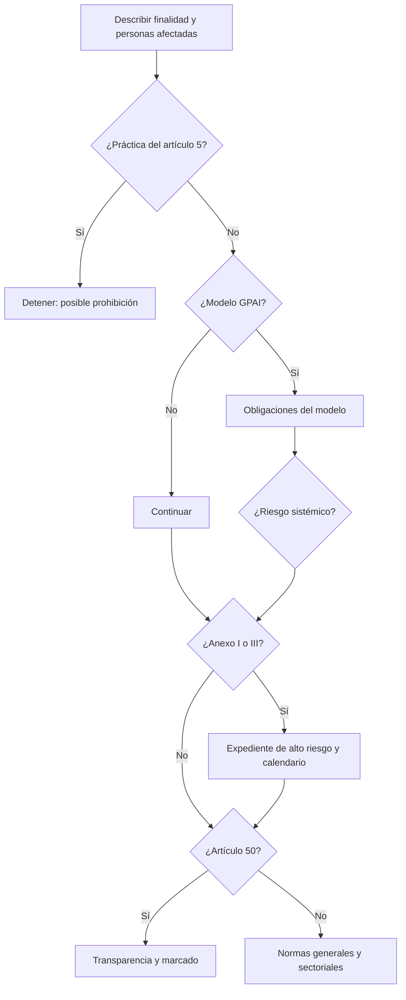

# AI Act: riesgos, calendario y prohibiciones

> **Estado:** vigente. Texto consolidado tras el AI Omnibus de 27 de julio de 2026. Revisión: 25 de agosto de 2026.

El Reglamento (UE) 2024/1689 regula actividades y responsabilidades a lo largo de la cadena de IA. Su lógica es proporcional al riesgo, pero no es una simple pirámide: un sistema puede acumular obligaciones de transparencia, modelo de propósito general y normativa sectorial.

## Calendario aplicable

| Fecha | Qué ocurre | Estado al revisar |
|---|---|---|
| 1 ago 2024 | Entrada en vigor | Cumplido |
| 2 feb 2025 | Definiciones, prácticas prohibidas y alfabetización en IA | Aplicable |
| 2 ago 2025 | Gobernanza y obligaciones de modelos de propósito general | Aplicable |
| 2 ago 2026 | Aplicación general, artículo 50, autoridades y potestades de ejecución | Aplicable |
| 2 dic 2026 | Nuevas prohibiciones sobre material íntimo no consentido y abuso sexual infantil; fin de cierta transición de marcado | Próximo |
| 2 dic 2027 | Reglas para usos de alto riesgo del anexo III | Aplicación futura |
| 2 ago 2028 | Reglas de alto riesgo para IA integrada en productos regulados del anexo I | Aplicación futura |

El calendario original de 2024 fue modificado por el **AI Omnibus**, en vigor desde el 27 de julio de 2026. No uses infografías antiguas que aún indiquen agosto de 2026 o 2027 para todos los sistemas de alto riesgo.

## Nivel 1: prácticas prohibidas

Desde febrero de 2025 están prohibidos, con condiciones y excepciones precisas:

1. técnicas subliminales, manipuladoras o engañosas que alteren materialmente la conducta y causen o probablemente causen daño significativo;
2. explotación de vulnerabilidades por edad, discapacidad o situación social o económica con ese resultado dañino;
3. *social scoring* que produzca trato perjudicial injustificado, desproporcionado o fuera del contexto de los datos;
4. evaluación o predicción del riesgo individual de cometer delitos basada únicamente en perfiles o rasgos, salvo apoyo a una evaluación humana sustentada en hechos objetivos;
5. creación o ampliación de bases de reconocimiento facial mediante extracción indiscriminada de imágenes de internet o CCTV;
6. inferencia de emociones en trabajo y educación, salvo motivos médicos o de seguridad;
7. categorización biométrica que infiera determinados datos sensibles, como raza, opiniones políticas, afiliación sindical, religión, vida sexual u orientación sexual, con excepciones muy estrechas;
8. identificación biométrica remota en tiempo real en espacios públicos para fines policiales, salvo supuestos tasados, autorización y salvaguardas.

El AI Omnibus incorpora además prohibiciones contra sistemas destinados a generar o manipular material íntimo sexual explícito no consentido y material de abuso sexual infantil. Su aplicación comienza el **2 de diciembre de 2026**.

«Prohibido» no significa «alto riesgo con controles». Significa que no se arregla añadiendo una casilla de consentimiento, un aviso o supervisión humana si el uso cae realmente en la prohibición.

## Nivel 2: alto riesgo

Hay dos grandes vías:

### IA como producto o componente de seguridad

Puede ser alto riesgo cuando actúa como componente de seguridad de productos sujetos a legislación armonizada y el producto requiere evaluación de conformidad por tercero: maquinaria, dispositivos médicos, juguetes, ascensores, vehículos y otros del anexo I. Tras el Omnibus, el calendario principal llega a agosto de 2028 y se coordina más con la norma sectorial.

### Casos del anexo III

Incluyen, con límites y excepciones:

- biometría e identificación remota;
- seguridad de infraestructuras críticas;
- acceso, admisión y evaluación en educación o formación;
- contratación, selección, asignación de tareas, promoción, despido y evaluación de trabajadores;
- acceso a servicios esenciales públicos o privados, como crédito y determinados seguros;
- emergencias, policía, migración, asilo y fronteras;
- administración de justicia y procesos democráticos.

No todo software dentro de uno de esos sectores es automáticamente alto riesgo. Importan finalidad prevista e influencia material. Algunas tareas estrechas, preparatorias o puramente procedimentales pueden quedar fuera si no afectan materialmente la decisión. El perfilado de personas merece una cautela reforzada.

## Nivel 3: transparencia específica

Desde el 2 de agosto de 2026, el artículo 50 exige, según el actor y el sistema:

- informar cuando una persona interactúa directamente con IA, salvo que resulte obvio para alguien razonablemente informado y atento;
- hacer que contenido sintético de audio, imagen, vídeo o texto sea detectable mediante marcado legible por máquina, con límites técnicos y excepciones concretas;
- informar a las personas expuestas a reconocimiento de emociones o categorización biométrica;
- revelar que un *deepfake* es artificial o ha sido manipulado;
- revelar la generación o manipulación de texto publicado para informar sobre asuntos de interés público, salvo que exista revisión humana o control editorial y una persona o entidad asuma responsabilidad editorial.

Para sistemas puestos en el mercado antes del 2 de agosto de 2026 existe una transición limitada hasta el 2 de diciembre de 2026 únicamente respecto a determinadas obligaciones técnicas de marcado y detección. El contenido producido antes no se etiqueta retroactivamente de forma obligatoria.

El código europeo de transparencia es voluntario como método de cumplimiento. No adherirse no elimina la obligación: exige demostrar por otros medios que se cumple.

## Nivel 4: riesgo mínimo o limitado

Filtros de spam, videojuegos con IA o asistentes de productividad pueden no tener requisitos específicos de alto riesgo. Siguen sujetos a leyes generales, contratos y deberes profesionales. «Riesgo mínimo AI Act» no significa «sin responsabilidad».

## Modelos de propósito general

Un **GPAI model** es un modelo capaz de realizar de forma competente una amplia variedad de tareas y de integrarse en múltiples sistemas. La guía de la Comisión utiliza más de `10^23` FLOP de entrenamiento como indicador relevante, junto con capacidades y generalidad.

Obligaciones generales del proveedor:

- documentación técnica para autoridades;
- información a proveedores posteriores;
- política de cumplimiento del copyright europeo y respeto de reservas de derechos;
- resumen público suficientemente detallado del contenido de entrenamiento;
- representante autorizado en la UE cuando proceda.

Los GPAI con **riesgo sistémico**, presumidos en el Reglamento a partir de `10^25` FLOP salvo prueba o designación distinta, añaden evaluación y mitigación de riesgos sistémicos, pruebas adversariales, reporte de incidentes y ciberseguridad del modelo y su infraestructura.

Un modelo abierto no obtiene una exención total. Algunas obligaciones de documentación pueden flexibilizarse si cumple las condiciones de licencia y publicación; no ocurre así para riesgo sistémico, copyright y resumen de entrenamiento.

## Sanciones máximas

Como referencia europea general:

| Infracción | Máximo |
|---|---|
| Prácticas prohibidas | 35 millones de euros o 7 % del volumen mundial anual anterior |
| Otras obligaciones relevantes | 15 millones o 3 % |
| Información incorrecta o engañosa a autoridades | 7,5 millones o 1 % |
| Proveedores de GPAI | hasta 3 % del volumen mundial anual anterior |

Se aplica el mayor umbral a empresas y existen reglas de proporcionalidad, especialmente para pymes y empresas de mediana capitalización. Las multas no excluyen reclamaciones por RGPD, consumo, daños, contrato, empleo o propiedad intelectual.

## Miniárbol de clasificación

## Fuentes oficiales

- [Reglamento consolidado a 27 de julio de 2026](https://eur-lex.europa.eu/legal-content/ES/TXT/?uri=CELEX:02024R1689-20260727)
- [AI Omnibus en vigor, Comisión Europea](https://digital-strategy.ec.europa.eu/en/news/ai-omnibus-enters-force)
- [Calendario y navegación del AI Act](https://digital-strategy.ec.europa.eu/en/faqs/navigating-ai-act)
- [Ejecución del AI Act](https://digital-strategy.ec.europa.eu/en/policies/enforcement-ai-act)
- [Preguntas oficiales sobre el artículo 50](https://digital-strategy.ec.europa.eu/en/faqs/transparency-obligations-under-article-50-ai-act)
- [Obligaciones de GPAI](https://digital-strategy.ec.europa.eu/en/factpages/general-purpose-ai-obligations-under-ai-act)

