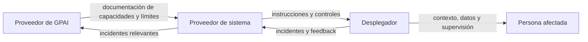

# AI Act: obligaciones según tu papel

> **Estado:** revisado el 25 de agosto de 2026. Las obligaciones de alto riesgo indicadas tienen aplicación futura según el calendario de la [unidad anterior](02-ai-act-riesgos-calendario-y-prohibiciones.md), pero conviene diseñarlas desde ahora.

La pregunta «¿qué debe cumplir mi producto?» empieza por otra: **¿qué papel desempeña cada entidad?** Una misma empresa puede acumular papeles.

## Los actores

| Actor | Qué hace | Ejemplo |
|---|---|---|
| Proveedor de sistema | desarrolla o manda desarrollar y comercializa bajo su nombre | SaaS que vende un clasificador de candidatos |
| Proveedor de GPAI | pone en el mercado un modelo de propósito general | empresa que publica un modelo fundacional |
| Responsable del despliegue | usa el sistema bajo su autoridad profesional | empresa que usa un asistente para soporte |
| Fabricante de producto | integra IA en un producto y lo comercializa | fabricante de maquinaria con visión artificial |
| Importador | introduce en la UE un sistema de un proveedor extracomunitario | distribuidor europeo de software extranjero |
| Distribuidor | comercializa sin ser proveedor ni importador | revendedor dentro de la UE |
| Representante autorizado | representa en la UE a un proveedor de fuera | entidad mandatada para interlocución regulatoria |
| Persona afectada | recibe o soporta la decisión o interacción | candidato, trabajador, paciente o cliente |

## Cuándo un desplegador se convierte en proveedor

Puede ocurrir si:

- pone su nombre o marca en un sistema de alto riesgo ya comercializado;
- realiza una modificación sustancial;
- cambia la finalidad prevista de un sistema para convertirlo en alto riesgo;
- integra componentes de forma que crea un sistema nuevo que comercializa.

Un *fine-tuning*, un conjunto de herramientas o una nueva política de decisión no son automáticamente «modificación sustancial», pero pueden serlo si alteran el cumplimiento o la finalidad. Debe documentarse el análisis.

## Proveedor de un sistema de alto riesgo

Su expediente incluye, como mínimo:

1. **gestión de riesgos continua**, desde diseño hasta poscomercialización;
2. **gobernanza de datos** de entrenamiento, validación y prueba: pertinencia, representatividad, calidad, sesgos y lagunas;
3. **documentación técnica** suficiente para evaluar conformidad;
4. **logs automáticos** que permitan trazabilidad;
5. **instrucciones de uso** claras para el desplegador;
6. **supervisión humana** diseñada, no añadida como un botón decorativo;
7. **exactitud, robustez y ciberseguridad** acordes a finalidad y riesgo;
8. **sistema de gestión de calidad** y responsabilidades internas;
9. **evaluación de conformidad**, registro cuando corresponda y marcado CE;
10. **vigilancia poscomercialización**, correcciones y reporte de incidentes graves.

La supervisión humana debe ser capaz de comprender capacidades y límites, detectar anomalías, evitar dependencia automática y anular o detener la salida cuando proceda. Si el humano tiene diez segundos, ninguna información útil y una carga imposible, el control puede ser nominal.

## Responsable del despliegue de alto riesgo

No basta con comprar un producto «conforme». Debe:

- seguir instrucciones y adoptar medidas técnicas y organizativas;
- asignar supervisión a personas con competencia, formación, autoridad y recursos;
- comprobar pertinencia y representatividad de datos de entrada bajo su control;
- vigilar el funcionamiento y comunicar riesgos o incidentes;
- suspender el uso cuando haya razones para pensar que existe riesgo relevante;
- conservar los logs bajo su control, normalmente al menos seis meses salvo norma distinta;
- informar a trabajadores y representantes antes de usar ciertos sistemas en el trabajo;
- cumplir RGPD y realizar una EIPD cuando corresponda;
- realizar evaluación de impacto en derechos fundamentales en los supuestos exigidos;
- permitir información, explicación o reclamación a personas afectadas cuando sea aplicable.

Las entidades públicas y algunos operadores de servicios esenciales tienen deberes reforzados de evaluación de impacto en derechos fundamentales antes del primer uso. El documento debe describir procesos, personas afectadas, riesgos, supervisión, reclamación y medidas correctoras.

## Importadores y distribuidores

No son transportistas neutrales. Antes de comercializar deben verificar elementos como:

- evaluación de conformidad y documentación;
- marcado e instrucciones;
- identidad del proveedor y representante autorizado;
- condiciones de almacenamiento o transporte que no degraden la conformidad.

Si sospechan incumplimiento o riesgo, no deben continuar como si fuera un defecto contractual privado: han de informar, cooperar y facilitar retirada o corrección cuando corresponda.

## Proveedor de GPAI y proveedor posterior

La documentación fluye hacia abajo y los incidentes hacia arriba. Un contrato debe hacer posible ese flujo: avisos de cambio de modelo, métricas, límites de uso, vulnerabilidades, subencargados, localización, logs, plazos de respuesta y derecho de auditoría.

## Quién hace qué dentro de una empresa

| Función | Evidencia esperable |
|---|---|
| Dirección | apetito de riesgo, responsables y criterios de prohibición |
| Producto | finalidad prevista, usuarios, límites y UX de supervisión |
| Ingeniería/ML | dataset, versión, evals, logs, seguridad y retirada |
| Legal/Compliance | clasificación, contratos, derechos y mapa normativo |
| DPO | base jurídica, EIPD, información y derechos RGPD |
| CISO | amenazas, acceso, secretos, incidentes y proveedores |
| RR. HH. | consulta, información laboral, no discriminación y formación |
| Compras | due diligence y cláusulas de cadena de suministro |

## Cláusulas mínimas al comprar IA

- finalidad autorizada y usos prohibidos;
- datos que pueden introducirse y si se reutilizan para entrenar;
- roles RGPD, subencargados, transferencias y eliminación;
- versiones del modelo, cambios materiales y continuidad;
- niveles de servicio, exactitud declarada y límites conocidos;
- propiedad intelectual, indemnidades y tratamiento de reclamaciones;
- seguridad, notificación de incidentes y pruebas;
- acceso a documentación necesaria para AI Act;
- portabilidad de logs y salida ordenada;
- cooperación con autoridades y personas afectadas.

## Fuentes oficiales

- [Reglamento de IA consolidado](https://eur-lex.europa.eu/legal-content/ES/TXT/?uri=CELEX:02024R1689-20260727)
- [Guía de GPAI para proveedores, Comisión Europea](https://digital-strategy.ec.europa.eu/en/policies/guidelines-gpai-providers)
- [Guía introductoria de AESIA](https://aesia.digital.gob.es/storage/media/01-guia-introductoria-al-reglamento-de-ia.pdf)

