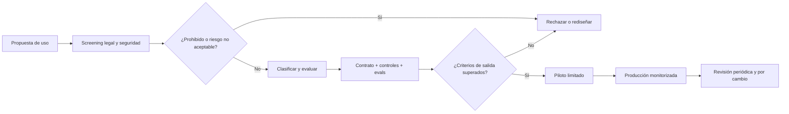

# Programa práctico de cumplimiento de IA

> **Objetivo:** convertir normas abstractas en decisiones, controles y pruebas. Revisión: 25 de agosto de 2026.

## Principio: gobernar usos, no marcas

Un inventario que dice «Microsoft Copilot» o «OpenAI» es insuficiente. Una misma herramienta puede resumir reuniones, evaluar currículos, generar publicidad o ejecutar código. Registra cada finalidad y flujo de datos por separado.

## El expediente mínimo de un sistema

```text
AI-USE-042/
├── 01-ficha-y-propietario.md
├── 02-clasificacion-ai-act.md
├── 03-datos-rgpd-y-copyright.md
├── 04-riesgos-y-evaluaciones.md
├── 05-evals-y-resultados/
├── 06-proveedor-y-contratos/
├── 07-supervision-y-procedimientos/
├── 08-formacion/
├── 09-cambios-versiones/
└── 10-incidentes-y-reclamaciones/
```

## Ficha de uso

| Campo | Ejemplo útil |
|---|---|
| Finalidad | proponer borradores de respuesta a tickets, nunca enviarlos |
| Propietario | directora de soporte |
| Personas afectadas | clientes y agentes de soporte en España |
| Sistema | modelo, versión, proveedor, RAG y herramientas |
| Entradas | ticket, artículos autorizados, metadatos mínimos |
| Salidas | borrador y citas; aprobación humana obligatoria |
| Decisiones | el agente humano decide y edita |
| Impacto máximo | divulgación o instrucción incorrecta |
| Retirada | desactivar herramienta y volver al flujo manual |

## Flujo de aprobación



## Política de usos

### Verde: permitido con controles comunes

- lluvia de ideas sin datos sensibles;
- corrección de estilo de contenido no confidencial;
- resumen de documentación pública;
- ayuda de código sobre repositorios autorizados, con revisión y pruebas.

### Ámbar: aprobación previa

- datos personales o confidenciales;
- contenido externo publicado en nombre de la empresa;
- RAG sobre documentos licenciados;
- agentes con herramientas o acceso a sistemas;
- decisiones que priorizan personas, clientes o expedientes;
- dominios regulados.

### Rojo: prohibido por política o ley

- prácticas del artículo 5;
- credenciales, claves o secretos en herramientas no autorizadas;
- decisiones sensibles totalmente automatizadas sin base y salvaguardas;
- vigilancia emocional de empleados;
- suplantación o material íntimo no consentido;
- agentes con permisos irrestrictos y sin trazabilidad.

## Due diligence del proveedor

### Producto y modelo

- finalidad, límites, versión y ritmo de cambios;
- métricas relevantes para población y lengua reales;
- documentación AI Act y sistema de calidad;
- procedencia de datos y política de copyright;
- opciones de residencia, aislamiento y no entrenamiento;
- incidentes conocidos y proceso de notificación.

### Seguridad

- autenticación, roles, cifrado y segregación;
- retención, logs y borrado verificable;
- pruebas de penetración y gestión de vulnerabilidades;
- subprocesadores, cadena de suministro y continuidad;
- controles contra *prompt injection*, abuso de herramientas y exfiltración.

### Contrato

- roles legales y cooperación;
- aviso de cambios materiales;
- niveles de servicio y salida;
- auditoría y evidencias;
- propiedad intelectual e indemnidad;
- incidente, plazo y contenido mínimo de la notificación.

## Evals como control jurídico-técnico

No prueban «cumplimiento legal» por sí solas, pero permiten justificar diligencia. Mide:

- exactitud y tasa de abstención;
- errores graves, no solo promedio;
- diferencias por grupos y lenguas;
- robustez ante entradas adversarias;
- fuga de datos y reproducción;
- cumplimiento de instrucciones y uso de herramientas;
- eficacia de revisión humana;
- deriva tras cambios de datos o modelo.

Fija umbrales antes de mirar el resultado. Conserva dataset, versión, configuración, fecha, resultados y decisión de aceptación.

## Supervisión humana efectiva

Una revisión útil requiere:

- competencia y formación;
- información sobre origen, incertidumbre y límites;
- tiempo suficiente;
- autoridad para rechazar;
- ausencia de incentivos que conviertan aceptar en la única opción viable;
- registro de cambios y desacuerdos;
- muestreo de casos aprobados, no solo errores reportados.

La tasa de anulación extremadamente baja puede significar gran calidad o automatización acrítica. Investiga antes de celebrarla.

## Gestión de cambios

Reabre la aprobación ante:

- nuevo modelo o versión significativa;
- nueva fuente o categoría de datos;
- paso de asistente a ejecución;
- nueva población, idioma o país;
- cambio de finalidad o métrica de negocio;
- nueva herramienta, memoria o integración;
- incidente, reclamación o cambio regulatorio.

## Incidentes

El plan debe unir seguridad, privacidad, AI Act, producto y comunicación:

1. contener: desactivar herramientas, claves o rutas;
2. preservar evidencias y versión;
3. evaluar personas, territorios y daños;
4. determinar obligaciones y plazos de notificación;
5. informar a proveedor y afectados cuando corresponda;
6. corregir, validar y decidir reanudación;
7. documentar causa raíz y controles preventivos.

No borres logs útiles para una investigación, pero tampoco los conserves indefinidamente sin base.

## Alfabetización en IA

Desde febrero de 2025 existe obligación de adoptar medidas de alfabetización para personal que opera o usa IA, atendiendo a experiencia, contexto y personas afectadas. Tras el Omnibus no se impone un nivel único, pero deben existir medidas defendibles.

Una formación seria cubre:

- qué hace y no hace el sistema;
- alucinación, sesgo, privacidad y copyright;
- datos permitidos y prohibidos;
- revisión, citas y escalado;
- seguridad de herramientas y agentes;
- incidentes y canal de reporte;
- práctica específica del puesto.

Guarda programa, asistentes, evaluación y actualizaciones. Un vídeo genérico anual no basta para quien aprueba crédito o administra un agente de producción.

## Métricas para el comité de IA

- usos inventariados y porcentaje clasificado;
- sistemas sin propietario o revisión vigente;
- evals vencidas y cambios pendientes;
- incidentes, severidad y tiempo de contención;
- reclamaciones y correcciones;
- cobertura de formación por rol;
- proveedores críticos y concentración;
- acciones autónomas bloqueadas o revertidas.

## Fuentes oficiales

- [Preguntas sobre alfabetización, Comisión Europea](https://digital-strategy.ec.europa.eu/en/faqs/ai-literacy-questions-answers)
- [Repositorio de prácticas de alfabetización](https://digital-strategy.ec.europa.eu/en/policies/ai-literacy)
- [AI RMF de NIST](https://www.nist.gov/itl/ai-risk-management-framework)
- [Guía introductoria de AESIA](https://aesia.digital.gob.es/storage/media/01-guia-introductoria-al-reglamento-de-ia.pdf)

