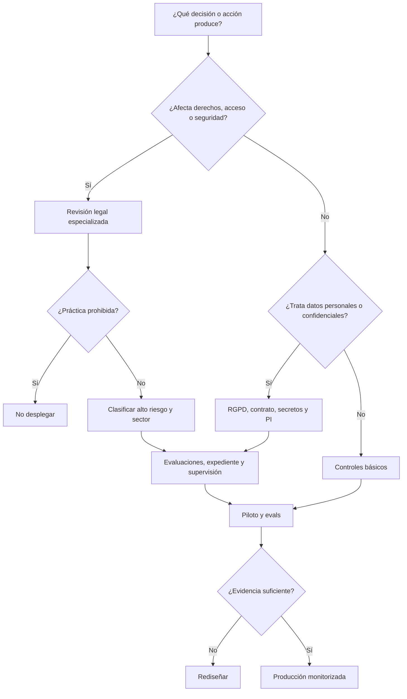

# Casos prácticos y árboles de decisión

> **Uso:** ejercicios orientativos, no dictámenes. Cambiar un dato puede cambiar la conclusión.

## Caso 1: empleados usan un chatbot público

**Situación:** cada persona copia documentos para redactar y programar.

**Riesgos:** datos personales, secretos, licencias, transferencias, retención, respuestas erróneas y falta de alfabetización.

**Respuesta razonable:** inventariar, bloquear cuentas no autorizadas para información interna, contratar modalidad empresarial tras due diligence, clasificar datos, formar, registrar incidentes y fijar revisión humana. El uso general de redacción suele no ser alto riesgo, pero el RGPD y la confidencialidad sí pueden aplicar.

## Caso 2: RAG interno sobre contratos

**Situación:** el asistente busca cláusulas y responde con citas.

**Preguntas:**

- ¿quién puede ver cada contrato?
- ¿el índice conserva permisos por documento?
- ¿hay datos personales y base jurídica?
- ¿los embeddings y logs se borran?
- ¿la respuesta enlaza fragmento y versión?
- ¿queda claro que no es asesoramiento final?

**Control clave:** recuperación con seguridad a nivel de documento y pruebas de aislamiento entre usuarios. Un buen prompt no sustituye control de acceso.

## Caso 3: filtro de currículos

**Situación:** un modelo ordena candidatos y descarta el 80 % inferior.

**Clasificación probable:** empleo del anexo III, alto riesgo cuando entre en aplicación la fase correspondiente. También RGPD, artículo 22 según automatización y efectos, derecho laboral e igualdad.

**Rediseño:** no descartar automáticamente; criterios vinculados al puesto; validación por grupos; adaptaciones; información; revisión competente; registro de versión y decisión; reclamación. No usar inferencia de emociones en vídeo.

## Caso 4: chatbot de atención al cliente

**Situación:** responde preguntas y crea tickets.

**Obligaciones:** informar que es IA cuando no resulte obvio, privacidad, seguridad y consumo. Si solo propone respuestas, bajo impacto. Si cancela servicios, concede crédito o bloquea cuentas, el análisis cambia.

**Control:** identidad clara, acceso rápido a humano, límites de acciones, confirmación, citas de políticas y logs proporcionados.

## Caso 5: generador de campañas y avatares

**Situación:** produce texto, imágenes, voz y vídeo.

**Obligaciones:** marcado técnico por proveedor cuando proceda; revelación visible de *deepfakes* por desplegador; derecho a la propia imagen y voz, copyright, publicidad y contrato con intérpretes. Para texto de interés público, revisar la excepción editorial y asumir responsabilidad identificable.

## Caso 6: agente de programación con producción

**Situación:** lee incidencias, modifica repositorios y despliega.

**Riesgos:** secreto, supply chain, acciones irreversibles, vulnerabilidades, identidad y falta de trazabilidad.

**Controles:** entorno aislado, ramas y revisiones, permisos efímeros, separación de despliegue, tests, límites, protección de secretos, aprobación para acciones externas y registro de tool calls. El AI Act puede no clasificarlo como alto riesgo, pero NIS2, CRA, contrato y deber profesional pueden ser críticos.

## Caso 7: modelo local con pesos abiertos

**Situación:** la empresa ejecuta y ajusta un SLM sin enviar datos fuera.

**Ventaja:** reduce transferencias y exposición al proveedor.

**No resuelve:** base jurídica del dataset, licencias, seguridad local, sesgos, documentación, finalidad, personas afectadas ni clasificación del sistema. Si se comercializa o modifica sustancialmente, la empresa puede asumir papel de proveedor.

## Árbol para un nuevo uso



## Árbol para intervención humana

1. ¿La salida produce por sí sola un efecto jurídico o similar significativo?
2. ¿La persona revisora recibe evidencia, incertidumbre y contexto?
3. ¿Tiene tiempo y autoridad para cambiar la decisión?
4. ¿Revisa de forma individual y no solo firma lotes?
5. ¿Se registra su criterio y puede la persona afectada impugnar?

Si las respuestas 2 a 5 son negativas, llamar «human in the loop» al proceso no garantiza una intervención humana efectiva.

## Preguntas de examen

1. ¿Por qué un sistema de riesgo mínimo bajo AI Act puede requerir una EIPD?
2. ¿Qué convierte a un desplegador en proveedor?
3. ¿Qué diferencia existe entre marcado legible por máquina y revelación visible?
4. ¿Por qué retirar atributos sensibles no elimina necesariamente discriminación?
5. ¿Qué obligaciones conserva quien compra un sistema de alto riesgo ya certificado?
6. ¿Por qué la ejecución local no resuelve copyright?
7. ¿Qué evidencia demostraría que la revisión humana es real?

## Plantilla de decisión ejecutiva

```markdown
# Decisión de uso de IA

- Propietario:
- Fecha y próxima revisión:
- Finalidad y uso excluido:
- Roles AI Act / RGPD:
- Clasificación y calendario:
- Personas y territorios:
- Datos, licencias y proveedores:
- Normas sectoriales:
- Riesgos críticos:
- Evals y umbrales:
- Supervisión y reclamación:
- Retirada e incidentes:
- Riesgo residual aceptado por:
- Decisión: aprobar / piloto / rediseñar / rechazar
```

## Cierre

El cumplimiento profesional no consiste en producir el mayor PDF posible. Consiste en poder demostrar que el uso fue entendido, clasificado, probado, limitado, supervisado y corregible antes de afectar a una persona.

