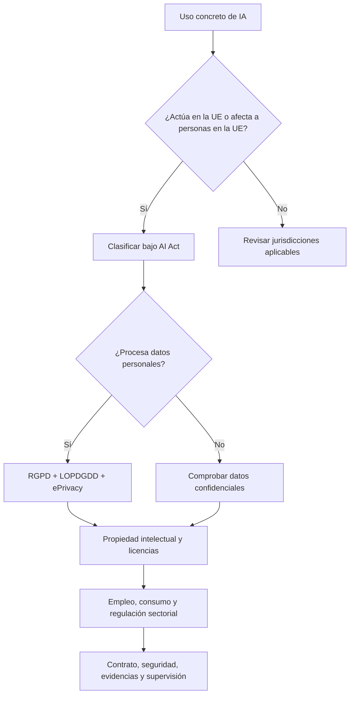

# Legal: utilizar IA profesionalmente sin improvisar

> **Estado de revisión:** 25 de agosto de 2026. Esta sección es formación general y no sustituye el análisis de un abogado, un delegado de protección de datos o el regulador competente. En derecho importa tanto la norma como el caso concreto, el sector, el contrato y la jurisprudencia.

La IA no vive bajo una sola «ley de IA». En Europa, el **AI Act** se superpone con protección de datos, propiedad intelectual, consumo, empleo, igualdad, ciberseguridad, seguridad de producto y normas sectoriales. Un sistema puede ser de riesgo mínimo para el AI Act y, aun así, infringir el RGPD o revelar secretos empresariales.

## Ruta de la sección

| Unidad | Pregunta que resuelve | Lectura prioritaria para |
|---|---|---|
| [01. Mapa regulatorio](01-mapa-regulatorio-y-metodo.md) | ¿Qué normas mirar y en qué orden? | Todo profesional |
| [02. AI Act](02-ai-act-riesgos-calendario-y-prohibiciones.md) | ¿Qué está prohibido, regulado o sujeto a transparencia? | Producto, dirección, legal |
| [03. Obligaciones por actor](03-ai-act-obligaciones-por-actor.md) | ¿Soy proveedor, desplegador, importador o distribuidor? | Empresas que compran o construyen IA |
| [04. España, empleo y sector público](04-espana-empleo-y-sector-publico.md) | ¿Qué añade España y qué ocurre al usar IA con trabajadores? | RR. HH., administraciones, empresa |
| [05. Datos, copyright y secretos](05-rgpd-copyright-y-secretos.md) | ¿Puedo usar estos datos, prompts, obras o repositorios? | Desarrollo, DPO, contenidos |
| [06. Normas europeas por sector](06-normas-europeas-por-sector.md) | ¿Qué otras leyes se activan en salud, finanzas o productos? | Sectores regulados |
| [07. Programa de cumplimiento](07-programa-de-cumplimiento.md) | ¿Cómo lo convierto en controles y evidencias? | CTO, CISO, DPO, compliance |
| [08. Panorama mundial](08-panorama-mundial-y-estandares.md) | ¿Qué cambia fuera de la UE? | Productos internacionales |
| [09. Casos y decisiones](09-casos-practicos-y-arboles-de-decision.md) | ¿Cómo se aplica a ChatGPT, RAG, RR. HH. o agentes? | Equipos de producto |

## La idea que evita más errores

El análisis se hace sobre un **uso previsto**, no sobre la marca del modelo. El mismo LLM puede ser un asistente de redacción de bajo riesgo, un componente de selección laboral de alto riesgo o una herramienta prohibida si infiere emociones de trabajadores sin una excepción válida.

## Semáforo temporal

Todas las unidades distinguen estas etiquetas:

- **Vigente y aplicable:** ya puede exigirse.
- **Vigente, aplicación futura:** la norma existe, pero su obligación tiene una fecha posterior.
- **Proyecto:** puede cambiar y no debe presentarse como obligación aprobada.
- **Guía o estándar voluntario:** ayuda a demostrar diligencia, pero no equivale por sí solo a una ley.

## Resultado de aprendizaje

Al terminar deberías poder:

1. describir el sistema y determinar el papel jurídico de cada organización;
2. detectar prácticas prohibidas, transparencia obligatoria y posibles usos de alto riesgo;
3. separar AI Act, RGPD, copyright y responsabilidad contractual;
4. preparar un inventario, una evaluación de impacto y un expediente de evidencias;
5. saber cuándo detener un despliegue y escalarlo a asesoría especializada.

## Fuentes troncales

- [Texto consolidado del Reglamento de IA a 27 de julio de 2026, EUR-Lex](https://eur-lex.europa.eu/legal-content/ES/TXT/?uri=CELEX:02024R1689-20260727)
- [Portal oficial del AI Act, Comisión Europea](https://digital-strategy.ec.europa.eu/en/policies/regulatory-framework-ai)
- [Guía introductoria al RIA, AESIA](https://aesia.digital.gob.es/storage/media/01-guia-introductoria-al-reglamento-de-ia.pdf)
- [Reglamento General de Protección de Datos, EUR-Lex](https://eur-lex.europa.eu/eli/reg/2016/679/oj)
- [Proyecto español de Ley Orgánica de buen uso y gobernanza de la IA, Congreso](https://www.congreso.es/es/proyectos-de-ley?_iniciativas_id=121%2F000096&_iniciativas_legislatura=XV&_iniciativas_mode=mostrarDetalle&p_p_id=iniciativas&p_p_lifecycle=0&p_p_mode=view&p_p_state=normal)

