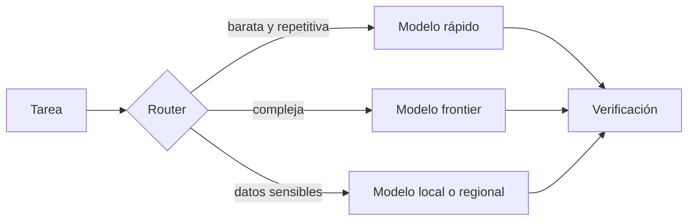

# Tablero de modelos y laboratorios

> **Estado comprobado el 26 de agosto de 2026.** “Actual” significa disponible o anunciado en esa fecha. Los nombres comerciales y las modalidades de acceso pueden cambiar con rapidez.

## Leer el tablero sin caer en el ranking

Un laboratorio puede liderar código y no ser la mejor elección para una aplicación europea con residencia estricta del dato. Un modelo abierto puede dar control y costes previsibles con mucho volumen, pero exigir una infraestructura que no compensa a un equipo pequeño. Y una API cerrada puede ofrecer el modelo más capaz mientras su producto agéntico resuelve mejor el trabajo que la API desnuda.

Las afirmaciones de cada fabricante deben tratarse como hipótesis hasta reproducirlas. Los benchmarks publicados por proveedores usan *prompts*, herramientas, presupuestos de cómputo y criterios de puntuación distintos.

## Foto de la competición

| Laboratorio | Referencia en este corte | Acceso | Apuesta principal | Matiz importante |
|---|---|---|---|---|
| OpenAI | GPT‑5.6: Sol, Terra y Luna | API y productos cerrados | Razonamiento, programación, agentes y una familia con distintos costes/latencias | El rendimiento real depende también de Codex, herramientas y esfuerzo de razonamiento |
| Anthropic | Claude Opus 5, Sonnet 5 y Fable 5 | API y productos cerrados | Código, trabajo profesional prolongado, agentes y controles de seguridad | Sus niveles y políticas de acceso forman parte del producto, no del peso aislado |
| Google DeepMind | Gemini 3.1 Pro y Gemini 3.7 Flash | API, nube y productos cerrados | Multimodalidad, contexto, velocidad e integración con el ecosistema Google | “Pro” y “Flash” ocupan puntos distintos de coste, latencia y capacidad |
| xAI | Grok 4.6 | API y productos cerrados | Agentes de larga duración, interfaces visuales e integración con el ecosistema X/xAI | Una ventana de contexto grande no garantiza que toda la información se use bien |
| Moonshot AI | Kimi K3 | Pesos abiertos, API y producto | Modelo multimodal agéntico, contexto de 1 M y razonamiento configurable | Sus 2,8 T de parámetros totales lo sitúan en infraestructura de centro de datos, no en un portátil |
| Z.ai | GLM‑5.3 | API; pesos anunciados | Código, tareas largas y agentes | El modelo se lanzó el 14 de agosto; los pesos seguían anunciados como próximos en este corte |
| Alibaba Qwen | Qwen3.8, 2.4T‑A95B y 27B | Pesos abiertos y servicios | Familia amplia, código, multimodalidad y despliegue flexible | El modelo grande y el de 27B sirven a presupuestos de hardware radicalmente distintos |
| DeepSeek | Familias V3/R1 y evolución V4 | Pesos y servicios, según versión | Eficiencia, MoE y razonamiento abierto | Hay que fijar repositorio, versión y licencia: “DeepSeek” no identifica un artefacto único |
| MiniMax | MiniMax M3 | Pesos abiertos y servicios | Código, agentes, multimodalidad y contexto de 1 M | El contexto anunciado debe probarse con datos largos y desordenados del caso real |
| Meta | Muse Spark y ecosistema Llama | Mixto: productos cerrados y modelos abiertos | Asistente multimodal de consumo, investigación y gran ecosistema desplegable | Muse y Llama son líneas distintas; no debe atribuirse a una la política de acceso de la otra |
| Mistral AI | Mistral Medium 3.5, Small 4 y modelos especializados | API, nube y parte del catálogo abierto | Soberanía europea, inferencia regional, eficiencia y especialización | “Europeo” no sustituye la revisión de región, contrato, subencargados y transferencia efectiva |

Fuentes oficiales de este corte: [GPT‑5.6](https://openai.com/index/gpt-5-6/), [noticias de Anthropic](https://www.anthropic.com/news), [model cards de Google DeepMind](https://deepmind.google/models/model-cards/), [Grok 4.6](https://x.ai/news/grok-4-6), [Kimi K3](https://github.com/MoonshotAI/Kimi-K3), [GLM‑5.3](https://z.ai/blog/glm-5.3), [Qwen3.8](https://github.com/QwenLM/Qwen3.8), [organización de DeepSeek](https://github.com/deepseek-ai), [MiniMax M3](https://github.com/MiniMax-AI/MiniMax-M3), [Meta AI](https://ai.meta.com/blog/introducing-model-meta-superintelligence-labs/) y [novedades de Mistral](https://mistral.ai/news/).

## Kimi K3 y GLM‑5.3: la distinción que importa

Kimi K3 no es un rumor ni una abreviatura de K2. Moonshot publicó el repositorio, los pesos y las instrucciones de inferencia. Es un modelo nativamente multimodal y orientado a agentes, con razonamiento configurable y conservación del historial de razonamiento entre pasos. Su tamaño ilustra una idea clave: *open weights* significa que se pueden descargar los parámetros, no que sea barato operarlos.

GLM‑5.3 también es un lanzamiento real, pero su estado de distribución es diferente. Z.ai presentó el modelo y su API el 14 de agosto de 2026, declaró que usa la misma base que GLM‑5.2 y atribuyó la mejora a un *post-training* escalado. En la misma publicación prometió los pesos para aproximadamente dos semanas después. En la fecha de este corte aún deben etiquetarse como **anunciados, no publicados**.

## Familias, no caballos únicos

Los laboratorios ofrecen familias porque ningún modelo optimiza a la vez capacidad, latencia, precio y despliegue. Un modelo pequeño puede ganar en una función repetitiva de alto volumen; uno grande puede reservarse para planificación, revisión o casos ambiguos. La arquitectura práctica suele ser un *router*: clasifica la tarea, asigna el modelo adecuado y escala a uno más capaz solo cuando la evidencia o el riesgo lo justifican.

## Abierto, cerrado y todo lo intermedio

No basta con preguntar si un modelo es “open source”. Conviene separar cinco capas:

1. **Pesos:** ¿se pueden descargar y modificar?
2. **Código:** ¿están disponibles entrenamiento, inferencia y evaluación?
3. **Datos:** ¿se documentan las fuentes y licencias?
4. **Licencia:** ¿permite uso comercial, derivados y redistribución?
5. **Servicio:** ¿también existe una API gestionada con condiciones propias?

Un mismo laboratorio puede combinar capas abiertas y cerradas. Para profundizar, consulta [modelos chinos, pesos abiertos y variantes desrestringidas](../04-era-ia-local/05-modelos-chinos-openweights-y-abliterated.md).
