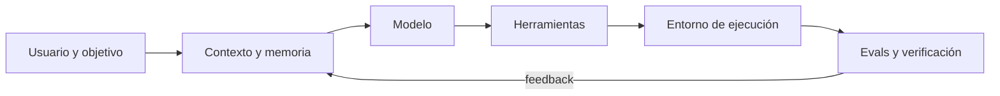

# En qué están compitiendo realmente

## La unidad de competencia es el sistema

El modelo base sigue siendo importante, pero el usuario compra o construye una cadena completa. La calidad final depende de cuánto contexto se selecciona, qué herramientas puede usar el agente, cómo se aísla la ejecución, qué memoria conserva y quién verifica el resultado.

Esto explica por qué dos productos con el mismo modelo pueden rendir de forma muy distinta. Un buen *harness* evita contexto irrelevante, expone las herramientas correctas, conserva estado, ejecuta pruebas y devuelve los fallos al modelo. Codex, Claude Code, los agentes de Kimi o las plataformas empresariales de Google compiten tanto en ese bucle como en los pesos subyacentes.

## Las ocho carreras simultáneas

### 1. Capacidad útil

No es “cuántas preguntas sabe contestar”, sino qué proporción de tareas termina correctamente: corregir un repositorio, analizar un contrato, navegar una interfaz o coordinar una investigación. Las tareas largas revelan errores acumulativos que un benchmark de una sola respuesta no ve.

### 2. Calidad por coste y latencia

El precio por millón de tokens es incompleto. Hay que medir el coste de **resolver** una tarea: reintentos, tokens de razonamiento, llamadas a herramientas, caché, tiempo humano de revisión y errores. Un modelo caro que acierta a la primera puede costar menos que otro barato con cuatro intentos.

### 3. Agentes y herramientas fiables

La frontera se desplaza desde generar texto hacia mantener un objetivo, elegir herramientas, recuperarse de errores y comprobar el trabajo. Aquí importan permisos mínimos, entornos aislados, puntos de aprobación y trazas auditables, no solo autonomía.

### 4. Multimodalidad nativa

Texto, imagen, audio, vídeo y acción empiezan a compartir un flujo. “Nativo” suele indicar que las modalidades se entrenaron conjuntamente, pero no garantiza la misma calidad en todas. Una aplicación debe evaluar cada combinación que use de verdad.

### 5. Contexto largo efectivo

Una ventana de 500 000 o un millón de tokens expresa capacidad de entrada, no comprensión uniforme. El modelo puede perder hechos en medio, confundir versiones o dedicar más tiempo y dinero. Recuperar fragmentos relevantes, resumir por etapas y validar citas sigue siendo necesario.

### 6. Pesos abiertos y control

Qwen, DeepSeek, Kimi, GLM y MiniMax presionan la frontera abierta; Llama y Mistral sostienen ecosistemas amplios. Los pesos permiten adaptar, cuantizar, inspeccionar y desplegar bajo control propio, pero trasladan al operador costes de seguridad, infraestructura, licencias y evaluación.

### 7. Distribución y ecosistema

Un modelo integrado en editor, nube, correo, documentos o red social dispone de contexto y canales de acción difíciles de replicar. OpenAI, Google, Microsoft, Anthropic, xAI y Meta no compiten únicamente en inteligencia: compiten por convertirse en la capa desde la que se hace el trabajo.

### 8. Confianza, soberanía y cumplimiento

Para empresas y administraciones importan residencia del dato, retención, cifrado, identidad, auditoría, propiedad intelectual y soporte contractual. En Europa, la combinación de AI Act, RGPD y regulación sectorial puede decidir antes que el benchmark. Consulta [Legal y gobernanza](../15-legal/README.md).

## No existe una única clasificación

La competición se parece a una **frontera de Pareto**: mejorar una dimensión suele sacrificar otra. Más razonamiento implica más latencia; más control local requiere más operación; un modelo pequeño reduce coste, pero puede necesitar más supervisión.

| Si priorizas… | Aceptas normalmente… | Debes medir… |
|---|---|---|
| Máxima capacidad | Mayor coste y latencia | Tasa de resolución y revisión humana |
| Respuesta instantánea | Menor profundidad | P95 de latencia y errores |
| Control local | Operación propia | Coste total, seguridad y disponibilidad |
| Ecosistema integrado | Dependencia del proveedor | Portabilidad y salida contractual |
| Autonomía agéntica | Mayor superficie de riesgo | Acciones incorrectas, recuperaciones y aprobaciones |
| Soberanía regional | Menos opciones o regiones | Flujo real del dato y subencargados |

## Tendencias que convergen

- **Esfuerzo de razonamiento configurable:** gastar más cómputo solo cuando la tarea lo merece.
- **Memoria de trabajo entre herramientas:** conservar decisiones y resultados sin recomenzar cada paso.
- **Modelos especializados:** código, voz, OCR, búsqueda o robótica pueden superar a un generalista en su nicho.
- **Mixture of Experts:** crecer en capacidad sin activar todos los parámetros en cada token.
- **Rutas híbridas:** combinar nube, modelos regionales y modelos locales según riesgo y dificultad.
- **Evals continuas:** cada cambio de modelo, *prompt* o herramienta se trata como una modificación de software.
