# Atlas práctico de Inteligencia Artificial

> Un curso cronológico y funcional para programadores. Empieza en AlphaGo, llega hasta los agentes capaces de usar herramientas y termina en el estado de la IA a **26 de agosto de 2026**.

La idea central del curso es sencilla: una IA moderna no apareció de una sola invención. Es una pila de avances —representaciones vectoriales, entrenamiento a escala, Transformers, alineamiento, *thinking*, herramientas, MCP y agentes— que se fueron desbloqueando unos a otros.

## Cómo está organizado

```text
Andrea/
├── 00-guia/                  Cómo estudiar y mapa del curso
├── 01-era-alphago/           2016–2017: aprender, buscar y planificar
├── 02-era-transformer/       2017–2020: atención, tokens y escalado
├── 03-era-chatgpt/           2020–2023: RAG, RLHF y la interfaz conversacional
├── 04-era-ia-local/          2022–2024: SLM, GGUF, cuantización y rendimiento
├── 05-era-thinking/          2022–2025: razonamiento y cómputo en inferencia
├── 06-era-agent-tools/       2022–2024: function calling, ReAct y automatización
├── 07-era-mcp/               2024–2025: el “USB-C” del contexto y las herramientas
├── 08-era-agentes-autonomos/ 2025–hoy: coding agents, multiagente y robótica
├── 09-impacto-y-productos/   Productos, sociedad, trabajo y gobernanza
├── 10-laboratorios/          Prácticas reproducibles
├── 11-casos-y-experimentos/  Incidentes, mitos y comportamientos extraños
├── 12-codex/                 Cómo sacar partido a Codex hoy
├── 13-prompting-loop-graph-engineering/
│                              Prompts, bucles, grafos y verificación
├── 14-ampliacion-avanzada/   Segunda capa técnica, separada de la ruta principal
├── 15-legal/                 AI Act, España, UE y cumplimiento profesional
├── 16-panorama-actual/        Quién compite, en qué y cómo elegir hoy
└── referencias/              Cronología, glosario y fuentes maestras
```

## Ruta recomendada

```mermaid
flowchart LR
    A[AlphaGo: aprender y buscar] --> B[Transformer: prestar atención]
    B --> C[GPT: predecir y escalar]
    C --> D[ChatGPT: seguir instrucciones]
    D --> E[Thinking: gastar cómputo al responder]
    E --> F[Tools: actuar fuera del modelo]
    F --> G[MCP: conectar de forma estándar]
    G --> H[Agentes: objetivos largos y verificación]
    H --> I[Ingeniería de respuestas: medir y corregir]
    I --> J[Panorama actual: comparar sistemas]
```



1. Lee [cómo usar el curso](00-guia/01-como-usar-el-curso.md).
2. Recorre las eras en orden desde [AlphaGo](01-era-alphago/01-alphago-el-punto-de-partida.md).
3. Consulta el [glosario](referencias/glosario.md) cuando aparezca un término nuevo.
4. Aprende a convertir respuestas plausibles en procesos verificables con [prompting, loops y grafos](13-prompting-loop-graph-engineering/README.md).
5. Ponlo en práctica en los [laboratorios](10-laboratorios/README.md).
6. Salta a [ampliación avanzada](14-ampliacion-avanzada/README.md) cuando quieras abrir la “caja negra”.
7. Antes de llevar IA a producción, recorre la sección [Legal](15-legal/README.md) y su programa de cumplimiento.
8. Cierra con el [Panorama actual](16-panorama-actual/00-resumen.md), una fotografía fechada de laboratorios, modelos y criterios de elección.

## Principios editoriales

- **Funcional antes que matemático.** Primero se explica qué problema resuelve, qué entra, qué sale y dónde falla.
- **Historia como grafo, no como desfile de productos.** Cada hito enlaza con la capacidad que hizo posible.
- **Hecho, inferencia y marketing no son lo mismo.** Los casos llamativos incluyen un veredicto de evidencia.
- **Los benchmarks no son la realidad.** Una puntuación alta nunca sustituye una prueba sobre el caso de uso.
- **La sección avanzada está aislada.** La ruta principal no exige álgebra lineal ni cálculo.
- **Curso vivo.** Las páginas con datos cambiantes indican su fecha de revisión.

## Atajos por interés

| Si quieres entender… | Empieza aquí |
|---|---|
| Qué es realmente un modelo | [Modelo, vectores y predicción](01-era-alphago/02-modelos-vectores-y-aprendizaje.md) |
| Tokens, embeddings y contexto | [El lenguaje se vuelve números](02-era-transformer/01-tokens-embeddings-y-contexto.md) |
| FlashAttention, KV cache y velocidad | [El motor de inferencia](04-era-ia-local/03-inferencia-flashattention-y-kv-cache.md) |
| Context cache y reutilización de prompts | [Caché de contexto](04-era-ia-local/03-inferencia-flashattention-y-kv-cache.md#context-cache-caché-de-contexto-entre-peticiones) |
| Compactadores de contexto y continuidad de agentes | [Memoria y compactación](06-era-agent-tools/02-memoria-planificacion-y-fiabilidad.md#compactadores-de-contexto) |
| Por qué un modelo te da la razón aunque estés equivocado | [Sicofancia de modelos](03-era-chatgpt/05-sicofancia-de-modelos.md) |
| Cómo evolucionó el modo plan y cuándo utilizarlo | [De proponer pasos a revisar antes de ejecutar](06-era-agent-tools/05-evolucion-del-modo-plan.md) |
| Cuantización, GGUF y SLM locales | [IA local](04-era-ia-local/01-slm-pesos-abiertos-y-hardware.md) |
| MTP, MoE, LoRA y destilación | [Modelos eficientes](04-era-ia-local/04-lora-destilacion-moe-y-mtp.md) |
| Modelos chinos, *uncensored* y *abliterated* | [Pesos abiertos y modelos desrestringidos](04-era-ia-local/05-modelos-chinos-openweights-y-abliterated.md) |
| Hardware para IA local, Apple Silicon, Ryzen AI Max y DGX Spark | [Opciones y límites de la IA local](04-era-ia-local/06-hardware-y-runtimes-para-ia-local.md) |
| Fine-tuning, QLoRA, DPO y cuándo usar RAG | [Adaptación de modelos](14-ampliacion-avanzada/07-adaptacion-rag-finetuning-lora-dpo.md) |
| Data lake, data warehouse y lakehouse para IA | [Arquitecturas y gobierno de datos](14-ampliacion-avanzada/06-datos-tokenizacion-y-curacion.md#data-lake-data-warehouse-y-lakehouse) |
| Contexto largo, retrieval híbrido y reranking | [RAG avanzado](14-ampliacion-avanzada/08-contexto-largo-y-rag-avanzado.md) |
| Grafos de conocimiento, Neo4j, ontologías, embeddings y GNN | [Knowledge graphs y aprendizaje sobre grafos](14-ampliacion-avanzada/16-grafos-de-conocimiento-bases-de-grafos-y-gnn.md) |
| Entrenamiento distribuido y serving | [Sistemas de escala](14-ampliacion-avanzada/10-entrenamiento-distribuido.md) |
| Interpretabilidad y edición de modelos | [Mirar dentro del modelo](14-ampliacion-avanzada/12-interpretabilidad-y-edicion.md) |
| Robótica, hardware, energía y economía | [IA encarnada](14-ampliacion-avanzada/14-robotica-e-ia-encarnada.md) |
| Few-Shot, Chain-of-Thought, Tree/Graph of Thoughts y por qué los modelos “piensan” | [De ejemplos a búsqueda deliberada](05-era-thinking/01-de-chain-of-thought-a-reasoning-models.md) |
| Tools, agentes y n8n | [De texto a acción](06-era-agent-tools/01-function-calling-react-y-agentes.md) |
| LangGraph, CrewAI, AutoGen, Semantic Kernel y frameworks de agentes | [Mapa y criterios de elección](06-era-agent-tools/06-frameworks-de-agentes.md) |
| Guardarraíles, evals, alucinaciones y bucles infinitos | [Diseño de controles y evaluación](06-era-agent-tools/07-guardarrailes-evals-y-control-de-fallos.md) |
| Data exfiltration, PII redaction y protección de trazas | [Controles de datos sensibles](06-era-agent-tools/07-guardarrailes-evals-y-control-de-fallos.md#data-exfiltration-cuando-los-datos-salen-por-una-ruta-permitida) |
| MCP | [Protocolo de contexto](07-era-mcp/01-que-es-mcp.md) |
| Lovable y el *vibe coding* | [Atlas de productos](09-impacto-y-productos/01-productos-que-cambiaron-la-interfaz.md) |
| Casos de “escape”, engaño y foros de agentes | [Casos y experimentos](11-casos-y-experimentos/README.md) |
| Codex: Skills, MCP, plugins, navegador y Goal | [Guía de Codex](12-codex/README.md) |
| Prompts, bucles y grafos para maximizar exactitud | [Ingeniería de respuestas verificables](13-prompting-loop-graph-engineering/README.md) |
| Ragas, DeepEval, Langfuse y evaluación continua | [Herramientas de eval y observabilidad](13-prompting-loop-graph-engineering/05-verificacion-jueces-y-evals.md#ragas-deepeval-y-langfuse) |
| AI Act, RGPD, España y uso profesional | [Legal](15-legal/README.md) |
| OpenAI, Grok, Kimi, GLM y la competición actual | [Panorama actual](16-panorama-actual/00-resumen.md) |

## Alcance

El punto de partida narrativo es AlphaGo (2016), no el nacimiento académico de la IA en 1956. Se recuperan antecedentes anteriores solo cuando ayudan a entender una pieza moderna. El objetivo no es memorizar nombres de modelos: es poder diseñar, ejecutar, evaluar y gobernar sistemas de IA con criterio.

## Visor web

El repositorio incluye una aplicación React que convierte todo el árbol Markdown en una experiencia editorial interactiva:

- navegación por unidades y lecciones;
- búsqueda global con `Ctrl/⌘ + K`;
- diagramas Mermaid, tablas y código resaltado;
- tabla de contenidos y progreso de lectura;
- tema claro y oscuro;
- modo escenario con la tecla `P`;
- cambio de tema con la tecla `T`;
- navegación anterior/siguiente con `Alt + ←/→`.

```bash
npm install
npm run dev
npm run check
```

La aplicación se construye como sitio estático con rutas relativas para funcionar correctamente bajo el subdirectorio `/atlas-ia/`. El archivo `lisa.deploy.json` y el `Dockerfile` de la raíz contienen el contrato de despliegue.
